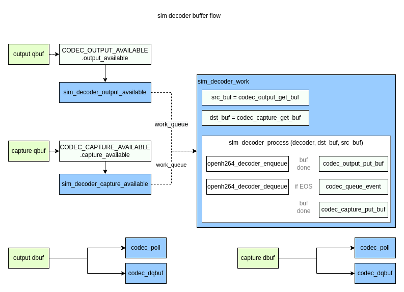

# V4L2 M2M Codec 驱动开发指南

## 一、概述

`openvela` 的视频框架借鉴了 Linux 内核成熟的 **Video for Linux 2 (V4L2)** 体系，并重点实现了其 **Memory-to-Memory (M2M)** 模型。在 Linux 中，`v4l2m2m` 是一个标准模块，专用于处理需要内存作为输入和输出的硬件，如视频编解码器（Codec）。

通过在 `openvela` 中引入这套标准化的 `v4l2m2m` 接口，我们成功统一了视频驱动框架，为南向芯片厂商提供了标准的编解码驱动接入层。这使得第三方硬件可以便捷地集成到 `openvela` 生态中，显著降低了开发和适配成本。

## 二、V4L2 框架概览

`openvela` V4L2 框架采用经典的分层设计，将通用逻辑与设备特定实现解耦。这种模式类似于 `openvela` 音频驱动中的**上层** **(Upper-Half)** 和**下层 (Lower-Half)** 模型。

- **V4L2 通用层 (Upper-Half):**

    - 由 `v4l2_core`、`v4l2_cap` (用于摄像头等捕捉设备) 和 `v4l2_m2m` (用于编解码设备) 模块构成，有对应的 `capture ops` 和 `codec ops`。
    - 该层负责响应来自应用程序的 `ioctl` 系统调用，处理 V4L2 的核心逻辑、缓冲区管理和事件机制。它为下层驱动定义了一套标准的操作函数集（ops）。

- **设备驱动层 (Lower-Half):**

    - 由具体的硬件驱动程序构成，例如文档中用作示例的 `sim_camera` 和 `sim_decoder`。
    - **驱动开发者的核心工作**就是实现这一层。通过填充并注册特定的 `ops` 结构体，驱动即可与通用层无缝对接。

当系统启动后，下层驱动（如 `sim_decoder`）会注册相应的设备节点（如 `/dev/video1`）。应用程序通过标准文件接口访问这些节点，请求经由 V4L2 通用层，最终分派到对应的下层驱动进行处理。


**说明:** V4L2 的顶层 `file_operations` (`g_v4l2_fops`) 接收到 `ioctl` 等请求后，根据设备类型，将其分发给 `capture` (摄像头) 或 `m2m` (编解码器) 的通用实现层，最终调用到具体设备 (`sim_camera` 或 `sim_decoder`) 的驱动逻辑。

### 1、框架层数据结构与 Ops

#### `v4l2_s`

`v4l2_s` 是 V4L2 设备的顶层抽象结构体，是整个 V4L2 驱动的入口点。它封装了指向设备具体操作的两个核心函数指针表：`vops` 和 `fops`。

- `vops`: 指向 `v4l2_ops_s` 结构体，定义了所有 V4L2 相关的 `ioctl` 操作。
- `fops`: 指向 `file_operations` 结构体，定义了标准的 VFS 文件操作（如 `open`, `close`, `poll` 等）。

根据设备类型，`v4l2_s` 会被实例化并指向不同的实现，例如 Camera 设备对应 `g_capture_vops` 和 `g_capture_fops`，而 M2M Codec 设备则对应 `g_codec_vops` 和 `g_codec_fops`。

```C
struct v4l2_s
{
  FAR const struct v4l2_ops_s      *vops;
  FAR const struct file_operations *fops;
};
```

#### `v4l2_ops_s`

`v4l2_ops_s` 是 V4L2 框架中**通用**的 `ioctl` 操作函数集。它定义了所有 V4L2 设备（包括 Camera 和 M2M Codec）可能支持的操作的原型。当一个 `ioctl` 请求通过 VFS 传递到 V4L2 核心层后，最终会通过该结构体中的函数指针分发到具体设备类型的通用层（如 `v4l2_m2m.c`）进行处理。

```C
struct v4l2_ops_s
{
  CODE int (*querycap)(FAR struct file *filep,
                       FAR struct v4l2_capability *cap);
  CODE int (*g_input)(FAR int *num);
  CODE int (*enum_input)(FAR struct file *filep,
                         FAR struct v4l2_input *input);
  CODE int (*reqbufs)(FAR struct file *filep,
                      FAR struct v4l2_requestbuffers *reqbufs);
  CODE int (*querybuf)(FAR struct file *filep,
                       FAR struct v4l2_buffer *buf);
// ... 其他标准V4L2操作 ...
```

## 三、V4L2 M2M 驱动详解

本章将深入剖析 `openvela` V4L2 M2M Codec 驱动的内部机制，涵盖其核心组件、接口定义、数据交互模型及关键开发实践。

### 1、核心概念与组件

`openvela` 的 `v4l2m2m` 实现借鉴了 Linux 的成熟设计，其架构围绕以下四个核心组件构建：

- **`codec_ops_s`**: **下层驱动的核心实现**。它定义了一套操作回调函数，功能对标 Linux 的 `v4l2_ioctl_ops`。驱动开发者的主要工作就是实现此接口。
- **`codec_file_s`**: **设备实例管理器**。每当应用程序 `open` 设备节点时，框架会创建一个 `codec_file_s` 实例来管理该会话的上下文，包括独立的缓冲区队列，从而实现多实例支持。并且 m2m 中对 `buffer` 的分配管理也是通过`codec_file_s`来完成。
- **`codec_mng_s`**: **设备顶层管理器**。在驱动注册设备节点（如 `/dev/video1`）时，框架会创建一个 `codec_mng_s` 实例，作为该设备在内核中的全局句柄。
- **`v4l2_ops_s`**: **V4L2 通用** **`ioctl`** **接口**。这是一个框架层（Upper-Half）的接口，M2M 通用层会提供一个该接口的实例 (`g_codec_vops`)，它负责接收上层请求并调用到下层驱动的具体实现 (`codec_ops_s`)。


**图注:** 此图清晰展示了 `v4l2_ops_s` 作为通用入口，如何通过 `codec_mng_s` 和 `codec_file_s` 最终调用到驱动开发者实现的 `codec_ops_s`。

### 2、关键代码文件

V4L2 M2M 框架的逻辑主要分布在以下几个文件中：

- `nuttx/drivers/video/v4l2_core.c`: V4L2 框架的总入口，定义了顶层文件操作 `g_v4l2_fops`，并将请求分发至 Camera 或 M2M 的实现。

- `nuttx/drivers/video/v4l2_m2m.c`: **M2M 通用层 (Upper-Half)**。实现了 M2M 设备的通用逻辑，定义了 `g_codec_fops` 和 `g_codec_vops`，对应`file_operations`和`v4l2_ops_s`。**这是下层驱动主要交互的模块**。参考 `sim_decoder`，`codec` 的开发主要是 `codec_ops_s`的实现，以及完成输入输出 `buffer` 的对接。

- `nuttx/drivers/video/video_framebuff.c`: V4L2 通用的缓冲区管理模块，为上层提供统一的缓冲区申请、排队和生命周期管理能力。

- `nuttx/drivers/video/v4l2_cap.c`: Camera 设备的通用实现，Codec 开发一般不直接涉及。包括 `image capture` 和 `video capture` ，定义了 Camera 的`g_capture_fops`和`g_capture_vops`，对应`file_operations`和`v4l2_ops_s`。

### 3、接口与数据结构详解

本节详细介绍 M2M 驱动开发中涉及的关键数据结构和操作集。

#### 下层驱动核心接口 (`codec_ops_s` & `codec_s`)

`codec_ops_s` 是下层驱动（Lower-Half）必须实现的操作回调函数集合。驱动开发者需要根据硬件能力，实例化一个 `codec_ops_s` 结构体并填充其函数指针。`codec_s` 结构体则将该操作集与驱动的私有数据绑定起来。

```C
/* 下层驱动需要实现的操作回调函数集合 */
struct codec_ops_s
{
  /* 设备生命周期管理 */
  CODE int (*open)(FAR struct codec_s *codec, void *arg);
  CODE int (*close)(FAR struct codec_s *codec);

  /* 流控制 */
  CODE int (*capture_streamon)(FAR struct codec_s *codec);
  CODE int (*output_streamon)(FAR struct codec_s *codec);
  // ... 其他 streamon/streamoff 及 available 回调 ...

  /* 标准 V4L2 IOCTLs 的具体实现 */
  CODE int (*querycap)(FAR struct codec_s *codec, FAR struct v4l2_capability *cap);
  CODE int (*capture_enum_fmt)(FAR struct codec_s *codec, FAR struct v4l2_fmtdesc *f);
  // ... 其他 ops，如 g_fmt, s_fmt, g_parm, s_parm, events, cmds 等 ...
};

/* 将 ops 与驱动私有数据绑定 */
struct codec_s
{
  FAR const struct codec_ops_s *ops;
  FAR void                     *priv;
};
```

**说明:** `codec_ops_s` 中的许多操作是可选的，驱动可以根据硬件支持的功能选择性地实现。

#### M2M 框架管理结构

这些数据结构由 M2M 通用层 (`v4l2_m2m.c`) 使用，用于管理设备、文件实例和资源。

- **`codec_mng_t`** **(****`struct codec_mng_s`****)**: 设备顶层管理结构，在设备注册时创建，每注册一个设备节点就会创建一个`codec_mng_s`。

- **`codec_file_t`** **(****`struct codec_file_s`****)**: 设备文件实例，在 `open` 时创建，其 `priv` 指针用于关联下层驱动的私有数据。它是实现多实例支持的关键，每个设备节点 `open` 一次，就会创建一个新的`codec_file_t`，对应不同的 `codec context`，实现了多实例的需求。

- **`codec_type_inf_t`** **(****`struct codec_type_inf_s`****)**: 用于管理单一类型（Capture 或 Output）的缓冲区信息。

- **`codec_event_t`** **(****`struct codec_event_s`****)**: 用于订阅 `event` 和管理 V4L2 事件的内部结构。

#### M2M 通用层接口 (`g_codec_fops` & `g_codec_vops`)

M2M 通用层提供了两组全局的操作实例，它们是连接 VFS/V4L2-Core 与下层驱动的桥梁。

- **`g_codec_fops`** **(****`struct file_operations`****)**:

    `g_codec_fops` 注册后，`v4l2_core` 中的 `fops` 会直接调用 `codec` 的 `fops`，完成 `codec` 的 `open`/`close`/`mmap`/`poll`操作。

    ```C
    static const struct file_operations g_codec_fops =
    {
      codec_open,            /* open */
      codec_close,           /* close */
      NULL,                  /* read */
      NULL,                  /* write */
      NULL,                  /* seek */
      NULL,                  /* ioctl */
      codec_mmap,            /* mmap */
      NULL,                  /* truncate */
      codec_poll,            /* poll */
    };
    ```

- **`g_codec_vops`** **(****`struct v4l2_ops_s`****)**:

    实现了 V4L2 的通用 `ioctl` 命令接口。这些函数作为**适配层**，其内部会调用下层驱动在 `codec_ops_s` 中注册的对应回调函数。例如，`codec_querycap` 函数最终会调用 `(codec->ops->querycap)(...)`。

    ```C
    /* M2M 通用层提供的 v4l2_ops_s 实现 */
    static const struct v4l2_ops_s g_codec_vops =
    {
      codec_querycap,                   /* querycap */
      NULL,                             /* g_input */
      NULL,                             /* enum_input */
      codec_reqbufs,                    /* reqbufs */
      codec_querybuf,                   /* querybuf */
      codec_qbuf,                       /* qbuf */
      codec_dqbuf,                      /* dqbuf */
      // ... 其他20余个已实现的接口 ...
      codec_decoder_cmd,                /* decoder_cmd */
      codec_encoder_cmd                 /* encoder_cmd */
    };
    ```

### 4、缓冲区交互模型

V4L2 M2M 框架的核心是其双队列缓冲区模型。内存由 M2M 通用层根据用户空间的 `VIDIOC_REQBUFS` 请求进行分配和管理。下层驱动通过以下 API 与通用层进行缓冲区数据交换：

- **获取缓冲区**:

    - `codec_output_get_buf()`: 获取一个包含待处理数据（如 H.264 码流）的输入缓冲区。
    - `codec_capture_get_buf()`: 获取一个空闲的、用于存放处理结果（如 YUV 数据）的输出缓冲区。

- **归还缓冲区**:

    - `codec_output_put_buf()`: 将已处理完毕的输入缓冲区归还给 M2M 通用层。
    - `codec_capture_put_buf()`: 将已填充数据的输出缓冲区归还给 M2M 通用层，使其可被应用层读取。

```C
FAR struct v4l2_buffer *codec_output_get_buf(FAR void *cookie);
FAR struct v4l2_buffer *codec_capture_get_buf(FAR void *cookie);

int codec_output_put_buf(FAR void *cookie, FAR struct v4l2_buffer *buf);
int codec_capture_put_buf(FAR void *cookie, FAR struct v4l2_buffer *buf);
```


**图注:** 此图详细描绘了解码器驱动如何通过 `get_buf` 和 `put_buf` API 与 M2M 通用层进行输入和输出缓冲区的交换。

### 5、开发注意事项

- **缓冲区申请:**

    输入 (`output`) 和输出 (`capture`) 缓冲区均由用户空间通过 `ioctl` 的 `VIDIOC_REQBUFS` 命令触发申请，内存由 M2M 通用层统一分配和管理。

- **队列操作:**

    受限于 `video_framebuff` 的当前实现，不建议一次性将所有请求的 `output` 缓冲区都入队到 M2M。推荐的模式是：在入队一个新的 `output` 缓冲区之前，先尝试出队所有已处理完的缓冲区。

- **延迟初始化:**

    `sim_decoder` 示例将 `sim_openh264dec` 的初始化推迟到 `output_streamon` 回调中执行。这种做法避免了在驱动探测（probe）阶段进行不必要的硬件初始化和关闭，是一种推荐的优化实践。

- **Flush 操作:**

    在调用 `output_streamoff` 时，驱动应确保硬件中缓存的所有帧都被完全处理并输出。`sim_decoder` 通过设置 flush 标志并调度工作队列来清空解码器内部的剩余数据。

## 四、实践案例：Simulator 驱动

`openvela` 提供了一套基于 openH264 (解码) 和 x264 (编码) 的模拟器驱动。它们是学习和开发 V4L2 M2M 驱动的最佳参考。

### 1、环境配置

在 `menuconfig` 中启用以下配置项，即可在 i386 模拟器环境中使用编解码能力。

#### Video Decoder 配置

```Makefile
CONFIG_SIM_VIDEO_DECODER=y
CONFIG_SIM_VIDEO_DECODER_DEV_PATH="/dev/video1"
CONFIG_VIDEOUTILS_OPENH264=y
```

#### Video Encoder 配置

```Makefile
CONFIG_SIM_VIDEO_ENCODER=y
CONFIG_SIM_ENCODER_DEV_PATH="/dev/video2"
CONFIG_VIDEOUTILS_LIBX264=y
```

#### 通用视频依赖项:

```C
CONFIG_VIDEO=y
CONFIG_DRIVERS_VIDEO=y
CONFIG_VIDEO_STREAM=y
```

### 2、Simulator Decoder 详解

#### 初始化流程

`sim_decoder` 驱动在系统启动阶段通过 `sim_decoder_initialize` 函数调用 `codec_register`，从而在 VFS 中创建设备节点 `/dev/video1`。当应用层 `open` 该节点时，会触发 `codec_open` 函数，进而调用驱动的 `open` 回调，完成实例的创建和缓冲区初始化。


#### 缓冲区处理流程

`sim_decoder` 的核心解码任务在一个工作队列 (`sim_decoder_work`) 中异步执行。该任务由 `sim_decoder_output_available` 和 `sim_decoder_capture_available` 回调触发。



#### Ops 实现解析 (`g_sim_decoder_ops`)

`g_sim_decoder_ops` 是 `sim_decoder` 驱动对 `codec_ops_s` 接口的具体实现。实现的 API 如下：

- **流控制接口 (****`streamon`****/****`streamoff`****)**

    - `sim_decoder_output_streamon`: 此回调被触发时，初始化 openH264 解码器实例，并配置相关参数。
    - `sim_decoder_capture_streamon`: 此回调被触发时，表明 M2M 层的缓冲区已准备就绪，此时调度工作队列开始解码。
    - `sim_decoder_output_streamoff`: 设置 flush 状态，并启动工作队列，以处理解码器中所有剩余的缓冲帧。
    - `sim_decoder_capture_streamoff`: 关闭并释放 openH264 解码器实例。

- **数据可用性接口 (****`available`****)**

    - `sim_decoder_output_available` / `sim_decoder_capture_available`: 当有新的输入数据或可用的输出缓冲区时，M2M 通用层调用这些回调。它们通常只做一件事：触发工作队列执行实际的解码工作。

- **`g_bufsize`** **接口 (openvela 扩展)**

    - `capture_g_bufsize` / `output_g_bufsize`: 这两个接口是 `openvela` 的特定扩展，用于让下层驱动根据当前格式（分辨率、像素格式等）计算并返回精确的缓冲区大小。M2M 通用层在分配内存时会使用这个返回值。这与 Linux V4L2 通过 `S_FMT` 协商大小的方式有所不同，是 `openvela` 实现的一个特点。

- **格式协商接口 (****`xxx_fmt`****)**

    - 这些接口（如 `capture_enum_fmt`, `output_g_fmt` 等）的实现与标准 Linux V4L2 驱动类似，负责查询和设置设备支持的像素格式、分辨率等。

### 3、Simulator Encoder

`sim_encoder` 的驱动实现与 `sim_decoder` 在结构上高度相似，主要区别在于数据流方向相反，并调用 x264 库进行编码。开发者可直接参考其源码进行学习。

## 五、参考资料

- [Linux Media Subsystem Documentation (官方)](https://www.kernel.org/doc/html/latest/userspace-api/media/index.html)
