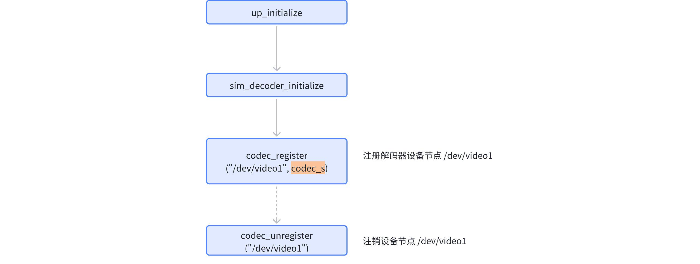
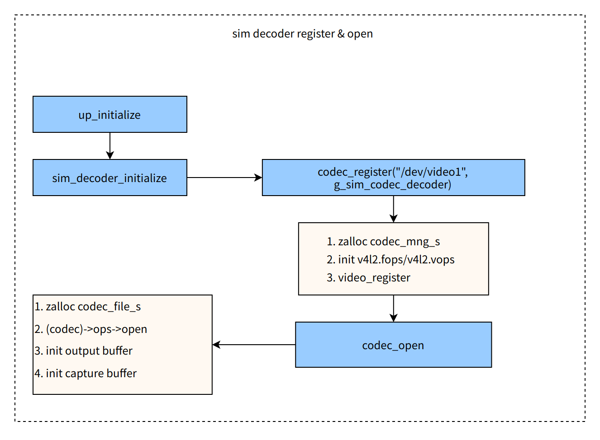

# V4L2 M2M Codec 驱动开发指南

[[English](../../../../en/device_dev_guide/media/v4l2/v4l2_m2m_driver_guide.md) | 简体中文]

## 一、概述

### 1、目标读者与范围

本指南面向芯片供应商（Vendor）的嵌入式驱动开发工程师。

本文档详细阐述了如何在 `openvela` 实时操作系统中，基于 V4L2 M2M (Memory-to-Memory) Codec 框架适配和开发硬件视频编解码器驱动，并介绍了相关的调试方法和最佳实践。

> **说明：** 为保持简洁，本文档将以解码器（Decoder）的适配过程作为主要示例。编码器（Encoder）的适配流程与此高度相似，本文不再赘述共通部分。

### 2、核心代码路径

驱动开发过程主要涉及以下代码文件：

- **M2M** **框架核心:**

    - `drivers/video/v4l2_m2m.c`
    - `drivers/video/v4l2_core.c`
    - `drivers/video/video_framebuff.c`

- **框架对外头文件:**

    - `include/nuttx/video/v4l2_m2m.h`

- **参考实现:**

    - `arch/sim/src/sim/sim_decoder.c` (解码器)
    - `arch/sim/src/sim/sim_encoder.c` (编码器)

## 二、驱动注册与生命周期

V4L2 Codec 驱动通常在系统启动阶段进行注册，其核心流程如下：



### 核心步骤

1. **实现驱动核心逻辑:** 开发者需要根据硬件特性，完整实现 `codec_ops_s` 结构体中定义的回调函数，并将其封装在 `codec_s` 结构体中。
2. **注册设备节点:** 在驱动初始化函数中，调用 `codec_register()` 接口。该函数接收设备节点路径（如 `/dev/video0`）和已实例化的 `codec_s` 结构体作为参数，向系统注册一个 V4L2 Codec 设备。
3. **注销设备节点:** 当不再需要该设备时（例如模块卸载时），应调用 `codec_unregister()` 接口来释放资源并移除设备节点。

## 三、驱动实现核心：`codec_ops_s` 详解

`codec_ops_s` 结构体是连接 V4L2 M2M 框架与底层硬件编解码器的桥梁。驱动开发者的**首要任务**就是填充此结构体中的函数指针，以响应框架的调用。

```C
struct codec_ops_s
{
  CODE int (*open)(FAR void *cookie, FAR void **priv);
  CODE int (*close)(FAR void *priv);

  CODE int (*capture_streamon)(FAR void *priv);
  CODE int (*output_streamon)(FAR void *priv);
  CODE int (*capture_streamoff)(FAR void *priv);
  CODE int (*output_streamoff)(FAR void *priv);

  CODE int (*capture_available)(FAR void *priv);
  CODE int (*output_available)(FAR void *priv);

  /* VIDIOC_QUERYCAP handler */

  CODE int (*querycap)(FAR void *priv,
                       FAR struct v4l2_capability *cap);

  /* VIDIOC_ENUM_FMT handlers */

  CODE int (*capture_enum_fmt)(FAR void *priv,
                               FAR struct v4l2_fmtdesc *fmt);

  CODE int (*output_enum_fmt)(FAR void *priv,
                              FAR struct v4l2_fmtdesc *fmt);

  /* VIDIOC_G_FMT handlers */

  CODE int (*capture_g_fmt)(FAR void *priv,
                            FAR struct v4l2_format *fmt);
  CODE int (*output_g_fmt)(FAR void *priv,
                           FAR struct v4l2_format *fmt);

  /* VIDIOC_S_FMT handlers */

  CODE int (*capture_s_fmt)(FAR void *priv,
                            FAR struct v4l2_format *fmt);
  CODE int (*output_s_fmt)(FAR void *priv,
                           FAR struct v4l2_format *fmt);

  /* VIDIOC_TRY_FMT handlers */

  CODE int (*capture_try_fmt)(FAR void *priv,
                              FAR struct v4l2_format *fmt);
  CODE int (*output_try_fmt)(FAR void *priv,
                             FAR struct v4l2_format *fmt);

  /* Buffer handlers  */

  CODE size_t (*capture_g_bufsize)(FAR void *priv);
  CODE size_t (*output_g_bufsize)(FAR void *priv);

  /* Stream type-dependent parameter ioctls */

  CODE int (*capture_g_parm)(FAR void *priv,
                             FAR struct v4l2_streamparm *parm);
  CODE int (*output_g_parm)(FAR void *priv,
                            FAR struct v4l2_streamparm *parm);
  CODE int (*capture_s_parm)(FAR void *priv,
                             FAR struct v4l2_streamparm *parm);
  CODE int (*output_s_parm)(FAR void *priv,
                            FAR struct v4l2_streamparm *parm);

  /* Control handlers */

  CODE int (*g_ext_ctrls)(FAR void *priv,
                          FAR struct v4l2_ext_controls *ctrls);
  CODE int (*s_ext_ctrls)(FAR void *priv,
                          FAR struct v4l2_ext_controls *ctrls);

  /* Crop ioctls */

  CODE int (*capture_g_selection)(FAR void *priv,
                                  FAR struct v4l2_selection *clip);
  CODE int (*output_g_selection)(FAR void *priv,
                                 FAR struct v4l2_selection *clip);
  CODE int (*capture_s_selection)(FAR void *priv,
                                  FAR struct v4l2_selection *clip);
  CODE int (*output_s_selection)(FAR void *priv,
                                 FAR struct v4l2_selection *clip);
  CODE int (*capture_cropcap)(FAR void *priv,
                              FAR struct v4l2_cropcap *cropcap);
  CODE int (*output_cropcap)(FAR void *priv,
                             FAR struct v4l2_cropcap *cropcap);

  /* Event handlers */

  CODE int (*subscribe_event)(FAR void *priv,
                              FAR struct v4l2_event_subscription *sub);

  /* Command handlers */

  CODE int (*decoder_cmd)(FAR void *priv,
                          FAR struct v4l2_decoder_cmd *cmd);
  CODE int (*encoder_cmd)(FAR void *priv,
                          FAR struct v4l2_encoder_cmd *cmd);
};
```

下面将详细说明一下每个接口的核心功能：

| **接口名称**                                   | **核心职责与调用时机**                                                                                                                                                                                                                                                                                            |
| :--------------------------------------------- | :---------------------------------------------------------------------------------------------------------------------------------------------------------------------------------------------------------------------------------------------------------------------------------------------------------------- |
| `open`                                         | 当应用层调用 `open()` 打开设备节点时，框架调用此函数。开发者应在此处完成单实例资源的初始化。<br>**参数说明：**<br>`cookie`: M2M 框架层维护的会话句柄，用于后续调用框架提供的 API (如 `codec_*_get_buf`)。<br>`priv`: 由驱动分配并返回的私有数据指针，用于存储该实例的上下文。框架会将其透传给后续的其他回调函数。 |
| `close`                                        | 当应用层调用 `close()` 关闭设备节点时，框架调用此函数。<br> 开发者应在此处释放 `open` 时分配的私有资源。                                                                                                                                                                                                          |
| `output_streamon`                              | 响应 `VIDIOC_STREAMON` (`OUTPUT` 队列)。 <br>此时输入格式已确定，驱动可以获取到解码图像格式，完成 Decoder 的初始化工作。                                                                                                                                                                                          |
| `capture_streamon`                             | 响应 `VIDIOC_STREAMON` (`CAPTURE` 队列)。 <br>此时缓冲区已准备就绪，可以启动工作队列（`work_queue`）开始数据处理。                                                                                                                                                                                                |
| `output_streamoff`                             | 响应 `VIDIOC_STREAMOFF` (`OUTPUT` 队列)。 <br>停止接收新的输入数据。                                                                                                                                                                                                                                              |
| `capture_streamoff`                            | 响应 `VIDIOC_STREAMOFF` (`CAPTURE` 队列)。 <br>停止处理和输出数据，并确保硬件内部缓存的数据被清空（flush）。                                                                                                                                                                                                      |
| `output_available`                             | 当应用层通过 `QBUF` 向 `OUTPUT` 队列提供一帧待处理数据（如H.264码流）时，框架调用此函数。 <br>通常在此触发一次工作队列以处理新数据，底层解码器可以准备解码。                                                                                                                                                      |
| `capture_available`                            | 当应用层通过 `QBUF` 将一个空的 `CAPTURE` 缓冲区归还给驱动时，框架调用此函数。 <br>通常在此触发一次工作队列以填充此缓冲区。                                                                                                                                                                                        |
| `querycap`                                     | 响应 `VIDIOC_QUERYCAP`。 <br>填充 `v4l2_capability` 结构体，向应用层报告驱动的能力，如设备类型、是否支持流控等。                                                                                                                                                                                                  |
| `output_enum_fmt`                              | 响应 `VIDIOC_ENUM_FMT` (`OUTPUT` 队列)。 <br>枚举驱动支持的输入数据格式：<br>解码器：`V4L2_PIX_FMT_H264` 等。<br>编码器：`V4L2_PIX_FMT_YUV420` 等。                                                                                                                                                               |
| `capture_enum_fmt`                             | 响应 `VIDIOC_ENUM_FMT` (`CAPTURE` 队列)。 <br>枚举驱动支持的输出数据格式：<br>解码器：`V4L2_PIX_FMT_YUV420` 等。<br>编码器：`V4L2_PIX_FMT_H264` 等。                                                                                                                                                              |
| `output_s_fmt` / `capture_s_fmt`               | 响应 `VIDIOC_S_FMT`。 <br>设置输入/输出队列的像素格式、分辨率等参数。                                                                                                                                                                                                                                             |
| `output_g_fmt` / `capture_g_fmt`               | 响应 `VIDIOC_G_FMT`。 <br>获取当前输入/输出队列的格式。                                                                                                                                                                                                                                                           |
| `output_try_fmt` / `capture_try_fmt`           | 响应 `VIDIOC_TRY_FMT`。 <br>校验并调整应用层尝试设置的格式。                                                                                                                                                                                                                                                      |
| `output_g_bufsize`                             | 返回 `OUTPUT` 队列中单个缓冲区的建议大小。<br>对于解码器，应设置为能容纳的最大压缩帧（如最大 I 帧）的 size。                                                                                                                                                                                                      |
| `capture_g_bufsize`                            | 返回 `CAPTURE` 队列中单个缓冲区的建议大小。<br>对于解码器，这是一帧解码后原始图像（如 YUV）的大小 (w * h * 3 / 2)。<br>对于编码器，size 大小为编码后压缩数据的最大帧大小。                                                                                                                                        |
| `alloc_buf`/`free_buf`                         | **可选。**<br>当前 M2M mmap buffer 模式内部使用 `kumm_memalign(align:32)` 内存分配接口分配内存。<br>若硬件对内存（如物理连续）有特殊要求，则实现这两个函数以覆盖框架默认的内存分配行为。                                                                                                                          |
| `decoder_cmd`                                  | `VIDIOC_DECODER_CMD`：处理解码控制命令，如 `START`, `STOP`, `PAUSE`, `FLUSH`。                                                                                                                                                                                                                                    |
| `encoder_cmd`                                  | `VIDIOC_ENCODER_CMD`：处理编码控制命令，如 `START`, `STOP`, `PAUSE`。                                                                                                                                                                                                                                             |
| `g_ext_ctrls`/`s_ext_ctrls`                    | `VIDIOC_G_EXT_CTRLS` / `VIDIOC_S_EXT_CTRLS`：批量获取或设置扩展控制参数，如编码器的 GOP、码率、Profile 等。                                                                                                                                                                                                       |
| `output_g/s_parm` `capture_g/s_parm`           | `VIDIOC_G_PARM` / `VIDIOC_S_PARM`：获取或设置流参数，如帧率和场格式。                                                                                                                                                                                                                                             |
| `output_g/s_selection` `capture_g/s_selection` | 获取或设置输入/输出端处理的区域。                                                                                                                                                                                                                                                                                 |
| `capture_cropcap`/`output_cropcap`             | `VIDIOC_CROPCAP`：获取输入/输出端裁剪参数。                                                                                                                                                                                                                                                                       |
| `subscribe_event`                              | `VIDIOC_SUBSCRIBE_EVENT`：允许应用层订阅驱动事件，如 `V4L2_EVENT_EOS` 。                                                                                                                                                                                                                                          |


## 四、M2M 框架辅助 API

V4L2 M2M 框架为下层驱动提供了一系列辅助 API，用于简化设备管理、缓冲区交互和事件通知。

### 1、设备注册与注销

```C++
/* 注册 V4L2 M2M Codec 设备 */
int codec_register(FAR const char *devpath, FAR struct codec_s *codec);

/* 注销 V4L2 M2M Codec 设备 */
int codec_unregister(FAR const char *devpath);
```

### 2、缓冲区交互

驱动通过以下 API 与 M2M 框架进行数据缓冲区的获取与归还，这是实现数据流处理的核心。

```C++
// 从m2m获取buffer
// 解码场景：
// - output queue存放视频压缩数据，output_get_buf即从m2m output queue获取一帧压缩数据。
// - capture queue存放解码后的视频帧，capture_get_buf即从m2m capture queue中获取一个空闲buffer等待被填充解码后的数据。

// 编码场景：
// - output queue存放视频Raw数据，output_get_buf即从m2m output queue获取一帧Raw数据。
// - capture queue存放编码压缩数据，capture_get_buf即从m2m capture queue中获取一个空闲buffer,等待被填充编码后的数据。

// 从 OUTPUT 队列获取一个待处理的缓冲区
FAR struct v4l2_buffer *codec_output_get_buf(FAR void *cookie);

// 从 CAPTURE 队列获取一个用于填充结果的空闲缓冲区
FAR struct v4l2_buffer *codec_capture_get_buf(FAR void *cookie);

// 将已处理完的 OUTPUT 缓冲区归还给框架
int codec_output_put_buf(FAR void *cookie, FAR struct v4l2_buffer *buf);

// 将已填充数据的 CAPTURE 缓冲区归还给框架，使其对应用层可见
int codec_capture_put_buf(FAR void *cookie, FAR struct v4l2_buffer *buf);
```

**使用场景示例 (解码器):**

1. 在工作队列中，调用 `codec_output_get_buf()` 获取一帧待解码的压缩数据（如 H.264）。
2. 调用 `codec_capture_get_buf()` 获取一个用于存放解码结果（如 YUV）的空闲缓冲区。
3. 将压缩数据送入硬件解码，并将解码后的 YUV 数据直接填充到指定的缓冲区。
4. 调用 `codec_output_put_buf()` 归还已使用的压缩数据缓冲区。
5. 调用 `codec_capture_put_buf()` 归还已填充解码结果的缓冲区。

### 3、事件通知

驱动可以使用此 API 主动向应用层发送异步事件。

```C++
// driver发送事件给应用，比如：编解码结束的时候，发送EOS事件。
int codec_queue_event(FAR void *cookie, FAR struct v4l2_event *evt);
```

## 五、关键开发注意事项与最佳实践

### 1、压缩数据缓冲区大小设置

为压缩数据队列（解码器的 `OUTPUT` 队列，编码器的 `CAPTURE` 队列）设置一个合理的缓冲区大小至关重要。该大小通过实现 `output_g_bufsize` 或 `capture_g_bufsize` 来定义，并在应用层调用 `VIDIOC_REQBUFS` 时生效。

- **解码器 (****`output_g_bufsize`****)**: 输入的压缩帧大小不固定。建议将缓冲区大小设置为一个安全的上限值，例如目标分辨率下原始图像大小的一半。

    - **示例**: 对于 `640x480` 的 `YUV420P` 格式，原始图像大小为 `640 * 480 * 3 / 2 = 460800` 字节。可将输入缓冲区大小设置为 `230400` 字节。

- **编码器 (****`capture_g_bufsize`****)**: 输出的压缩帧大小同样不固定。建议将其设置为硬件可能产生的最大I帧（I-frame）的大小。

### 2、实现零拷贝（Zero-Copy）数据流

`openvela` V4L2 M2M 框架的设计旨在促进零拷贝数据流，以最大化性能。驱动应避免在内部进行不必要的数据拷贝，并让框架管理缓冲区的生命周期。

#### 默认内存管理模式

如果硬件对内存没有特殊要求，驱动应完全依赖 M2M 框架进行内存管理。

1. **内存分配**: 应用层调用 `VIDIOC_REQBUFS` 时，M2M 框架会根据驱动提供的 `g_bufsize` 回调，使用 `kumm_memalign(32, ...)` 统一分配所有缓冲区。
2. **数据处理 (以解码器为例)**:

    - **输入**: 驱动通过 `codec_output_get_buf()` 获取的缓冲区地址，直接传递给硬件进行解码。
    - **输出**: 硬件将解码结果直接写入从 `codec_capture_get_buf()` 获取的缓冲区地址。

3. **内存释放**: 应用层关闭设备时，框架自动释放所有缓冲区。

#### 自定义内存分配模式

如果硬件要求使用特殊的内存（如物理连续、特定地址范围等），驱动需要适配 `alloc_buf` 和 `free_buf` 回调。

1. **实现接口**: 在 `codec_ops_s` 中提供 `alloc_buf` 和 `free_buf` 的具体实现，内部调用芯片平台专用的内存分配器。
2. **数据流**: 缓冲区交互流程与默认模式完全相同，驱动依然通过 `get_buf`/`put_buf` API 与框架交互，实现了零拷贝。

## 六、实践案例：Simulator 驱动

`openvela` 提供了一套基于 openH264 (解码) 和 x264 (编码) 的模拟器驱动。它们是学习和开发 V4L2 M2M 驱动的最佳参考。

### 1、环境配置

在 `menuconfig` 中启用以下配置项，即可在 i386 模拟器环境中使用编解码能力。

#### Video Decoder 配置

```Makefile
CONFIG_SIM_VIDEO_DECODER=y
CONFIG_SIM_VIDEO_DECODER_DEV_PATH="/dev/video1"
CONFIG_VIDEOUTILS_OPENH264=y
```

#### Video Encoder 配置

```Makefile
CONFIG_SIM_VIDEO_ENCODER=y
CONFIG_SIM_ENCODER_DEV_PATH="/dev/video2"
CONFIG_VIDEOUTILS_LIBX264=y
```

#### 通用视频依赖项

```C
CONFIG_VIDEO=y
CONFIG_DRIVERS_VIDEO=y
CONFIG_VIDEO_STREAM=y
```

### 2、Simulator Decoder 详解

#### 初始化流程

`sim_decoder` 驱动在系统启动阶段通过 `sim_decoder_initialize` 函数调用 `codec_register`，从而在 VFS 中创建设备节点 `/dev/video1`。当应用层 `open` 该节点时，会触发 `codec_open` 函数，进而调用驱动的 `open` 回调，完成实例的创建和缓冲区初始化。



#### 缓冲区处理流程

`sim_decoder` 的核心解码任务在一个工作队列 (`sim_decoder_work`) 中异步执行。该任务由 `sim_decoder_output_available` 和 `sim_decoder_capture_available` 回调触发。


#### Ops 实现解析 (`g_sim_decoder_ops`)

`g_sim_decoder_ops` 是 `sim_decoder` 驱动对 `codec_ops_s` 接口的具体实现。实现的 API 如下：

- **流控制接口 (`streamon`/`streamoff`)**

    - `sim_decoder_output_streamon`: 此回调被触发时，初始化 openH264 解码器实例，并配置相关参数。
    - `sim_decoder_capture_streamon`: 此回调被触发时，表明 M2M 层的缓冲区已准备就绪，此时调度工作队列开始解码。
    - `sim_decoder_output_streamoff`: 设置 flush 状态，并启动工作队列，以处理解码器中所有剩余的缓冲帧。
    - `sim_decoder_capture_streamoff`: 关闭并释放 openH264 解码器实例。

- **数据可用性接口 (`available`)**

    - `sim_decoder_output_available` / `sim_decoder_capture_available`: 当有新的输入数据或可用的输出缓冲区时，M2M 通用层调用这些回调。它们通常只做一件事：触发工作队列执行实际的解码工作。

- **`g_bufsize` 接口(openvela 扩展)**

    - `capture_g_bufsize` / `output_g_bufsize`: 这两个接口是 `openvela` 的特定扩展，用于让下层驱动根据当前格式（分辨率、像素格式等）计算并返回精确的缓冲区大小。M2M 通用层在分配内存时会使用这个返回值。这与 Linux V4L2 通过 `S_FMT` 协商大小的方式有所不同，是 `openvela` 实现的一个特点。

- **格式协商接口 (`xxx_fmt`)**

    - 这些接口（如 `capture_enum_fmt`, `output_g_fmt` 等）的实现与标准 Linux V4L2 驱动类似，负责查询和设置设备支持的像素格式、分辨率等。

### 3、Simulator Encoder

`sim_encoder` 的驱动实现与 `sim_decoder` 在结构上高度相似，主要区别在于数据流方向相反，并调用 x264 库进行编码。开发者可直接参考其源码进行学习。

`openvela` 在 `arch/sim/src/sim/sim_decoder.c` 中提供了一个功能完整的解码器驱动范例。我们强烈建议开发者在开始适配前，详细研究此文件的实现。

其处理逻辑和设计模式可以参考[V4L2 M2M 框架介绍](./v4l2_m2m_framework.md)。

## 七、驱动调试与测试

驱动开发完成后，`openvela` 提供了多种工具进行功能验证和性能调试。

### 1、`nxcodec` 测试工具

`nxcodec` 是一个命令行工具，专门用于直接测试 V4L2 Codec 驱动的 `ioctl` 接口和基本编解码功能。对于驱动开发初期的功能验证，此工具是首选。使用说明请参考 [nxcodec 用户指南](./nxcodec.md)。

### 2、FFmpeg 测试工具

在真实应用场景中，上层多媒体应用通常通过 `FFmpeg` 来调用 V4L2 M2M 驱动。因此，通过 `FFmpeg` 和 `mediatool` 进行集成测试是确保驱动稳定性和兼容性的关键一步。使用说明请参考 [FFmpeg V4L2 M2M 使用指南](./ffmpeg_v4l2m2m_guide.md)。
