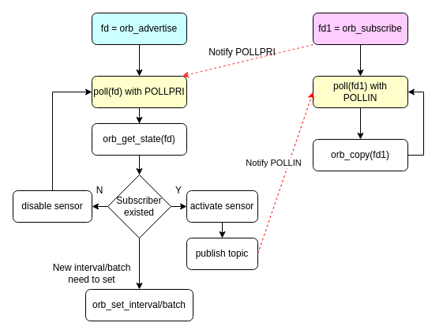
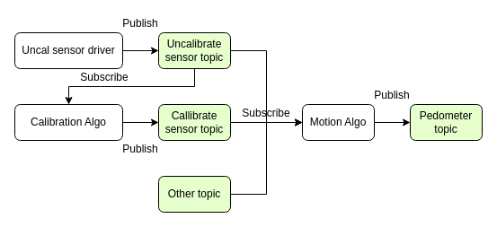
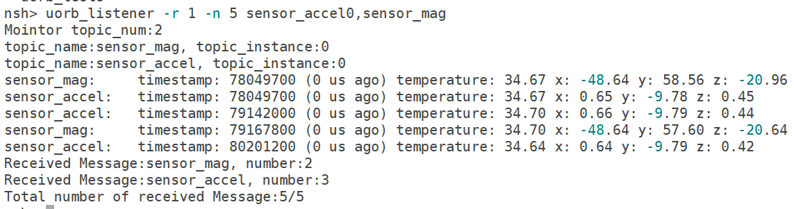

# uORB 框架开发指南

[[English](../../../en/device_dev_guide/middleware/uorb_developer_guide.md) | 简体中文]

## 一、概述

openvela 采用 `uORB` (Micro Object Request Broker，微对象请求代理器) 作为其传感器框架及核心应用间通信的基石。`uORB` 是一个源自 PX4 开源飞控项目的轻量级、高性能的进程间通信 (IPC) 中间件，它在系统内部构建了一个高效的消息总线。

本文档旨在帮助开发者：

- 了解 uORB 框架及其特性。
- 掌握使用 uORB 进行应用编程的方法。

### 1、核心特性

`uORB` 基于**发布/订阅 (Publish/Subscribe)** 设计模式，主要负责多模块间数据传输，其关键特性包括：

- **高性能与低延迟**：内部通过共享内存 (Shared Memory) 实现高效的任务间通信，并通过无锁 (Lock-free) 设计，以极小的内存占用 (Memory Footprint) 实现低延迟的数据交换。
- **POSIX** **标准接口**：`uORB` 将每个消息主题抽象为 NuttX 标准的字符设备节点。开发者可以使用 `open`, `read`, `write`, `ioctl` 和 `poll` 等标准文件操作 API 与之交互，学习成本低且易于集成。
- **灵活解耦**：其核心实现不依赖于特定的线程或工作队列 (Work Queue) 模型，能够有效解耦系统中的各个功能模块，提升系统的模块化程度和可维护性。

## 二、核心概念

要掌握 `uORB`，首先需要理解以下几个核心概念。

### 1、主题、发布者与订阅者

`uORB` 的通信模型围绕三个基本角色展开：

- **主题 (Topic)：** 数据传输的基本单元，代表一类特定的消息。每个主题由其**元数据 (Metadata)** 进行唯一标识，元数据定义了主题的名称 (`name`) 和消息体大小 (`size`)。为区分不同来源的同类数据，一个主题可以创建多个**实例 (Instance)**。

- **发布者 (Publisher/Advertiser)：** 向特定主题发布新消息的角色。其工作流程通常是：

    - **广播 (Advertise)**：向系统声明一个主题，使其可被订阅。
    - **发布 (Publish)**：向已广播的主题写入新的数据。
    - **取消广播 (Unadvertise)**：当不再需要发布时，撤销主题广播。

- **订阅者 (Subscriber)：** 从特定主题接收消息的角色。其工作流程通常是：

    - **订阅 (Subscribe)**：向系统注册对某个主题的兴趣。
    - **获取数据 (Copy)**：从主题中读取最新的数据。
    - **取消订阅 (Unsubscribe)**：当不再需要接收数据时，取消订阅。

在数据流控制方面，发布者可以通过**采样率** **(Sample Rate/Interval)** 控制数据生成频率，并通过**批处理延迟 (Batch Latency)** 将多次数据捆绑后进行单次发布，以优化系统性能。例如，一个加速度传感器采样率为 50Hz，最大发布延迟为 100ms，这意味着硬件每 100ms 产生一次中断，并在该中断中一次性发布 5 笔数据 (`100ms / (1000ms / 50Hz)`)。

### 2、主题类型

在 `openvela` 中，根据数据的使用场景和生命周期，`uORB` 主题被分为两类：

| **主题类型**                         | **特性描述**                                                             | **适用场景**                                                                                                                       |
| :----------------------------------- | :----------------------------------------------------------------------- | :--------------------------------------------------------------------------------------------------------------------------------- |
| **通用主题**  (General Topic)        | 订阅者只关心订阅之后新发布的数据，不关心历史状态。这是最常见的主题类型。 | 例如加速度传感器，应用只关注下次传感器发出`data ready` 中断上报的数据，而不是过去某个时刻的数据。                                  |
| **通知类主题**  (Notification Topic) | 订阅者不关心是否存在发布者或是否已发布，而是直接获取当前状态。           | 例如电量信息，openvela 上由 `healthd` 广播并发布电量信息，之后取消广播；应用订阅时，直接获取当前设备节点中最新的数据作为当前状态。 |

**实现差异**：发布通知类主题时，需要使用带有 `_persist` 后缀的 `advertise` API。订阅者端的 API 调用与通用主题完全一致。

### 3、设备节点抽象

`uORB` 的核心实现巧妙地利用了 NuttX 的文件系统。每一个被广播的主题实例都会在 `/dev/uorb/` 目录下映射为一个字符设备节点。这种设计使得与 `uORB` 的交互符合 POSIX 标准：

- **发布者**：以 `O_WRONLY` (只写) 模式 `open()` 对应的设备节点，通过 `write()` 操作发布数据。
- **订阅者**：以 `O_RDONLY` (只读) 模式 `open()` 对应的设备节点，通过 `read()` 操作订阅数据。
- **数据共享**：发布者和订阅者通过设备节点内部维护的一个环形缓冲区 (Ring Buffer) 来高效地共享数据。
- **事件监控与控制**：双方均可通过 `poll()` 机制异步监听数据更新事件 (`POLLIN`) 或状态变化事件 (`POLLPRI`)，并通过 `ioctl()` 操作对设备节点进行控制。

## 三、核心机制与使用方式

### 1、智能功耗管理

在 openvela 中，`uORB` 框架与电源管理紧密结合，可根据应用需求动态控制传感器硬件，以实现智能化的低功耗运行。

- **物理传感器**：驱动程序在系统启动后会自动广播（Advertise）其对应的主题，但并**不会**立即启动传感器硬件。框架会根据是否有订阅者来动态管理传感器的电源状态：

    - 当第一个订阅者订阅某传感器主题时，框架会自动**激活**（Activate）该传感器硬件。
    - 当最后一个订阅者取消订阅时，框架会自动**禁用**（Disable）该传感器。

- **虚拟主题**：对于算法输出、系统状态和跨核等虚拟主题，会在首次发布和订阅的时候自动注册字符设备节点。这些节点一旦创建便会**常驻系统中**，即使没有活跃的发布者或订阅者，节点也不会被注销。

### 2、状态监控与同步

`uORB` 提供了强大的状态监控机制，允许发布者和订阅者相互感知对方的状态变化，这对于实现动态采样率调整等高级功能至关重要。

- **订阅者监控数据更新**：订阅者使用 `poll()` 监听文件描述符上的 `POLLIN` 事件。当发布者发布新数据时，该事件被触发，订阅者随即可以读取数据。
- **发布者监控订阅者状态**：发布者使用 `poll()` 监听文件描述符上的 `POLLPRI` 事件。以下情况会触发 `POLLPRI` 事件：

    - 当主题有新的订阅者或广播者加入。
    - 当主题的订阅者进行采样率(`interval`) 、批处理参数设置。
    - 当主题有订阅者或广播者退出。

当发布者收到 `POLLPRI` 事件后，应调用 `orb_get_state()` 函数获取当前主题的聚合状态，包括所有订阅者中要求的最大采样率 (`max_frequency`)、最小批处理间隔 (`min_batch_interval`)、内部环形队列大小 (`queue_size`)、订阅者总数 (`nsubscribers`) 以及数据打点 (`generation`)，并据此调整其数据发布策略，以达到最优的性能和功耗。

下图展示了发布者与订阅者通过 `poll` 进行事件驱动交互的典型流程：



综上所述，开发者应根据应用场景选择合适的编程模式：

- **强关联场景**：当发布者需要根据订阅者的状态（如数量、采样率）动态调整行为时，应采用 `poll` (或 `libuv` 等异步事件库) 的**事件驱动编程模型**。
- **弱关联或无关联场景**：当发布者与订阅者无需交互，订阅者仅需获取一次性或最新的状态时，使用**通知类主题**是更简洁高效的选择。

### 3、解耦的算法模型

`uORB` 的发布/订阅模式天然适用于构建模块化的数据处理流水线。不同算法模块可以作为独立的任务运行，通过共享主题进行数据交互，从而实现高度解耦。

例如，一个典型的传感器数据处理流程可以设计如下：

1. **传感器驱动**：发布**未校准传感器**主题。
2. **校准算法模块**：订阅**未校准传感器**主题，处理后发布**已校准传感器**主题。
3. **运动算法模块**：订阅**已校准传感器**和**未校准传感器**主题，并发布**运动状态**主题。
4. **上层应用**：订阅**运动状态**主题，用于业务逻辑。

这种设计使得每个模块都可以独立开发、测试和升级，而无需关心其他模块的具体实现。



## 四、源码目录结构

`apps/system/uorb` 目录下包含了 `uORB` 的核心封装、单元测试、物理传感器主题定义以及 `uorb_listener` 工具。

```Bash
├── Kconfig                             
├── listener.c   # uorb_listener 工具实现             
├── Make.defs                     
├── Makefile                       
├── sensor       # 物理传感器主题定义              
│   ├── accel.c                   
│   ├── accel.h                 
│   ├── baro.c                    
│   ├── baro.h                  
│   ├── cap.c                   
│   ├── cap.h                     
│   ├── ***.c                    
│   ├── tvoc.c
│   ├── tvoc.h
│   ├── uv.c
│   └── uv.h
├── test
│   ├── unit_test.c   # uORB 单元测试
│   ├── utility.c
│   └── utility.h
└── uORB
    ├── uORB.c   # uORB 核心封装层实现
    └── uORB.h
```

## 五、关键数据结构

- **`struct orb_metadata`：元数据 (Static Metadata)**

    每个 uORB 主题都对应一个 `struct orb_metadata` 结构，用于描述主题的元数据，包括名称 (`o_name`)、消息体大小 (`o_size`)，以及数据格式化输出 (`o_format`)。

    ```C
    struct orb_metadata {
        FAR const char   *o_name;   // 主题名称字符串
        uint16_t          o_size;    // 主题消息结构体的大小
    #ifdef CONFIG_DEBUG_UORB
        FAR const char   *o_format; // 格式化输出字符串，用于 uorb_listener 等工具
    #endif
    };
    
    typedef FAR const struct orb_metadata *orb_id_t; // 定义元数据句柄类型
    ```

- **`struct orb_state`：动态状态 (Runtime State)**

    此结构体描述了主题在运行时的动态状态。在广播或订阅主题后，调用者可以通过 `orb_get_state()` 函数获取这些信息，包括所有订阅者要求的最大发布频率 (`max_frequency`)、最小批处理间隔 (`min_batch_interval`)、内部换行队列长度 (`queue_size`)、订阅者总数 (`nsubscribers`) 以及主线索引打点 (`generation`)。

    ```C
    struct orb_state {
        uint32_t max_frequency;      // 所有订阅者要求的最大频率 (Hz)
        uint32_t min_batch_interval; // 所有订阅者要求的最小批处理间隔 (us)
        uint32_t queue_size;         // 内部环形缓冲区的大小
        uint32_t nsubscribers;       // 当前订阅者的数量
        uint64_t generation;         // 数据版本号，每次发布时递增
    };
    ```

- **`struct orb_object`：主题实例 (Topic Instance)**

    `uORB` 支持将一个主题实例化为多个实体，每个实体通过从 0 开始递增的 `instance` 编号进行唯一标识。`struct orb_object` 就代表了一个具体的主题实例，包含了指向其元数据 (`meta`) 的指针和其实例编号 (`instance`)。

    ```C
    struct orb_object {
        orb_id_t meta;      // 指向主题元数据的指针
        int      instance;  // 主题的实例编号，从 0 开始
    };
    ```

## 六、定义新主题

PX4 中定义了大量的 `uORB` [主题](https://docs.px4.io/main/en/middleware/uorb_graph.html)，openvela 中新的 `uORB` 主题可以根据使用需求，在 `frameworks/topics/`、`system/uorb/sensor/` 或 `vendor/` 等目录下进行定义。

定义一个新主题通常包含三个步骤：

1. 在 `.h` 头文件中定义主题的**数据结构**。
2. 在 `.c` 源文件中使用 `ORB_DEFINE` 宏定义主题的**元数据全局变量**。
3. （可选）为调试目的，在 `.c` 源文件中实现用于 `uorb_listener` 的**打印函数**。

定义过程中主要使用以下三个宏：

- `ORB_ID(name)`：获取主题 `name` 的全局元数据句柄 (`&g_orb_name`)。
- `ORB_DECLARE(name)`：在头文件中声明主题的全局元数据，使其可被外部引用。
- `ORB_DEFINE(name, structure, format)`：在源文件中定义并初始化主题的全局元数据。

```C
#define ORB_ID(name)  &g_orb_##name

#define ORB_DECLARE(name) extern const struct orb_metadata g_orb_##name

#define ORB_DEFINE(name, structure, format) \
  const struct orb_metadata g_orb_##name = \
  { \
    #name, \
    sizeof(structure), \
    format, \
  };
#else
#define ORB_DEFINE(name, structure, format) \
  const struct orb_metadata g_orb_##name = \
  { \
    #name, \
    sizeof(structure), \
  };
#endif
```

### 示例：定义 `sensor_compass` 主题

下面以 `sensor_compass` 主题为例，演示完整的定义流程。

#### 步骤 1：定义数据结构 (`compass.h`)

首先，在头文件 (`frameworks/topics/include/sensor/compass.h`) 中定义消息的数据结构，并使用 `ORB_DECLARE` 声明其元数据。

```C
// frameworks/topics/include/sensor/compass.h

#ifndef _TOPICS_INCLUDE_SENSOR_COMPASS_H_
#define _TOPICS_INCLUDE_SENSOR_COMPASS_H_
                                                                                   
#include <uORB/uORB.h>

// 定义数据结构体
struct sensor_compass {     
    uint64_t timestamp; /* Units is microseconds */ 
    uint8_t state; /* Calibration level, the Range is [0, 4]. */
    float direction; /* Compass direction， the unit is 1 degree. */
    float gravity_direction; /* Gravity direction， the unit is 1 degree. */
    float gravity_magnitude; /* Gravity magnitude, the range is 0 to 9.8 m/s². */
};

// 声明主题元数据，使其可被外部引用
ORB_DECLARE(sensor_compass);

#endif
```

#### 步骤 2：定义元数据和打印函数 (`compass.c`)

在源文件 (`frameworks/topics/src/sensor/compass.c`) 中实现两个部分：

- 一个可选的打印函数，用于 `uorb_listener` 工具进行调试输出。此函数应包裹在 `CONFIG_DEBUG_UORB` 宏定义内。
- 使用 `ORB_DEFINE` 宏定义主题的元数据实例，将主题名称、数据结构和可选的打印函数关联起来。

```C
// frameworks/topics/src/sensor/compass.c

#include <sensor/compass.h>

#ifdef CONFIG_DEBUG_UORB
static void print_compass_message(const struct orb_metadata* meta, const void* buffer)  
{
    const struct sensor_compass* message = buffer;
    const orb_abstime now = orb_absolute_time();

    uorbinfo_raw("%s:\ttimestamp: %" PRIu64 " (%" PRIu64 " us ago)"                     
                 "state: %d, direction: %.01f, gravity_direction: %.01f,"               
                 "gravity_magnitude: %.1f",                                             
                 meta->o_name, message->timestamp, now - message->timestamp,             
                 message->state, message->direction, message->gravity_direction,         
                 message->gravity_magnitude);                                               
}                                                                                       
#endif                                                                                

// 定义主题元数据
ORB_DEFINE(sensor_compass, struct sensor_compass, print_compass_message);               
```

## 七、API 说明

`uORB` 提供了一套完整的 API，用于主题的发布、订阅和管理。这些 API 可分为四大类：发布者（Advertiser）、订阅者（Subscriber）、通用控制（Normal）和工具（Tool）。

`uORB` 的核心 API 几乎都围绕文件描述符（fd）进行操作。这些文件描述符与创建它们的任务（Task/Thread）绑定，**不能跨任务使用**。例如，在一个任务中 `orb_subscribe` 获取的 `fd`，不能传递给另一个任务去 `orb_copy`。

暂时无法在小米办公Pro文档外展示此内容

### 1、发布者 API (Advertiser)

这类 API 用于创建主题节点、广播（Advertise）并发布（Publish）数据。

#### 发起通知类主题广播

广播一个主题意味着创建一个设备节点，并声明你将成为该主题的数据提供者。

- **核心函数：`orb_advertise_multi_queue`**

    这是最底层的广播函数，所有其他 `orb_advertise*` 函数都是基于它的封装。`orb_advertise_multi_queue_persist` 与 `orb_advertise_multi_queue` 参数一致，只是内部实现不同。

    ```C
    int orb_advertise_multi_queue(FAR const struct orb_metadata *meta,
                                  FAR const void *data,
                                  FAR int *instance,
                                  unsigned int queue_size);
    ```

- **参数说明：**

    - `meta`: 主题的元数据指针。
    - `data`: 用于初始化的数据。
    - `instance`: 指向实例编号的指针。

        - 如果 `*instance` 是一个有效值（如 0, 1, ...），则广播指定实例。
        - 如果 `instance` 指针为 `NULL` ，则 `instance` 从现有值递增，并将结果写回 `*instance`。
        - 支持同一个主题实例广告多次，即一个设备节点，多个发布者。

    - `queue_size`: 主题内部环形缓冲区的深度，即最多能缓存多少条未被读取的消息。

- **返回值：**成功时返回一个文件描述符（`fd`），失败时返回 -1。

- **便利封装 (Convenience Wrappers)**：这些函数提供了更简洁的调用方式：

    ```C
    // 广播实例 0，队列深度为 1
    int orb_advertise(FAR const struct orb_metadata *meta, FAR const void *data);   
    
    // 广播指定实例，队列深度为 1
    static inline int orb_advertise_multi(FAR const struct orb_metadata *meta,
                                          FAR const void *data,
                                          FAR int *instance);
    
    // 广播实例 0，指定队列深度                                      
    static inline int orb_advertise_queue(FAR const struct orb_metadata *meta,
                                          FAR const void *data,
                                          unsigned int queue_size); 
                                          
    int orb_advertise_multi_queue_info(FAR const struct orb_metadata *meta,
                                       FAR const void *data,
                                       FAR int *instance,
                                       unsigned int queue_size,
                                       FAR orb_info_t *info);
                                   
                        
    ```

#### 发布主题数据

通过广播时获取的 `fd`，向对应的主题发布新数据。

```C++
// 发布单条数据
int orb_publish(FAR const struct orb_metadata *meta, int fd, FAR const void *data);

// 批量发布数据 (用于批处理场景)
ssize_t orb_publish_multi(int fd, FAR const void *data, size_t len);
```

- **返回值**:

    - `orb_publish`：成功返回 0，失败返回 -1。
    - `orb_publish_multi`：成功返回发布的字节数，失败返回 -1。

#### 取消广播

关闭广播句柄，释放相关资源。如果一个主题实例的所有发布者都取消了广播，该节点将被销毁。

```C
int orb_unadvertise(int fd); // 内部调用 orb_close(fd)
```

### 2、订阅者 API (Subscriber)

这类 API 用于订阅主题、检查更新和拷贝数据。

#### 订阅主题

订阅一个已广播的主题以接收数据。函数 `orb_subscribe` 是 `orb_subscribe_multi` 订阅实例 0 的便利封装。

`orb_subscribe_nonwakeup` 系列函数的功能类似，但当有新数据发布时，它们**不会唤醒**通过 `poll()` 等待的休眠任务。这适用于那些只在任务运行时才关心数据、不需要被动唤醒的场景。

- **返回值**: 成功时返回一个文件描述符（`fd`），失败时返回 -1 并设置 `errno`。

```C
// 订阅指定实例 (核心函数)
int orb_subscribe_multi(FAR const struct orb_metadata *meta, unsigned instance);

// 订阅实例 0 (便利封装)
static inline int orb_subscribe(FAR const struct orb_metadata *meta)
{
  return orb_subscribe_multi(meta, 0);
}

// 订阅指定实例，且不唤醒休眠任务
int orb_subscribe_multi_nonwakeup(FAR const struct orb_metadata *meta, unsigned instance);

// 订阅实例 0，且不唤醒休眠任务 (便利封装)
static inline int orb_subscribe_nonwakeup(FAR const struct orb_metadata *meta)
{
  return orb_subscribe_multi_nonwakeup(meta, 0);
}
```

#### 获取数据

通过订阅时获取的 `fd`，从主题的环形缓冲区中拷贝最新的数据到本地。

- `orb_copy` 每次只能读取一条数据，是 `orb_copy_multi` 的封装。
- `orb_copy_multi` 可进行批量读取。

**返回值**:

- `orb_copy`: 成功返回 0，失败返回 -1。
- `orb_copy_multi`: 成功返回实际读取的字节数，失败返回 -1。

```C
// 批量拷贝数据 (核心函数)
ssize_t orb_copy_multi(int fd, FAR void *buffer, size_t len);

// 拷贝单条数据 (便利封装)
static inline int orb_copy(FAR const struct orb_metadata *meta, int fd, FAR void *buffer)
{
  ssize_t ret = orb_copy_multi(fd, buffer, meta->o_size);
  return ret == meta->o_size ? 0 : -1;
}
```

#### 检查更新

检查订阅的主题自上次拷贝以来是否有新数据发布，但**不拷贝数据**。这通常与 `poll()` 结合使用，或在循环中用于判断是否需要执行 `orb_copy`。

```C
int orb_check(int fd, FAR bool *updated);
```

- **参数** **`updated`**: 这是一个输出参数。如果函数返回后 `*updated` 为 `true`，表示有新数据。

#### 取消订阅

关闭订阅句柄，释放相关资源。`uORB` 会自动减少主题的订阅者计数。

```C
// 内部调用 orb_close(fd)
static inline int orb_unsubscribe(int fd)
{
  return orb_close(fd);
}
```

### 3、通用控制类 API (Normal)

这类 API 提供了更底层的设备节点操作、状态查询和参数配置功能，通常用于物理传感器的精细化控制。

#### 设备节点管理

直接通过主题名称字符串打开或关闭其对应的字符设备节点。这是一种比 `orb_advertise`/`orb_subscribe` 更底层的访问方式。

```C++
// 打开设备节点
int orb_open(FAR const char *name, int instance, int flags);

// 关闭文件描述符
int orb_close(int fd);
```

- **参数说明**:

    - `name`: 主题名称字符串，如 `"sensor_accel"`。
    - `instance`: 主题实例索引。
    - `flags`: 打开模式。

        - 订阅者使用 `O_RDONLY`。
        - 发布者使用 `O_WRONLY`。
        - 使用第三者 **0** 的方式打开节点，用于获取设备节点信息。

#### 主题状态与信息

```C
// 获取主题的运行时状态 (订阅者数、队列大小等)
int orb_get_state(int fd, FAR struct orb_state *state);

// 获取硬件传感器的详细信息 (如供应商、型号等)
int orb_get_info(int fd, FAR orb_info_t *info);
```

#### 采样率与批处理 (物理传感器)

这些 API 主要用于配置物理传感器的数据生成速率和上报策略。

- **采样间隔 (Interval) / 频率 (Frequency)**: 两者互为倒数，用于设置传感器的采样速率。
- **批处理间隔 (Batch Interval)**: 仅针对有硬件 FIFO 支持的物理传感器。它定义了数据在 FIFO 中缓存的最长延迟时间（单位 us），达到该时间后数据将被上报，即便 FIFO 未满。

```C++
// 设置/获取采样间隔 (单位: μs)
int orb_set_interval(int fd, unsigned interval);
int orb_get_interval(int fd, FAR unsigned *interval);

// 设置/获取采样频率 (单位: Hz)
static inline int orb_set_frequency(int fd, unsigned frequency);
static inline int orb_get_frequency(int fd, FAR unsigned *frequency);

// 设置/获取主题最大的延迟上报时间 (单位: μs)
int orb_set_batch_interval(int fd, unsigned batch_interval);
int orb_get_batch_interval(int fd, FAR unsigned *batch_interval);
```

#### 主题通用控制 (`orb_ioctl`)

提供了一个通用的 I/O 控制接口，用于对主题（尤其是物理传感器）进行特定配置，例如控制加速度，陀螺仪，地磁和 ppg 的量程、分辨率等等。

```C
int orb_ioctl(int fd, int cmd, unsigned long arg);
```

**注意****：**`arg` 参数必须指向特定格式的缓冲区，具体取决于 `cmd` 的类型：

- **用于校准命令** (`SNIOC_SET_CALIBVALUE`, `SNIOC_CALIBRATE`): `arg` 必须是一个指向 256 字节缓冲区的指针。

- **用于驱动私有控制命令**: `arg` 必须是指向 `struct sensor_ioctl_s` 结构体的指针，该结构体允许传递可变长度的数据。

    ```C
    struct sensor_ioctl_s {
        size_t len;      /* 参数的实际长度 */
        char data[1];    /* 可变长度的参数缓冲区 */
    };
    ```

- 设置采样率/批处理间隔**不应**使用 `orb_ioctl`，而应使用上一节提到的专用 API。

#### 硬件事件处理 (物理传感器)

用于支持硬件 FIFO 的传感器，可以手动触发数据刷新并获取完成事件。

```C++
// 触发硬件 FIFO 刷新，将缓存数据立即上报
int orb_flush(int fd);

// 获取事件状态 (当前支持 ORB_EVENT_FLUSH_COMPLETE)
int orb_get_events(int fd, FAR unsigned int *events);
```

- **使用流程**: 调用 `orb_flush()` 后，驱动会开始清空 FIFO。操作完成后，会向订阅者发送一个 `POLLPRI` 事件，此时可调用 `orb_get_events()` 来确认 `ORB_EVENT_FLUSH_COMPLETE` 事件已发生。

#### 异步事件循环 (`orb_loop`)

`orb_loop` API 用于构建异步、基于回调的事件处理循环，常用于多线程数据处理。

其核心思想是创建一个 `loop` 引擎，然后将多个事件源（`handle`）注册到引擎中。当 `loop` 运行时，它会监听所有事件源，并在事件发生时调用对应的回调函数。

```C
// 循环引擎管理
int orb_loop_init(FAR struct orb_loop_s *loop, enum orb_loop_type_e type);
int orb_loop_run(FAR struct orb_loop_s *loop);
int orb_loop_deinit(FAR struct orb_loop_s *loop);

// 事件句柄管理
int orb_handle_init(FAR struct orb_handle_s *handle, int fd, int events,
                    FAR void *arg, orb_datain_cb_t datain_cb,
                    orb_dataout_cb_t dataout_cb, orb_eventpri_cb_t pri_cb,
                    orb_eventerr_cb_t err_cb);
int orb_handle_start(FAR struct orb_loop_s *loop,
                     FAR struct orb_handle_s *handle);
int orb_handle_stop(FAR struct orb_loop_s *loop,
                    FAR struct orb_handle_s *handle);
```

### 4、工具类及辅助 API (Tool)

这些 API 提供了一些便捷的辅助功能。

```C
// 检查指定主题实例是否存在发布者。
// meta 主题元数据，instance 为主题实例index。成功返回 0，失败返回 ERROR。
int orb_exists(FAR const struct orb_metadata *meta, int instance);

// 获取某个主题已创建的实例总数。
int orb_group_count(FAR const struct orb_metadata *meta);

// 返回当前系统的绝对时间戳。
orb_abstime orb_absolute_time(void);
// 计算从 then 到现在所经过的时间。
static inline orb_abstime orb_elapsed_time(FAR const orb_abstime *then);

// 根据主题名称字符串获取其元数据指针。
FAR const struct orb_metadata *orb_get_meta(FAR const char *name);
```

- **`orb_get_meta` 使用限制：**对于非物理传感器主题，该函数只有在主题已经被广播（`advertise`）或订阅（`subscribe`）之后才能成功获取到元数据指针。

## 八、调试工具：uorb_listener

`uorb_listener` 是一个位于 uORB 层之上的命令行测试工具。它通过调用 uORB 的订阅 API 来监听和打印主题数据，是验证系统数据流是否正常的首选工具。

**核心特性：**

- **按需监听**：可以监听所有已经被广播的主题，可以指定一个或多个主题。
- **实时反馈**：实时打印主题内容、频率和实例信息。
- **多种模式**：支持按频率、按数量、按时长等多种监听模式。
- **使用方式：**可通过 `uorb_listener -h` 来查看。 
- **中断操作**：所有监听过程均可通过 `Ctrl+C` 组合键暂停。

### 1、用法与参数

```Bash
# 基本语法
uorb_listener [topic_name,...] [options]

listener <command> [arguments...]
 Commands:
        <topics_name> Topic name. Multi name are separated by ','
        [-h       ]  Listener commands help
        [-s       ]  Record uorb data to file
        [-n <val> ]  Number of messages, default: 0
        [-r <val> ]  Subscription rate (unlimited if 0), default: 0
        [-b <val> ]  Subscription maximum report latency in us(unlimited if 0),
                     default: 0
        [-t <val> ]  Time of listener, in seconds, default: 5
        [-T       ]  Top, continuously print updating objects
        [-l       ]  Top only execute once.
        [-i       ]  Get sensor device information based on topic.
        [-f       ]  Flush sensor drive data.
        [-u       ]  Subscribe in non-wakeup mode to save power.
```

#### 参数说明

| **参数**       | **必需参数** | **描述**                                                                                                                                                                                                                                                                                                                                                                                                                                                                                                              |
| :------------- | :----------- | :-------------------------------------------------------------------------------------------------------------------------------------------------------------------------------------------------------------------------------------------------------------------------------------------------------------------------------------------------------------------------------------------------------------------------------------------------------------------------------------------------------------------- |
| `<topic_name>` | 否           | 要监听的主题名称，多个主题用逗号 `,` 分隔。若不指定，则监听所有已广播的主题。                                                                                                                                                                                                                                                                                                                                                                                                                                         |
| `-h`           |              | 显示帮助信息。                                                                                                                                                                                                                                                                                                                                                                                                                                                                                                        |
| `-s`           | 否           | 将监听到的 uORB 数据记录到 CSV 文件中。路径通常为 `/data/uorb/<timestamp>/<topic_name>.csv`。<br> **注意**：在低性能设备上高频使用此功能可能导致 I/O 瓶颈。<br>例如：`uorb_listener -s sensor_accel0` 表示持续保存当前主题的信息到文件中。                                                                                                                                                                                                                                                                            |
| `-n <val>`     | `val`        | 设置监听的消息数量上限。`0` 表示不限制。<br>例如：<br>`uorb_listener n 1`：打印所有主题的当前**信息快照。**<br>`uorb_listener n num`：打印所有主题的信息，直到 `num` 条信息为止。                                                                                                                                                                                                                                                                                                                                     |
| `-r <val>`     | `val`        | 设置订阅速率（单位：Hz）。`0` 表示不限制，以主题的自然发布频率监听。 <br> 例如：<br>`uorb_listener r 1` 表示以 1Hz 的频率 ，打印所有主题的信息。<br>`uorb_listener r x n num` 表示以 xHz 的频率打印所有主题的信息，直到 `num` 条信息为止。<br>`uorb_listener 主题列表 r 1` 表示以 1Hz 的频率， 持续打印指定的主题的信息。指定主题列表中，以逗号为分隔符。其中每一项可以是主题名称， 例如：`sensor_accel` ，它将会打印该主题的所有实例的信息。也可以是主题实例名称， 例如：`sensor_mag0`，将仅打印当前主题实例的信息。 |
| `-T`           |              | 类似 `top` 命令，持续更新并打印主题信息。                                                                                                                                                                                                                                                                                                                                                                                                                                                                             |
| `-l`           |              | 仅执行一次 `top` 模式的打印。                                                                                                                                                                                                                                                                                                                                                                                                                                                                                         |
| `-i`           |              | 获取并打印指定主题关联的传感器设备信息。                                                                                                                                                                                                                                                                                                                                                                                                                                                                              |
| `-f`           |              | 触发一次 `flush` 操作，强制传感器上报 FIFO 中的数据。                                                                                                                                                                                                                                                                                                                                                                                                                                                                 |
| `-u`           |              | 以 `non-wakeup` 模式订阅，用于节能场景。                                                                                                                                                                                                                                                                                                                                                                                                                                                                              |

### 2、常用场景与示例

1. **实时监控所有主题：**

    以各个主题的自然发布频率，持续打印所有数据。

    ```Bash
    uorb_listener
    ```

2. **获取所有主题的单次快照：**

    打印所有主题当前的数据一次。

    ```C
    uorb_listener -n 1
    ```

3. **以固定频率监控指定主题：**

    以 50Hz 的频率订阅 `sensor_accel` 和 `sensor_gyro`，总共接收 10 条消息后退出。

    ```C
    uorb_listener sensor_accel,sensor_gyro -r 50 -n 10
    ```

    

4. **在指定时间内监控：**

    监控 `battery_state` 主题 20 秒，期间若有数据发布则会打印。

    ```Bash
    uorb_listener battery_state -t 20
    ```

5. **将指定主题数据保存到文件：**

    持续监听 `sensor_accel` 的实例 0，并将其数据保存到 CSV 文件中。

    ```Bash
    uorb_listener -s sensor_accel0
    ```

## 九、调试工具：uorb_generator

`uorb_generator` 是一个强大的数据发布工具，可以和 `uorb_listener` 配合使用，用于模拟数据输入、回放日志和复现问题。

**注意**：使用此工具前，必须确保系统的 **`NSH_LINELEN`** 配置参数足够大（建议设为 256 或 512），否则从终端输入的长数据字符串会被截断。

### 1、用法与参数

`uorb_generator` 支持两种主要的数据发布模式：**文件回放**和**假数据**。

```Bash
The tool publishes topic data via uorb.
Notice:NSH_LINELEN must be set to 128 or more.

generator <command> [arguments...]
  Commands:
    <topics_name> The playback topic name.
    [-h       ]  Listener commands help.
    [-f <val> ]  File path to be played back(absolute path).
    [-n <val> ]  Number of playbacks(fake model), default: 1
    [-r <val> ]  The rate for playing fake data is only valid when parameter 's' is used. 
                 default:10hz.
    [-s <val> ]  Playback fake data.
    [-t <val> ]  Playback topic.
```

#### 参数说明

| **参数**   | **必需参数** | **描述**                                                                                                                                |
| :--------- | :----------- | :-------------------------------------------------------------------------------------------------------------------------------------- |
| `-t <val>` | `val`        | 指定要发布的目标主题名称和实例，如 `sensor_accel0`。                                                                                    |
| `-f <val>` | `val`        | **[文件回放模式]** 指定包含 uORB 数据的 CSV 文件路径（绝对路径）。该文件通常由 `uorb_listener -s` 生成。                                |
| `-s`       |              | **[假数据模式]** 启用假数据发布模式。此时，从终端输入的数据生成结构体数据，会修改当前数据的时间戳为实时时间，假数据放到整条指令的结尾。 |
| `-n <val>` | `val`        | **[仅用于假数据模式]** 设置发布次数，默认为 `1` 次。                                                                                    |
| `-r <val>` | `val`        | **[仅用于假数据模式]** 设置发布频率（单位：Hz），默认为 `10`Hz。                                                                        |
| `-h`       |              | 显示帮助信息。                                                                                                                          |

### 2、示例

#### 示例 1：发布单条自定义假数据

向 `sensor_accel0` 主题发布一条自定义的加速度数据。注意，数据字符串必须放在命令的末尾。

```Bash
# 格式: uorb_generator -s -t <topic_name> <field>:<value>,...
uorb_generator -s -t sensor_accel0 timestamp:23191100,x:0.1,y:9.7,z:0.81,temperature:22.15
```

- 该命令会立即发布一条数据，时间戳会被更新为当前系统时间。
- 你可以使用 `uorb_listener sensor_accel0` 在另一个终端查看发布的数据。

#### 示例 2：高频发布多条假数据

以 5Hz 的频率，向 `sensor_baro0` 主题连续发布 100 次气压数据。

```Bash
uorb_generator -n 100 -r 5 -s -t sensor_baro0 timestamp:23191100,pressure:999.12,temperature:26.34
```

#### 示例 3：从文件回放数据

将之前保存的 `sensor_accel0.csv` 文件中的数据，重新发布到 `sensor_accel1` 主题上。这对于在不同设备或不同实例上复现问题非常有用。

```Bash
uorb_generator -f /data/uorb/20240823061723/sensor_accel0.csv -t sensor_accel1
```
