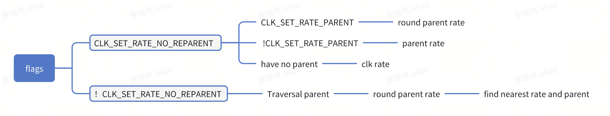

# 时钟框架概述

\[ [English](../../../en/device_dev_guide/power_mgt/Clock.md) | 简体中文 \]

## 一、时钟配置

### 配置选项

以下是时钟配置的相关选项：

```Makefile
CONFIG_CLK=y 
CONFIG_CLK_RPMSG=y //支持跨核控制
```

## 二、时钟框架

### 1、整体架构

以下是时钟框架的主要组成部分及其功能：



中间层：

- 提供统一的时钟控制接口，支持多种时钟类型和硬件适配。

### 2、南向适配层

#### 南向接口实现

时钟南向适配需要实现 `struct clk_ops_s` 接口，以支持以下特性：

| **特性**        | **南向接口**          | **作用**                                             |
| --------------- | --------------------- | ---------------------------------------------------- |
| **clk gate**    | `enable`              | 使能时钟。                                           |
|                 | `disable`             | 关闭时钟。                                           |
|                 | `is_enabled`          | 判断时钟是否使能。                                   |
| **calc rate**   | `recalc_rate`         | 根据父时钟频率计算当前时钟频率。                     |
|                 | `round_rate`          | 根据目标频率，计算合适的频率和父时钟频率。           |
|                 | `determine_rate`      | 根据目标频率，计算最佳频率、最佳父时钟及其频率。     |
| **multiplexer** | `set_parent`          | 设置对应的父时钟。                                   |
|                 | `get_parent`          | 获取当前父时钟。                                     |
| **set rate**    | `set_rate`            | 根据父时钟频率，配置当前时钟频率。                   |
|                 | `set_rate_and_parent` | 根据父时钟频率配置当前时钟频率，并选择对应的父时钟。 |
| **phase**       | `get_phase`           | 获取时钟相位。                                       |
|                 | `set_phase`           | 设置时钟相位。                                       |

- `struct clk_ops_s` 定义

  以下是 `struct clk_ops_s` 的定义及其接口参数：

```C
struct clk_ops_s
{
  CODE int       (*enable)(FAR struct clk_s *clk);
  CODE void      (*disable)(FAR struct clk_s *clk);
  CODE int       (*is_enabled)(FAR struct clk_s *clk);
  CODE uint32_t  (*recalc_rate)(FAR struct clk_s *clk, uint32_t parent_rate);
  CODE uint32_t  (*round_rate)(FAR struct clk_s *clk,
                               uint32_t rate, uint32_t *parent_rate);
  CODE uint32_t  (*determine_rate)(FAR struct clk_s *clk, uint32_t rate,
                                   uint32_t *best_parent_rate,
                                   struct clk_s **best_parent_clk);
  CODE int       (*set_parent)(FAR struct clk_s *clk, uint8_t index);
  CODE uint8_t   (*get_parent)(FAR struct clk_s *clk);
  CODE int       (*set_rate)(FAR struct clk_s *clk, uint32_t rate,
                             uint32_t parent_rate);
  CODE int       (*set_rate_and_parent)(FAR struct clk_s *clk, uint32_t rate,
                                        uint32_t parent_rate,
                                        uint8_t index);
  CODE int       (*get_phase)(FAR struct clk_s *clk);
  CODE int       (*set_phase)(FAR struct clk_s *clk, int degrees);
};
```

- 时钟节点注册接口

  框架提供 `clk_register` 接口，用于注册时钟控制节点。定义如下：

```C
FAR struct clk_s *clk_register(FAR const char *name,
                               FAR const char * const *parent_names,
                               uint8_t num_parents, uint8_t flags,
                               FAR const struct clk_ops_s *ops,
                               FAR void *private_data, size_t private_size)；
```

##### 参数说明

| **参数**     | **说明**           |
| :----------- | :----------------- |
| name         | 时钟单元名称       |
| parent_names | 父时钟单元名称数组 |
| num_parents  | 父时钟单元个数     |
| flags        | 时钟单元属性       |
| ops          | 时钟单元控制接口   |
| private_data | 私有数据           |
| private_size | 私有数据长度       |

##### 注册属性说明

以下是时钟注册时的属性标志及其说明：

| **flag**                  | **属性说明**                                                                          |
| :------------------------ | :------------------------------------------------------------------------------------ |
| CLK_SET_RATE_GATE         | 调用 `clk_set_rate` 设置频率时，需要 gate 当前时钟。                                  |
| CLK_SET_PARENT_GATE       | 调用 `clk_set_parent` 关联非当前父时钟时，需要 gate 当前时钟。                        |
| CLK_SET_RATE_PARENT       | 调用 `clk_set_rate` 设置频率时，可以变更父时钟及其频率。                              |
| CLK_SET_RATE_NO_REPARENT  | 设置频率时，不需要重新变更父时钟。                                                    |
| CLK_GET_RATE_NOCACHE      | 调用 `clk_get_rate` 时根据父时钟频率重新计算频率，否则直接从内存结构获取。            |
| CLK_NAME_IS_STATIC        | 调用 `clk_register` 时，时钟名称为静态内存。                                          |
| CLK_PARENT_NAME_IS_STATIC | 调用 `clk_register` 时，父时钟名称为静态内存。                                        |
| CLK_IS_CRITICAL           | 时钟不允许被关闭。                                                                    |
| CLK_OPS_PARENT_ENABLE     | 调用 `clk_set_parent`、`clk_set_rate`、`clk_enable`、`clk_disable` 时需要使能父时钟。 |

### 3、中间框架层注册接口

#### 3.1 分频器

以下是分频器中间框架的注册接口：

```C
FAR struct clk_s *clk_register_divider(FAR const char *name,
                                       FAR const char *parent_name,
                                       uint8_t flags, uint32_t reg,
                                       uint8_t shift, uint8_t width,
                                       uint16_t clk_divider_flags)
```

- 参数说明

| **参数**          | **说明**                             |
| ----------------- | ------------------------------------ |
| name              | 时钟单元名称                         |
| parent_name       | 父时钟单元名称                       |
| flags             | 时钟单元属性标志                     |
| reg               | 指定操作寄存器地址                   |
| shift             | 配置寄存器的偏移量                   |
| width             | 配置寄存器的宽度                     |
| clk_divider_flags | 分频器属性标志，用于控制分频器的行为 |

- 功能：根据 `reg` 对应位的值对父时钟频率进行分频。

- 属性及计算公式

以下是分频器的属性标志及其计算公式和作用：

| **属性**                      | **计算公式及作用**                                                                              |
| ----------------------------- | ----------------------------------------------------------------------------------------------- |
| **CLK_DIVIDER_ONE_BASED**     | `fout = (fin + val − 1) / val`<br>分频系数从 1 开始，没有该标志时，`val` 从寄存器读出后需加 1。 |
| **CLK_DIVIDER_HIWORD_MASK**   | 高 16 位掩码，对低 16 位修改 `value` 时进行掩码操作，无需回读寄存器即可完成配置。               |
| **CLK_DIVIDER_ROUND_CLOSEST** | 在 `round_rate` 时，寻找最接近目标频率的分频值。                                                |
| **CLK_DIVIDER_READ_ONLY**     | 在 `round_rate` 时，不允许修改寄存器值。                                                        |
| **CLK_DIVIDER_MAX_HALF**      | 计算最大分频系数为掩码值的一半。                                                                |
| **CLK_DIVIDER_DIV_NEED_EVEN** | 分频系数需要为偶数。                                                                            |
| **CLK_DIVIDER_POWER_OF_TWO**  | `fout = (fin + 2^n − 1) / 2^n`<br>分频系数为 2 的 n 次幂。                                      |
| **CLK_DIVIDER_MINDIV_OFF**    | `flags` 中最小除法数的偏移量。                                                                  |
| **CLK_DIVIDER_MINDIV_MSK**    | `flags` 中最小除法数的位掩码。                                                                  |

- `round_rate` 算法流程

以下是分频器 `round_rate` 算法的流程图：


#### 3.2 固定系数调频器

```C
FAR struct clk_s *clk_register_fixed_factor(FAR const char *name,
                                            FAR const char *parent_name,
                                            uint8_t flags, uint8_t mult,
                                            uint8_t div)
```

- 调频公式

  固定系数调频器的输出频率 (fout) 通过以下公式计算：

  `fout = fin * mult / div`
```shell
    fin：父时钟频率。
    mult：倍频因子。
    div：分频因子。
    round_rate 算法
```

- `round_rate` 算法用于计算最接近目标频率的输出频率，具体步骤如下：

  1. 根据目标输出频率 (`fout`) 反推父时钟频率 (`fp`)：

      fp = fout * div / mult

  2. 对父时钟频率 (`fp`) 进行四舍五入，得到最接近的父时钟频率 (`fpbest`)。

  3. 根据最优父时钟频率 (`fpbest`) 计算最优输出频率 (`foutbest`)：

     foutbest = fpbest * mult / div

#### 3.3 固定频率调节器

```C
FAR struct clk_s *clk_register_fixed_rate(FAR const char *name,
                                          FAR const char *parent_name,
                                          uint8_t flags, uint32_t fixed_rate)
```

- fixed_rate：固定输出频率值。

#### 3.4 选通器

```C
FAR struct clk_s *clk_register_gate(FAR const char *name,
                                    FAR const char *parent_name,
                                    uint8_t flags, uint32_t reg,
                                    uint8_t bit_idx,
                                    uint8_t clk_gate_flags)
```

- bit_idx：指定寄存器中用于选通操作的位索引。

#### 3.5 倍频器

```C
FAR struct clk_s *clk_register_multiplier(FAR const char *name,
                                          FAR const char *parent_name,
                                          uint8_t flags, uint32_t reg,
                                          uint8_t shift,
                                          uint8_t width,
                                          uint8_t clk_multiplier_flags)
```

- 参数说明

| 参数  | 说明               |
| ----- | ------------------ |
| reg   | 倍频寄存器地址。   |
| shift | 倍频寄存器偏移量。 |
| width | 倍频寄存器宽度。   |

- 倍频器属性及计算公式

以下是倍频器的属性标志及其计算公式和作用：

| **属性**               | **计算公式及作用**                                                                |
| :--------------------- | :-------------------------------------------------------------------------------- |
| CLK_MULT_ONE_BASED     | fout = fin * val <br> 倍频系数从 1 开始，没有该标志时，val 从寄存器读出后需加 1。 |
| CLK_MULT_ALLOW_ZERO    | 允许倍频系数为 0。                                                                |
| CLK_MULT_HIWORD_MASK   | 高 16 位掩码，对低 16 位修改 value 时进行掩码操作，无需回读寄存器即可完成配置。   |
| CLK_MULT_MAX_HALF      | 计算最大倍频系数为掩码值的一半。                                                  |
| CLK_MULT_ROUND_CLOSEST | 在 round_rate 时，寻找最接近目标频率的倍频值。                                    |

- `round_rate` 算法流程


#### 3.6 多路选择器

```C
FAR struct clk_s *clk_register_mux(FAR const char *name,
                                   const char * const *parent_names,
                                   uint8_t num_parents,
                                   uint8_t flags, uint32_t reg,
                                   uint8_t shift, uint8_t width,
                                   uint8_t clk_mux_flags)
```

- 参数说明

| 参数  | 说明                     |
| ----- | ------------------------ |
| reg   | 多路选择器寄存器地址。   |
| shift | 多路选择器寄存器偏移量。 |
| width | 多路选择器寄存器宽度。   |

功能：根据 `reg` 对应的位选择父时钟频率输出。

- 多路选择器属性说明

| 属性                  | 说明                                                                            |
| --------------------- | ------------------------------------------------------------------------------- |
| CLK_MUX_HIWORD_MASK   | 高 16 位掩码，对低 16 位修改 value 时进行掩码操作，无需回读寄存器即可完成配置。 |
| CLK_MUX_READ_ONLY     | 只支持获取父时钟频率，不支持修改。                                              |
| CLK_MUX_ROUND_CLOSEST | 在 determine_rate 时，寻找最接近目标频率的父时钟频率。                          |

- `determine_rate` 步骤



#### 3.7 相位调节器

```C
FAR struct clk_s *clk_register_phase(FAR const char *name,
                                     FAR const char *parent_name,
                                     uint8_t flags, uint32_t reg,
                                     uint8_t shift, uint8_t width,
                                     uint8_t clk_phase_flags)
```

- 参数说明

| 参数  | 说明                     |
| ----- | ------------------------ |
| reg   | 相位调节器寄存器地址。   |
| shift | 相位调节器寄存器偏移量。 |
| width | 相位调节器寄存器宽度。   |

功能：根据 `reg` 对应的位选择父时钟频率，并进行相位调节。

- 相位调节器属性说明

| **属性**              | **说明**                                                                          |
| :-------------------- | :-------------------------------------------------------------------------------- |
| CLK_PHASE_HIWORD_MASK | 高 16 位掩码，对低 16 位修改 `value` 时进行掩码操作，无需回读寄存器即可完成配置。 |

#### 3.8 分数除法器

```C
FAR struct clk_s *
clk_register_fractional_divider(FAR const char *name,
                                FAR const char *parent_name,
                                uint8_t flags, uint32_t reg,
                                uint8_t mshift, uint8_t mwidth,
                                uint8_t nshift, uint8_t nwidth,
                                uint8_t clk_divider_flags)
```

- 参数说明

| 参数   | 说明                         |
| ------ | ---------------------------- |
| reg    | 分数除法器寄存器地址。       |
| mshift | 分数除法器分母寄存器偏移量。 |
| mwidth | 分数除法器分母寄存器宽度。   |
| nshift | 分数除法器分子寄存器偏移量。 |
| nwidth | 分数除法器分子寄存器宽度。   |

功能：根据 `reg` 对应的位选择父时钟频率，通过分数除法计算输出频率。

- 分数除法器属性及计算公式

| **属性**               | **说明**                                                               |
| :--------------------- | :--------------------------------------------------------------------- |
| CLK_FRAC_DIV_DOUBLE    | 不包含该标志：`fout = fin * m /n` <br>包含该标志：`fout = fin * m /2n` |
| CLK_FRAC_MUL_NEED_EVEN | 在 `round_rate` 时，`m` 值需要是偶数。                                 |

### 4、API接口层

| **API**                 | **功能**                                                                                         |
| :---------------------- | :----------------------------------------------------------------------------------------------- |
| clk_get                 | 从 `g_clk_root_list` 和 `g_clk_orphan_list` 中匹配指定名称的 `clk_s`。                           |
| clk_get_parent          | 获取 `clk_s` 当前关联的父时钟的 `clk_s`。                                                        |
| clk_get_parent_by_index | 获取 `clk_s` 第 `index` 个父时钟对应的 `clk_s`。                                                 |
| clk_set_parent          | 根据父时钟的名称是否与 `clk` 的父时钟名称匹配，来关联父时钟，并根据父时钟频率刷新 `clk` 的频率。 |
| clk_enable              | 使能父时钟，启用 `clk_s`，并增加 `enable_count`。                                                |
| clk_disable             | 减少 `enable_count`，禁用 `clk_s`，并禁用父时钟。                                                |
| clk_is_enabled          | 判断 `clk_s` 是否已启用。                                                                        |
| clk_round_rate          | 根据目标频率计算最合适的频率。                                                                   |
| clk_set_rate            | 设置 `clk` 的频率。                                                                              |
| clk_set_rates           | 批量配置多个 `clk` 的频率。                                                                      |
| clk_get_rate            | 获取 `clk` 当前的频率。                                                                          |
| clk_set_phase           | 配置 `clk` 的相位。                                                                              |
| clk_get_phase           | 获取 `clk` 的相位。                                                                              |
| clk_disable_unused      | 关闭未启用的 `clk`。                                                                             |
| clk_get_name            | 获取 `clk` 的名称。                                                                              |

## 三、调试PROCFS

通过 `/proc/clk` 文件节点，可以查看时钟树的结构关系，以及每个时钟节点的以下信息：

   - enable_cnt：时钟启用计数。
   - rate：时钟频率。
   - phase：时钟相位。


- 示例操作

以下是通过 `cat` 命令查看 `/proc/clk` 文件的示例：

```Bash
ap> cat /proc/clk
   clock                                  enable_cnt        rate       phase
   clk_1000                                         0        1000           0
   clk_2000                                         0        2000           0
ap> 
```

## 四、参考文档

- 异步跨核支持请参见 `rpmsg clk` 相关文档。
