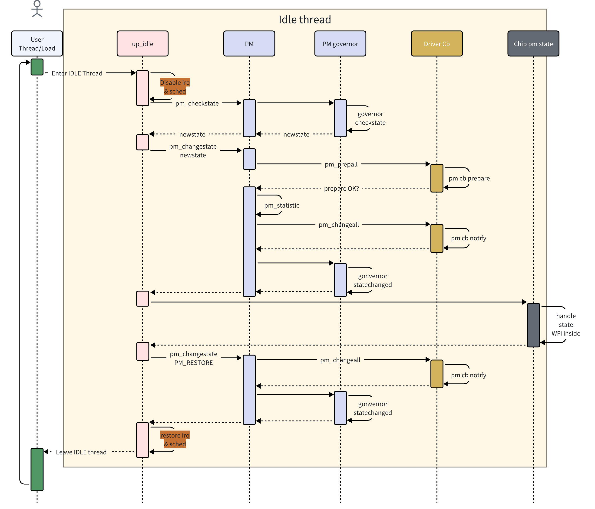
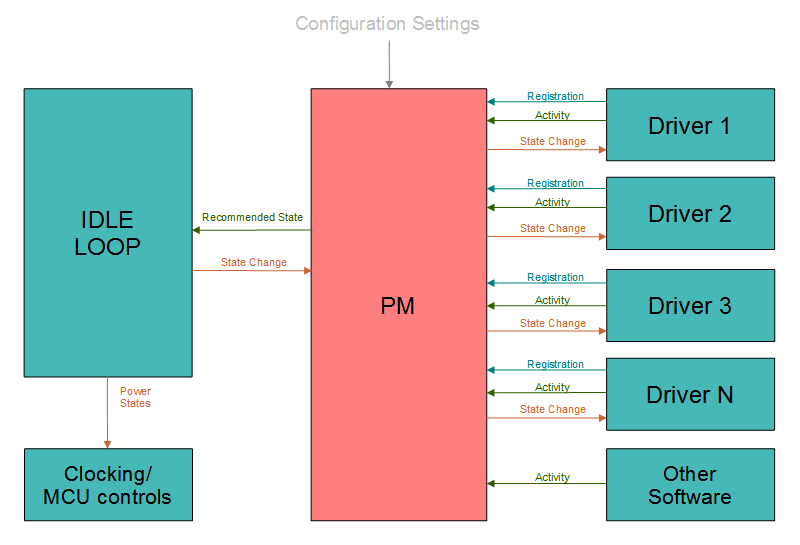
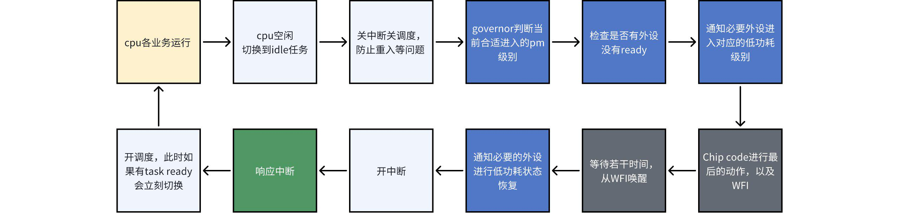

# 电源管理框架指南

\[ [English](../../../en/device_dev_guide/power_mgt/pm_framework_guide.md) | 简体中文 \]

本文档详细介绍了 openvela 电源管理 (Power Management, PM) 框架的核心概念、API 使用方法以及可用的电源管理策略 (Governors)。

**目标读者**：需要为特定硬件平台开发或适配电源管理功能的嵌入式系统开发者。

**相关头文件**：[openvela include/nuttx/power/pm.h](../../../../../../nuttx/blob/dev-ai-contest-2026/include/nuttx/power/pm.h)

## 一、核心概念

在深入了解 API 和配置之前，您需要先理解 PM 框架的三个核心概念：**电源状态**、**电源域**和**决策者**。

### 1、电源状态 (Power States)

openvela PM 框架定义了标准的电源状态，对应到不同的硬件运行状态。在芯片适配过程中，您需要将其映射到芯片的具体硬件运行模式。具体的设备功耗状态取决于芯片的功耗设计。

| **状态 (State)**   | **`enum pm_state_e`** | **核心特征描述**                                                                                                                                                                                                                             |
| :----------------- | :-------------------- | :------------------------------------------------------------------------------------------------------------------------------------------------------------------------------------------------------------------------------------------- |
| **正常 (Normal)**  | `PM_NORMAL`           | 芯片正常运行态。                                                                                                                                                                                                                             |
| **空闲 (Idle)**    | `PM_IDLE`             | 低功耗状态，只要不干扰正常操作，就可以通过一些简单的步骤来降低功耗。<br>比如，在系统空闲，简单地调暗背光；待机是一种低功耗模式，可能涉及更广泛的电源管理步骤，例如禁用时钟或将处理器设置为低功耗模式。<br>系统能够**几乎立即**通过中断唤醒。 |
| **待机 (Standby)** | `PM_STANDBY`          | 比 `Idle` 更深的低功耗状态。<br>可能涉及关闭更多时钟域或外设电源，但内存 (RAM) 仍保持供电（retention）。系统可**快速恢复**。                                                                                                                 |
| **休眠 (Sleep)**   | `PM_SLEEP`            | 低功耗状态，最深层次的低功耗状态。<br>整个芯片进入最底层的低功耗中，应采取尽可能大的功率降低措施。<br>包括但不限于关闭 CPU、外设、甚至部分 RAM 的电源。<br>允许**消耗较长时间**进行恢复到正常的操作（某些 MCU 甚至可能需要进行复位启动）。   |

**内部控制状态**：

- `PM_RESTORE`（枚举值为 -1）是一个内部状态，用于通知注册的外设驱动从低功耗状态中返回，它本身并非一个实际的功耗状态。

**时序图**：



**进一步阅读**：

- [电源管理驱动开发指南](./pm_driver_guide.md)

### 2、电源域 (Power Domains)

电源域 (Domain) 是 PM 框架进行功耗管理的逻辑单元。您可以将多个驱动和模块或者单个驱动和模块，定义成一个专用电源域，从而实现精细化的电源控制。

- **规划**：您需要根据产品业务逻辑以及处理器与外设的依赖关系，来规划电源域的划分。
- **SMP 支持**：在对称多处理 (Symmetric Multi-Processing, SMP) 系统中，您必须为每个 CPU 核心预留一个专用的电源域。

### 3、工作原理与决策者 (Governor)

PM 框架知悉 CPU 进入/退出某个功耗状态的时间数据，联合驱动的活动（`activity`）时间数据，通过时间对比的方式，决策（governor）当前 CPU 的下一个电源管理状态。





## 二、基础配置与初始化

本章节指导您完成 PM 框架的基础配置和初始化流程。

### 1、初始化 PM 框架

在内核启动后、外设驱动初始化之前，您必须调用 `pm_initialize()` 来初始化 PM 框架。

```C
void pm_initialize(void)
```

### 2、配置电源域数量

通过 Kconfig 选项 `CONFIG_PM_NDOMAINS` 来定义系统支持的电源域总数。

```CMake
# 示例：定义3个电源域，其中可能包含CPU域和外设域
CONFIG_PM_NDOMAINS=3
```

### 3、设置特定域的决策者

系统初始化时会为所有域设置一个默认决策者。如果您需要为特定域指定不同的策略，请在 `pm_initialize()` 调用之后立即调用 `pm_set_governor()`。

```C
int pm_set_governor(int domain, FAR const struct pm_governor_s *gov)
```

**示例**：为 `PM_IDLE_DOMAIN` 设置 `stability` 决策者。

```C
void arm_pminitialize(void)
{
    /* 首先初始化 PM 框架 */
    pm_initialize();
  
    /* 为 PM_IDLE_DOMAIN 指定 stability 决策者 */  
    pm_set_governor(PM_IDLE_DOMAIN, pm_stability_governor_initialize());
}
```

## 三、API 参考

本章节详细介绍 PM 框架提供的核心 API。

### 1、回调注册与注销

#### pm_domain_register

注册一个回调结构体，以便在电源状态发生变化时接收通知。所有需要参与功耗管理的驱动或模块都必须调用此接口。

```C
int pm_domain_register(int domain, FAR struct pm_callback_s *cb);

/* 宏定义，用于简化在 PM_IDLE_DOMAIN 上的注册 */
#define pm_register(cb) pm_domain_register(PM_IDLE_DOMAIN, cb)
```

#### pm_domain_unregister

当驱动或模块不再需要接收 PM 通知时，调用此接口注销其回调。

```C
int pm_domain_unregister(int domain, FAR struct pm_callback_s *cb);

/* 宏定义，用于简化在 PM_IDLE_DOMAIN 上的注销 */
#define pm_unregister(cb) pm_domain_unregister(PM_IDLE_DOMAIN, cb)
```

### 2、活动与状态请求

#### pm_activity

通知 PM 框架指定域 (domain) 处于活动状态，从而在一段时间内阻止其进入低功耗模式。

```C
void pm_activity(int domain, int priority)
```

- **`priority`**：表示活动等级。等级越高，阻止系统进入低功耗状态的时间越长。

#### pm_stay

请求 PM 框架将指定域强制保持在某个功耗状态，不允许进入更低功耗的状态，此函数内部维护一个引用计数，允许多次调用。

```C
void pm_stay(int domain, enum pm_state_e state);
```

#### pm_relax

释放一次由 `pm_stay()` 施加的状态维持请求，允许多次调用。**`pm_stay()` 和 `pm_relax()` 必须成对使用。**

```C
void pm_relax(int domain, enum pm_state_e state);
```

#### pm_staytimeout

请求 PM 框架将指定域维持在某个状态一段指定的时间（毫秒），超时后自动释放该请求。

```C
void pm_staytimeout(int domain, enum pm_state_e state, int ms)
```

### 3、唤醒锁 (Wakelock) 管理

Wakelock 提供了一种更结构化的方式来管理状态锁。

#### pm_wakelock_stay

通过一个 `wakelock` 结构体，请求 PM 框架阻止系统进入更低的功耗状态。

```C
void pm_wakelock_stay(FAR struct pm_wakelock_s *wakelock)
```

#### pm_wakelock_relax

释放由 `pm_wakelock_stay()` 施加的唤醒锁。**这两个函数必须成对使用。**

```C
void pm_wakelock_relax(FAR struct pm_wakelock_s *wakelock)
```

**说明**：当启用 `procfs` 文件系统后，您可以在 `pmconfig` 或者对应路径中观察到 `wakelock` 的统计信息。

- **进一步阅读**：[PM wakelock用法](./pm_wakelock_guide.md)

### 4、状态查询

#### pm_staycount

通过该接口可以查询指定域和状态的`pm_stay()` 引用计数值，`pm_stay` 和`pm_relax` 需要成对使用，计数器减到 0 才会释放状态维持。

```C
uint32_t pm_staycount(int domain, enum pm_state_e state)
```

#### pm_querystate

查询指定域当前所处的实际功耗状态。

```C
enum pm_state_e pm_querystate(int domain)
```

### 5、谨慎使用的接口

以下接口会产生系统级影响或可能导致较长延迟，请在充分理解其工作机制后谨慎使用。

#### pm_checkstate

检查某一驱动或者模块当前的推荐状态，并配合 `pm_changestate` 修改至推荐状态，以让其工作在最佳低功耗状态。

```C
enum pm_state_e pm_checkstate(int domain);
```

**警告**：此接口的推荐结果仅基于驱动或者模块状态，并未执行所有已注册的回调检查。例如，它可能无法感知到电池电量过低等外部条件。因此，其推荐结果可能并不总是最优或安全的。

#### pm_changestate

将所有驱动和模块设置为某一功耗状态，使用该函数会先关闭中断，通过回调检测此 domain 内的所有驱动或者模块软件是否准备好可进入 `newstate`：

- 如果均已准备好则开始模式切换。
- 如果没准备好，则终止此次模式切换，回滚至上一个已经确定可以进入的状态，并返回失败。

```C
int pm_changestate(int domain, enum pm_state_e newstate);
```

**警告：**此接口会调用 `pm_register` 中注册的回调函数，可能耗时较长，通常一个 domain 只保留一个调用入口。

例如，`PM_IDLE_DOMAIN` 的状态切换由系统的 Idle 线程统一管理。

- **进一步阅读**：[在 IDLE 线程中实现电源管理](./pm_idle_impl.md)

## 四、电源管理策略

Governor 是 PM 框架的核心，它实现了不同的电源管理策略。openvela 目前支持三种标准的电源管理策略。

### 1、Greedy 策略

- **工作原理**：策略最简单，从可用的（没有被锁定的）功耗级别中，选择最低的功耗级别。

- **适用场景**：适合用在需求较为简单的 domain 中，适配 PM 建议从该策略开始。

- **默认行为**：如果开启了选项，`pm_initialize` 会默认所有 domain 使用该策略。

- **源码参考**：[openvela drivers/power/pm/greedy_governor.c](../../../../../../nuttx/blob/dev-ai-contest-2026/drivers/power/pm/greedy_governor.c)

- **配置选项**：

    ```CMake
    # 启用 PM 子系统
    CONFIG_PM=y
    # 启用 Greedy 策略
    CONFIG_PM_GOVERNOR_GREEDY=y
    ```

### 2、Activity 策略

- **工作原理**：通过综合分析驱动活动时间、进入下一功耗状态的预期时间和退出当前功耗状态的预期时间，来动态决策最合适的功耗状态。

- **适用场景**：适用于需要根据系统负载动态调整功耗的复杂场景。

- **默认行为**：若未启用 `greedy` 决策者但启用了 `activity` 决策者，则后者会成为所有域的默认选择。

- **源码参考**：[openvela drivers/power/pm/activity_governor.c](../../../../../../nuttx/blob/dev-ai-contest-2026/drivers/power/pm/activity_governor.c)

- **说明**：每种时间可配置，通过配置传入进入/退出某个功耗状态的时间数据，所有 domain 都会被配置成同样的数据。

- **决策运行示例**：下图以 M55 CPU 为例，展示了 `activity governor` 如何与驱动交互并进行状态转移。

    

- **配置选项**：

    ```CMake
    # 启用 PM 子系统
    CONFIG_PM=y
    # 启用 Activity 策略
    CONFIG_PM_GOVERNOR_ACTIVITY=y
    
    # 配置各类状态的进入/退出阈值和最小维持时间 (单位: ticks)
    CONFIG_PM_GOVERNOR_IDLEENTER_THRESH
    CONFIG_PM_GOVERNOR_IDLEEXIT_THRESH
    CONFIG_PM_GOVERNOR_IDLEENTER_COUNT
    
    # ... (STANDBY 和 SLEEP 状态的类似配置)
    CONFIG_PM_GOVERNOR_STANDBYENTER_THRESH
    # ...
    ```

### 3、Stability 策略 (防抖动)

- **工作原理**：一种防抖动机制。当系统从低功耗状态唤醒后，它会强制系统在非睡眠状态停留一段时间，以避免因频繁的外部中断而导致系统在唤醒和休眠之间反复切换。

- **适用场景**：适用于唤醒/休眠代价较高的平台，或需要快速连续响应外部中断的场景。

- **最佳实践**：此策略不适合作为全局默认策略。**强烈建议仅在 `PM_IDLE_DOMAIN` 上通过 `pm_set_governor()` 单独应用此策略。**

    ```C
    pm_set_governor(PM_IDLE_DOMAIN, pm_stability_governor_initialize());
    ```

- **源码参考**：[openvela drivers/power/pm/stability_governor.c](../../../../../../nuttx/blob/dev-ai-contest-2026/drivers/power/pm/stability_governor.c)

- **关键实现细节**：当系统从 `SLEEP` 状态唤醒并返回 `IDLE` 时，无法利用 `last_state` 进行 `WFI` 维持时间检测。此时，它会从配置列表中选择一个阈值不为零的最深功耗级别（例如，如果 `SLEEP` 阈值为 0，`STANDBY` 阈值为 10，则会选择 `STANDBY`）作为新的检测基准。

- **决策运行示例：** 下图展示了 `stability` 策略的核心逻辑，即在尝试进入 `PM_SLEEP` 之前，会先检查在 `PM_IDLE` (WFI) 状态的停留时间是否满足阈值。

    

- **配置选项**：

    ```CMake
    # 启用 PM 子系统
    CONFIG_PM=y
    # 启用 Stability 策略
    CONFIG_PM_GOVERNOR_STABILITY=y
    
    # 配置进入各级别前的延迟时间 (单位: ticks)
    # 设置为 0 表示关闭对该状态的延迟检测
    CONFIG_PM_GOVERNOR_STABILITY_IDLE_THRESH
    CONFIG_PM_GOVERNOR_STABILITY_STANDBY_THRESH
    CONFIG_PM_GOVERNOR_STABILITY_SLEEP_THRESH
    ```

## 五、参考资料

- [Apache NuttX 官方文档 - Power Management](https://nuttx.apache.org/docs/10.0.0/components/power.html)
