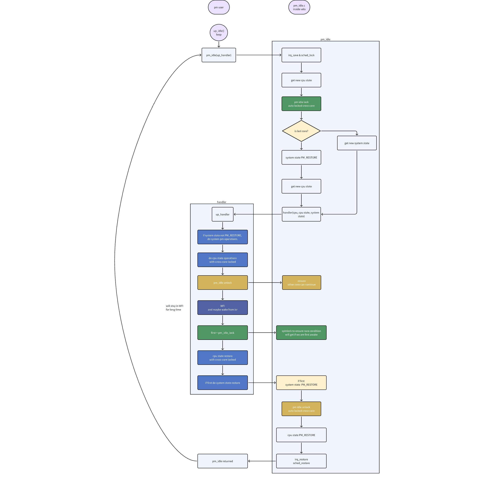

# 使用 pm_idle 标准化 Idle 线程的功耗管理

\[ [English](../../../en/device_dev_guide/power_mgt/pm_idle_guide.md) | 简体中文 \]

## 一、概述

本文档为嵌入式系统开发者提供在 openvela 实时操作系统中，使用 `pm_idle` 接口实现标准化空闲 (Idle) 线程功耗管理的方法。

openvela 提供 `pm_idle` 接口，旨在为**单核** (Uniprocessor, UP) 和**对称多处理** (Symmetric Multiprocessing, SMP) 架构提供统一、标准的 Idle 线程处理流程。该接口封装了复杂的电源状态决策和多核同步逻辑，可显著简化特定于平台的 (Platform-specific) `up_idle` 函数实现，降低开发风险。

**目标读者：** 负责实现或维护平台底层电源管理逻辑的嵌入式软件工程师。

**前置阅读**： 在开始之前，我们强烈建议您首先阅读以下文档，以了解 openvela 电源管理的基础概念：

- [电源管理框架指南](./pm_framework_guide.md)
- [在 IDLE 线程中实现电源管理](./pm_idle_impl.md)

## 二、API 参考

`pm_idle` 接口定义根据系统是否启用 SMP (`CONFIG_SMP`) 而有所不同。

### 1、单核 (UP) 场景

在单核场景下，系统只管理一个全局的电源状态（System State）。开发者仅需提供一个回调函数来响应此状态。

#### 函数指针： `pm_idle_handler_t`

定义一个回调函数，用于处理系统进入不同功耗状态前的操作。

```C
typedef void (*pm_idle_handler_t)(enum pm_state_e systemstate);
```

- `systemstate`： `enum pm_state_e` 类型，表示系统将要进入的目标电源状态，例如 `PM_SLEEP`。

#### 核心函数： `pm_idle`

在系统的 Idle 循环 (`up_idle`) 中调用此函数。它会计算当前系统可进入的最低功耗状态，并调用您提供的 `handler`。

```C
void pm_idle(pm_idle_handler_t handler);
```

- `handler`：`pm_idle_handler_t` 类型的函数指针，指向平台相关的电源状态处理回调函数。

### 2、多核 (SMP) 场景

在 SMP 场景下，每个 CPU Core 拥有独立的电源状态（CPU State），同时整个系统也存在一个共享的电源状态（System State）。`pm_idle` 接口扩展了其功能以协调多核行为。

#### 函数指针： `pm_idle_handler_t`

回调函数的定义增加了 `cpu` 和 `cpustate` 参数，以处理特定核心的状态，并返回一个布尔值，用于标识该核心是否为最后一个唤醒的核心。

```C
typedef bool (*pm_idle_handler_t)(int cpu,
                                  enum pm_state_e cpustate,
                                  enum pm_state_e systemstate);
```

- `cpu`：当前执行此回调函数的 CPU 核心 ID。
- `cpustate`：`enum pm_state_e` 类型，表示当前核心将要进入的电源状态。
- `systemstate`：`enum pm_state_e` 类型，表示当所有核心都进入 Idle 后，系统将进入的共享电源状态。
- 返回值：`bool` 类型。如果当前核心是第一个从 `WFI` 状态唤醒并负责恢复系统级资源的核心，则返回 `true`；否则返回 `false`。

下图展示了 `pm_idle` 如何与平台代码（`chip_idle_...`）和用户回调（`pm_idle_handler_cb`）协作，共同完成一次完整的 SMP Idle 流程。


#### 核心函数： `pm_idle`

与单核版本类似，在每个核心的 Idle 循环中调用。

```C
void pm_idle(pm_idle_handler_t handler);
```

- `handler`：`pm_idle_handler_t` 类型的函数指针，指向平台相关的电源状态处理回调函数。

#### 多核同步接口

在 SMP 场景中，为确保各核心能安全地进入和退出低功耗状态，`pm_idle` 框架内部管理着核心间的同步锁。但在平台相关的回调函数 (`handler`) 中，您必须在精确的时机手动调用 `pm_idle_unlock` 和 `pm_idle_lock` 来配合框架完成同步。

其核心机制是：

1. `pm_idle` 框架在调用您的 `handler` **之前**获取锁。
2. 您的 `handler` 在进入 `WFI` **之前**调用 `pm_idle_unlock()` 释放锁。
3. 您的 `handler` 在从 `WFI` **唤醒后**调用 `pm_idle_lock()` 重新获取锁，并借此判断自己是否为第一个唤醒的核心。
4. `pm_idle` 框架在 `handler` **返回后**最终释放锁。

---

`pm_idle_unlock`

在进入 `WFI` (Wait For Interrupt) 指令**之前**调用。此函数释放核心间的同步锁，允许其他核心继续其 `pm_idle` 流程。调用此函数后，不应再执行任何依赖多核同步的操作（例如访问共享资源）。

```C
void pm_idle_unlock(void);
```

`pm_idle_lock`

在从 `WFI` 指令唤醒**之后**立即调用。此函数重新获取核心间的同步锁，并判断当前核心是否为第一个被唤醒的核心。

```C
bool pm_idle_lock(int cpu);
```

## 三、实现指南

参考[在 IDLE 线程中实现电源管理](./pm_idle_impl.md)的实现，`pm_idle.c` 中将流程进行了标准化，只暴露了 `handler` 作为参考IDLE 线程中 `switch` 部分的处理。

### 1、单核 (UP) 场景实现

在单核系统中，`up_idle` 的实现非常直接。您只需将平台相关的低功耗指令（如 `WFI`）封装在回调函数 `up_pm_idle_handler` 中，并将其传递给 `pm_idle`。

```C
/*
 * 定义平台相关的电源状态处理函数。
 * 在所有支持的低功耗状态下，都执行 WFI 指令使 CPU 等待中断。
 */
static void up_pm_idle_handler(enum pm_state_e state)
{
  switch (state)
    {
      case PM_NORMAL:
      case PM_IDLE:
      case PM_STANDBY:
      case PM_SLEEP:
      default:
        /* 执行让 CPU 进入低功耗等待状态的指令 */
        up_cpu_wfi();
        break;
    }
}

/*
 * 实现 OS 的 Idle 线程主函数。
 * 在循环中调用 pm_idle，将电源管理逻辑委托给 PM 框架。
 */
void up_idle(void)
{
  pm_idle(up_pm_idle_handler);
}
```

### 2、多核 (SMP) 场景实现

在 SMP 系统中，`handler` 的实现更为复杂，因为它必须同时处理 CPU Domain 和 System Domain 的电源状态转换，并正确使用 `lock`/`unlock` 接口进行同步。

#### 工作流程

下图详细展示了 `pm_idle` 在 SMP 场景下的内部逻辑，以及 `pm_idle` 与平台回调函数 `handler` 之间的交互时序。



#### 代码示例

以下示例演示了典型的 SMP `handler` 实现结构，其步骤与上述工作流程图一一对应。

```C
static bool up_pm_idle_handler(int cpu,
                               enum pm_state_e cpu_state,
                               enum pm_state_e system_state)
{
  bool first = false;
  switch (cpu_state)
    {
      case PM_NORMAL:
      case PM_IDLE:
      case PM_STANDBY:
      case PM_SLEEP:

        /*
         * 步骤 1: 执行 CPU Domain 的低功耗准备操作。
         * 例如：关闭该核心的特定时钟或调节其电压。
         * 此时多核同步锁仍被持有。
         */
        /* do cpu domain pm enter operations */
        asm("NOP");


        /* 
         * 步骤 2: 如果系统状态有效，执行System Domain的低功耗准备操作。
         * pm_idle 内部机制确保此部分逻辑通常仅由最后一个进入 idle 的核心执行。
         */
        if (system_state >= PM_NORMAL)
          {
            switch (system_state)
              {
                case PM_NORMAL:
                case PM_IDLE:
                case PM_STANDBY:
                case PM_SLEEP:

                  /* do system domain pm enter operations */

                  asm("NOP");

                  break;
                default:
                  break;
              }
          }

        /*
         * 步骤 3: 释放多核同步锁，准备进入 WFI。
         * 此后不能再执行需要多核同步的操作。
         */
        pm_idle_unlock();

        /*
         * 步骤 4: 执行 WFI 指令，CPU 将在此处暂停，直到中断发生。
         */
        up_cpu_wfi();
        
        /*
         * 步骤 5: 从 WFI 唤醒后，立即获取多核同步锁。
         * 函数返回 true 表示本核心是第一个唤醒的。
         */
        first = pm_idle_lock(cpu);
        
        /*
         * 步骤 6: 如果是第一个唤醒的核心，执行恢复系统级共享资源的操作。
         *
         */
        if (first)
          {
            /* do system domain pm leave operations */

            asm("NOP");
          }

        /*
         * 步骤 7: 执行 CPU 域的恢复操作。
         * 此时多核同步锁已重新持有。
         */
        /* do cpu domain pm leave operations */

        asm("NOP");

        break;
      default:
        break;
    }

  /* 返回唤醒状态，通知 pm_idle 框架本核心是否为第一个唤醒者 */
  return first;
}

void up_idle(void)
{
  pm_idle(up_pm_idle_handler);
}
```

## 四、驱动适配指南

当驱动程序需要响应电源状态变化时，您需要将其回调函数注册到正确的电源域 (Power Domain)。

### System Domain (`PM_IDLE_DOMAIN`)

- **行为**: `system_state` 的状态变化会通知注册到 `PM_IDLE_DOMAIN` 的驱动。
- **兼容性**: 为了与单核用法保持兼容，标准的 `pm_register` 和 `pm_unregister` 接口默认将回调注册到此域。
- **用途**：适用于需要响应系统级（所有核心共享的）电源状态变化的驱动，例如操作主内存控制器或共享总线。

**注意**：如果您希望驱动回调 (`struct pm_callback_s`) 能接收来自其他特定域的状态变化通知，必须使用 `pm_domain_register` / `pm_domain_unregister` 接口，并明确指定 `domain` ID。

### CPU Domain

- **行为**: 如果驱动程序或其控制的硬件与某个特定的 CPU Core 强相关，您应将其注册到该核心对应的 CPU Domain。

- **获取 Domain ID**: 使用 `PM_SMP_CPU_DOMAIN(cpu)` 宏来获取指定核心的 Domain ID。

    ```C
    #  define PM_SMP_CPU_DOMAIN(cpu) (CONFIG_PM_NDOMAINS - CONFIG_SMP_NCPUS + (cpu))
    
    /* 获取当前核心的 Domain ID */
    int domain = PM_SMP_CPU_DOMAIN(this_cpu());
    
    /* 使用 domain ID 注册回调 */
    pm_domain_register(domain, &my_driver_pm_cb);
    ```

- **用途**: 适用于管理仅由单个核心使用的外设，例如核心私有的定时器 (per-core timer) 或中断控制器。
