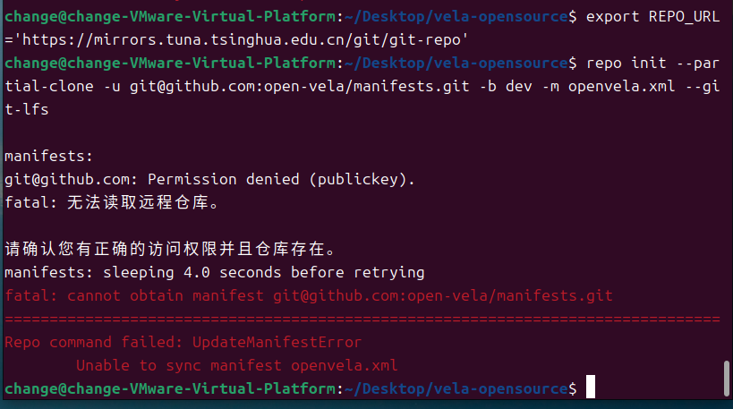
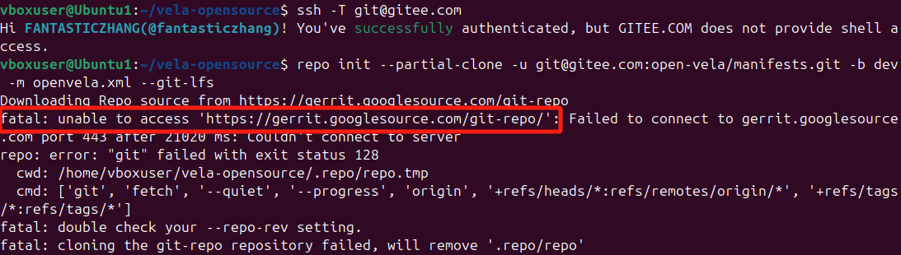
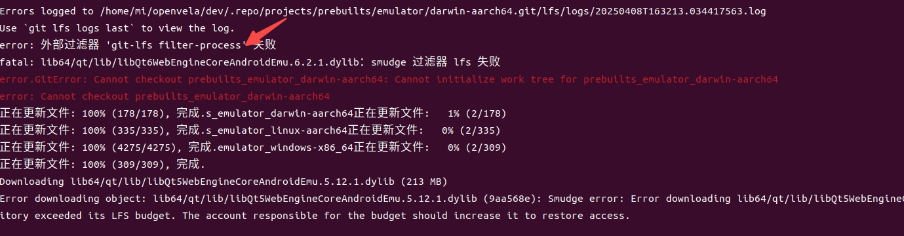
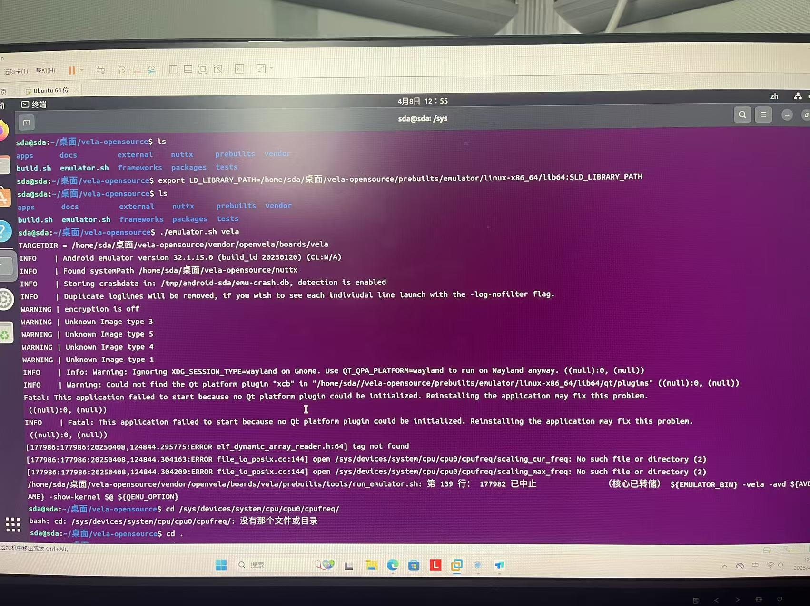

# 快速入门常见问题

\[ [English](./../../en/faq/QuickStart_FAQ.md) | 简体中文 \]

## 1、无法读取远程仓库

### 问题描述

初始化 openvela 仓库时出现以下错误：

```Bash
repo init --partial-clone -u git@gitee.com:open-vela/manifests.git -b dev-ai-contest-2026 -m openvela.xml --git-lfs
```



### 原因分析

**未正确设置 SSH 公钥**，导致无法通过 SSH 协议访问 Gitee 或 GitHub 远程仓库。

### 解决方案

参考官方文档完成 SSH 公钥的生成和配置：

- [GitHub](https://docs.github.com/zh/authentication/connecting-to-github-with-ssh/adding-a-new-ssh-key-to-your-github-account)
- [Gitee](https://gitee.com/help/articles/4191#article-header0)

## 2、无法访问 Google 源代码仓库

### 问题描述

运行 repo 初始化命令时，出现以下错误：

```Bash
fatal: unable to access 'https://gerrit.googlesource.com/git-repo/': Failed to connect to gerrit.googlesource.com
```



### 问题原因

网络限制、镜像源区域限制或 DNS 解析问题导致无法访问 Google 的代码仓库。

### 解决方案

- 永久修改 repo 源：

    ```Shell
    # 查找repo脚本路径
    which repo
    # 例如执行结果为 /usr/bin/repo
    
    # 切换清华源, /usr/bin/repo 换为实际文件路径
    sed -i 's#https://gerrit.googlesource.com/git-repo#https://mirrors.tuna.tsinghua.edu.cn/git/git-repo#' /usr/bin/repo
    
    # 或切换到中科大源(备用，如果清华源出现不稳定情况可以替换)，/usr/bin/repo 换为实际文件路径
    sed -i 's#https://gerrit.googlesource.com/git-repo#https://mirrors.ustc.edu.cn/aosp/git-repo#' /usr/bin/repo
    ```

- 临时修改 repo 源：

    ```Shell
    # 清华源
    repo init xxxxxx  --repo-url=https://mirrors.tuna.tsinghua.edu.cn/git/git-repo
    
    # 中科大源(备用)
    repo init xxxxxx  --repo-url=https://mirrors.ustc.edu.cn/aosp/git-repo
    ```

## 3、repo sync 因网络中断失败

### 问题描述

执行 `repo sync` 命令时中断，出现 `fatal: early EOF` 错误。


### 问题原因

- **SSH** 协议在网络波动时稳定性不足。
- 大文件传输超时。

### 解决方案

切换为 **HTTPS** 协议进行下载。

- Github：

    ```Bash
    repo init --partial-clone -u https://github.com/open-vela/manifests.git -b dev-ai-contest-2026 -m openvela.xml --git-lfs
    
    
    # Install Git LFS (Large File Storage) for managing large files
    sudo apt install git-lfs
    cd .repo/manifests 
    git lfs install
    git lfs --version
    cd ../../
    ```

- Gitee：

    ```Bash
    repo init --partial-clone -u https://gitee.com/open-vela/manifests.git -b dev-ai-contest-2026 -m openvela.xml --git-lfs
    
    
    # Install Git LFS (Large File Storage) for managing large files
    sudo apt install git-lfs
    cd .repo/manifests 
    git lfs install
    git lfs --version
    cd ../../
    ```

## 4、内存不足导致代码拉取失败

### 问题描述

代码同步过程中终端被终止，查看 `/var/log/syslog` 发现 OOM 相关日志。


### 问题原因

- 在 Ubuntu 22.04 及以上版本中，当内存使用率超过 50% 且持续 20 秒以上，且该内存无法被回收时，`systemd-oomd` 进程会终止占用大量内存的进程。

- 物理内存低于 16GB。

### 解决方案

1. 暂时关闭 systemd-oomd 守护进程：

    ```Shell
    sudo systemctl stop systemd-oomd systemd-oomd.socket
    sudo systemctl status systemd-oomd
    ```

2. 下载完成后重新启用守护进程：

    ```Shell
    sudo systemctl start systemd-oomd systemd-oomd.socket
    sudo systemctl status systemd-oomd
    ```

## 5、Git LFS 文件下载异常

### 问题描述

首次编译时出现大文件相关错误：



### 问题原因

该问题通常由 Git 大文件存储（Git LFS）文件未正确下载导致，可能由以下原因引起：

1. 使用的 repo 工具版本过低（低于 v2.10）。
2. 未正确配置 Git LFS 支持。
3. 网络中断导致 LFS 文件下载不完整。

### 解决方案

1. 检查 repo 版本：

    ```Bash
    repo --version
    ```

2. 确认 repo 版本兼容性：

   | **版本号** | **发布日期** | **支持情况**                 |
   | ---------- | ------------ | ---------------------------- |
   | v2.4       | 2021-01      | 实验性支持，部分功能不稳定。 |
   | v2.10      | 2022-03      | 正式支持。                   |
   | v2.22      | 2023-至今    | 默认启用，功能稳定。         |

3. 版本过低时更新 repo：

    如果版本低于 v2.22，请重新安装 repo。

## 6、Qt 平台插件初始化失败

### 问题描述

运行模拟器时出现以下错误：

```Bash
./emulator.sh vela
```

错误提示：

```Bash
No Qt platform plugin could be initialized
```



### 问题原因

源代码路径中包含中文字符，导致工具无法正确解析路径。

### 解决方案

将源码移动到不包含中文字符的目录路径中。

## 7、如何使用 build.sh 编译 NuttX 支持的开发板

以 qemu-armv7a:nsh 为例，提供两种编译方式：

- 使用 `build.sh` 脚本进行编译：

    ```Bash
    # 使用改进的 build.sh 脚本
    ./build.sh qemu-armv7a:nsh -j12
    ```
- 使用 `configure.sh` 脚本进行编译：

     ```Bash
    # 使用 NuttX 自带的配置脚本
    ./tools/configure.sh -l qemu-armv7a:nsh
    make -j12
    ```

`build.sh` 脚本对编译流程进行了优化，操作更简便，建议优先使用。

## 8、repo init 卡住或镜像源返回 404

### 问题描述

执行 `repo init` 时长时间无输出、卡在下载 repo 工具阶段，或使用清华源时报类似如下错误：

```Bash
repo init -u ssh://git@github.com/open-vela/manifests.git -b dev-ai-contest-2026 -m openvela.xml --repo-url=https://mirrors.tuna.tsinghua.edu.cn/git/git-repo/ --git-lfs
```

`.repo/repo.tmp` 长时间为空，或镜像地址返回 HTTP 404。

### 问题原因

`--repo-url` 指定的是下载 **repo 工具本身**（git-repo）的地址，与源码仓库地址无关。镜像站存在临时不可用、路径调整或区域限制时，会导致 repo 工具无法下载，`repo init` 因此卡住。

### 解决方案

按以下顺序排查：

1. 先验证镜像地址是否可访问：

    ```Bash
    curl -sS -o /dev/null -w "%{http_code}\n" https://mirrors.tuna.tsinghua.edu.cn/git/git-repo/
    ```

    返回 `404` 或连接失败说明该镜像当前不可用。

2. 切换到备用镜像（中科大源）：

    ```Bash
    repo init -u ssh://git@github.com/open-vela/manifests.git -b dev-ai-contest-2026 -m openvela.xml --repo-url=https://mirrors.ustc.edu.cn/aosp/git-repo --git-lfs
    ```

3. 若网络可直连，也可去掉 `--repo-url` 使用默认源：

    ```Bash
    repo init -u ssh://git@github.com/open-vela/manifests.git -b dev-ai-contest-2026 -m openvela.xml --git-lfs
    ```

> **说明**：重新 `repo init` 前，如 `.repo` 目录残留不完整内容，可先删除当前目录下的 `.repo` 再重试。

## 9、repo sync 出现大量 administratively prohibited 警告或同步缓慢

### 问题描述

执行 `repo sync` 时输出中频繁出现如下警告，且同步速度明显偏慢：

```Bash
channel 10: open failed: administratively prohibited:
channel 12: open failed: administratively prohibited:
```

### 问题原因

该警告由远程服务器（如 GitHub）对**单条 SSH 连接的并发通道数**做了限制引起。`repo sync` 的并发数（`-j`）较高时，部分通道会被拒绝。**这是非致命警告**，repo 会自动重试，不会导致同步失败，但频繁重试可能拖慢整体速度。

### 解决方案

- 适当降低并发数后重试（加 `-c` 只同步当前分支，传输数据更少、速度更快；`repo sync` 支持增量，可直接重跑）：

    ```Bash
    repo sync -c -j4
    ```

- 若仍不稳定，可进一步降低到 `-j2`。

> **说明**：并发数并非越低越好，网络状况良好时保持默认 `-j8` 通常更快；仅在出现上述警告或同步明显变慢时再调低。
