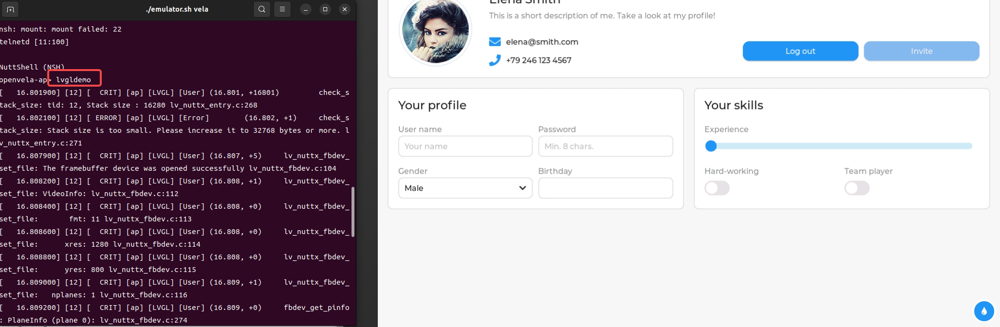

# 在模拟器上运行编译产物

\[ [English](./../../en/quickstart/Run_Vela_on_Vela_Emulator.md) | 简体中文 \]

## 概述

模拟器可在计算机上模拟 openvela 设备，供开发者在各种设备上测试应用程序和驱动程序，而无需拥有实体设备。

模拟器基于 Android 模拟器进行了改进和增强。
具备以下优势：

* 用于加载并运行 openvela 镜像的专属运行模式，能够跳过针对 Android 的特殊操作
* 在 openvela 模式加载 openvela 自有内核
* 在 openvela 模式加载 openvela 自有系统分区
* 为 `GNSS` 仿真器提供 `NMEA` 校验支持

支持下列 Host：

* Linux x86\_64
* Linux arm64
* macOS x86\_64
* macOS aarch64
* Windows x64

支持下列 Target：

* arm
* arm64
* x86
* x86\_64

已经在 openvela 中实现了下列 goldfish 专有驱动程序：

* Qemu Pipe
* ADB
* Battery
* Camera
* GNSS
* Graphic
* Sensors

## 运行模拟器

1. 切换到 openvela 仓库根目录下，通过传递 `vela` 选项至 emulator.sh 来启动一个模拟器实例。

    ```Bash
    ./emulator.sh vela
    ```

2. 启动进入 `nsh` 后，在 `openvela-ap>` 内运行如下命令：

    ```Bash
    lvgldemo &
    ```

    执行后效果如下：
    

3. 退出模拟器实例，如下图所示：

    

## 控制模拟器

可以通过 ADB 或控制台对运行中的模拟器实例进行控制。

* [ADB 命令](../debugging_tools/emulator/Android_Debug_Bridge_commands_zh-cn.md)
* [发送模拟器控制台命令](../debugging_tools/emulator/Send_emulator_console_commands_zh-cn.md)

## 使用模拟器调试

* [使用模拟器调试](../debugging_tools/emulator/Debugging_Vela_with_Vela_Emulator_zh-cn.md)
