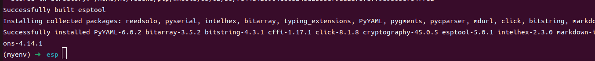
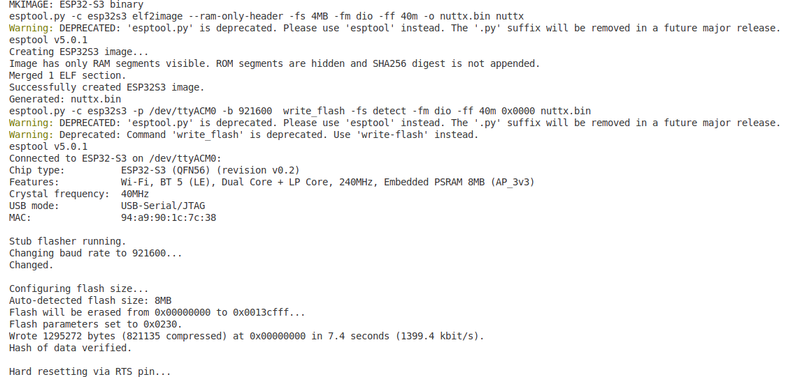
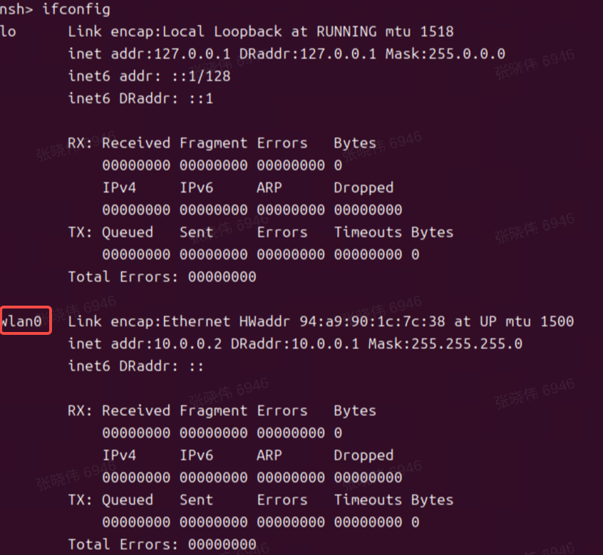

# 在 ESP32-S3-EYE 开发板上移植 openvela 并启用 Wi-Fi 功能

\[ [English](../../../en/quickstart/development_board/ESP32-S3-EYE.md) | 简体中文 \]

## 一、概述

本指南详细介绍如何在乐鑫（Espressif）的 ESP32-S3-EYE 开发板上完成 `openvela` 系统的移植工作，并重点启用其板载 Wi-Fi 功能。

**目标读者**： 熟悉 `openvela` 和嵌入式开发流程的工程师。

**最终目标**： 成功编译并烧录一个支持 Wi-Fi 的 `openvela` 固件到 ESP32-S3-EYE 开发板，并通过 NuttShell (NSH) 命令行验证网络接口。

## 二、前提条件

下载源码，请参见[快速入门](./../openvela_ubuntu_quick_start.md)。

## 三、准备工作：搭建 ESP32-S3 开发环境

您需要为 ESP32-S3 芯片准备专用的交叉编译工具链和烧录工具。

### 1、安装 ESP32-S3 工具链

1. 下载工具链： 执行以下命令，下载 Xtensa 架构的交叉编译工具链。

    ```Bash
    curl -L -O --progress-bar "https://github.com/espressif/crosstool-NG/releases/download/esp-12.2.0_20230208/xtensa-esp32s3-elf-12.2.0_20230208-x86_64-linux-gnu.tar.xz"
      ```

    

2. 解压工具链： 将下载的压缩包解压到您选择的安装目录（例如 `/opt`）。

    ```Bash
    tar -xf xtensa-esp32s3-elf-12.2.0_20230208-x86_64-linux-gnu.tar.xz -C /opt/
    ```

3. 配置环境变量： 将工具链的 `bin` 目录添加到系统的 `PATH` 环境变量中，以便系统能找到编译器。

    ```Bash
    export PATH="/opt/xtensa-esp32s3-elf/bin:$PATH"
    ```

    > **说明：** 为使配置永久生效，请将上述 `export` 命令添加到您的 `~/.bashrc` 或 `~/.zshrc` 文件中，并执行 `source ~/.bashrc`。

4. 验证安装： 执行以下命令，如果能正确显示工具链版本，则表示安装成功。

    ```Bash
    xtensa-esp32s3-elf-gcc -v
    ```

    

### 2、安装 esptool

`esptool` 是用于向 Espressif 芯片烧录固件的关键工具。我们强烈建议在 Python 虚拟环境中安装它，以避免与系统其他 Python 包产生冲突。

1. 创建并激活虚拟环境：

    ```Bash
    apt install python3.10-venv
    
    python3 -m venv myenv
    source myenv/bin/activate
    ```

    成功激活后，您的命令行提示符前会显示 `(myenv)`。

    

2. 在虚拟环境中安装 esptool：

    ```Bash
    pip install esptool
    ```

    > **注意：** 后续所有编译和烧录操作，都应在此已激活的 `(myenv)` 环境中执行。

    

## 三、移植与编译

本章节指导您如何创建板级配置文件并编译固件。

### 1、理解 `esp32s3-eye` 板级代码结构

在进行配置之前，请先熟悉 `esp32s3-eye` 的板级支持包（BSP）[目录结构](../../../../../../nuttx/tree/dev-ai-contest-2026/boards/xtensa/esp32s3/esp32s3-eye)。这有助于您理解各个文件的作用。

```bash
esp32s3-eye/
├── configs/                 # 板级功能配置中心，包含不同功能的 defconfig
│   ├── gpio/        
│   │      └── defconfig     # GPIO引脚功能映射（如按键/LED/传感器控制）
│   ├── i2c/           
│   │      └── defconfig     # I2C总线参数（速率/设备地址/中断配置）
│   ├── lcd/         
│   │      └── defconfig     # 显示屏接口协议（SPI/I2C）、分辨率、时序参数  
│   ├── nsh/         
│   │      └── defconfig     # NuttShell(NSH)交互环境配置（串口终端/启动脚本）
│   ├── usbhsh/      
│   │       └── defconfig    # USB Host协议栈配置（外设驱动支持）  
│   └── wifi/        
│           └── defconfig    # Wi-Fi/BLE无线协议参数（SSID/加密方式/射频校准）
├── include/                 # 板级硬件抽象层头文件
│   └── board.h              # 定义内存布局、时钟、外设基地址等
├── scripts/                 # 构建系统脚本
│   └── Make.defs            # 定义交叉编译器、编译选项等
└── src/                     # 板级驱动源码和功能初始化代码
    └── Kconfig              # Kconfig菜单配置项，用于menuconfig
```

### 2、创建自定义板级配置文件

您需要在 `vendor` 目录下为您的项目创建一套独立的板级配置。

1. 创建目录结构。 执行以下命令，创建所需的目录。`-p` 参数可以确保父目录也一并被创建。

    ```Bash
    mkdir -p vendor/espressif/boards/esp32s3/esp32s3-eye/configs/openvela
    ```

2. 添加 Wi-Fi 配置文件。 在刚创建的 `openvela` 目录下，新建一个名为 `defconfig` 的文件。此文件包含了启用 Wi-Fi 功能所需的所有 openvela 配置项。

3. 将 [附录 A: Wi-Fi 功能 defconfig](#附录-a-wi-fi-功能-defconfig) 中的全部内容复制并粘贴到 `vendor/espressif/boards/esp32s3/esp32s3-eye/configs/openvela/defconfig` 文件中。

### 3、执行编译

现在，使用 `build.sh` 脚本，并指定我们刚刚创建的 `defconfig` 路径来编译 `openvela`。

```Bash
# 确保您仍处于 (myenv) 虚拟环境中
rm nuttx/.config
rm nuttx/Make.defs

./build.sh vendor/espressif/boards/esp32s3/esp32s3-eye/configs/openvela/ -j8
```


## 四、烧录与验证

编译成功后，将生成的固件烧录到开发板并验证功能。

### 1、烧录固件

1. 连接开发板：

    使用 USB 线将 ESP32-S3-EYE 开发板连接到您的计算机。

2. 确定串口设备号：

    执行 `ls /dev/ttyACM*` 或 `dmesg` 命令，查找开发板对应的串口设备号，通常为 `/dev/ttyACM0`。

3. 执行烧录命令：

    在 `nuttx` 目录下，执行 `make flash` 命令。请将 `ESPTOOL_PORT` 替换为您实际的串口设备号。

    ```Bash
    # 确保您仍处于 (myenv) 虚拟环境中
    # 进入 nuttx 源码目录
    cd nuttx
    
    make -j$(nproc) flash ESPTOOL_PORT=/dev/ttyACM0 ESPTOOL_BINDIR=./
    ```

    

### 2、验证 Wi-Fi 功能

1. 打开串口终端： 使用 `minicom` 或其他串口工具连接到开发板，波特率通常为 115200。

    ```Bash
    sudo minicom -D /dev/ttyACM0
    ```

2. 检查网络接口： 系统启动后，您将看到 NSH 的命令行提示符 `nsh>`。输入 `ifconfig` 命令并按回车。

    

    **验证点：** 如果您在输出中能看到 `wlan0` 网络接口，如上图所示，即表明 Wi-Fi 驱动已成功加载，移植成功。

## 五、总结

本指南通过配置 ESP32-S3 工具链、创建并应用 `defconfig` 文件，成功地将 `openvela` 移植到了 ESP32-S3-EYE 开发板并启用了 Wi-Fi 功能。核心工作在于正确配置编译环境和提供一个包含完整网络协议栈及驱动的 `defconfig`。

## 六、参考文档

- [esp32s3-eye](../../../../../../nuttx/tree/dev-ai-contest-2026/boards/xtensa/esp32s3/esp32s3-eye)
- [defconfig](../../../../../../vendor_espressif/blob/dev-ai-contest-2026/boards/esp32s3/esp32s3-eye/configs/openvela/defconfig)
- [Managing esptool on virtual environment](https://nuttx.apache.org/docs/latest/platforms/xtensa/esp32s3/index.html#managing-esptool-on-virtual-environment)

## 附录 A: Wi-Fi 功能 defconfig

```Bash
#
# This file is autogenerated: PLEASE DO NOT EDIT IT.
#
# You can use "make menuconfig" to make any modifications to the installed .config file.
# You can then do "make savedefconfig" to generate a new defconfig file that includes your
# modifications.
#
# CONFIG_ARCH_LEDS is not set
# CONFIG_NSH_ARGCAT is not set
# CONFIG_NSH_CMDOPT_HEXDUMP is not set
CONFIG_ARCH="xtensa"
CONFIG_ARCH_BOARD="esp32s3-eye"
CONFIG_ARCH_BOARD_COMMON=y
CONFIG_ARCH_BOARD_ESP32S3_EYE=y
CONFIG_ARCH_CHIP="esp32s3"
CONFIG_ARCH_CHIP_ESP32S3=y
CONFIG_ARCH_CHIP_ESP32S3WROOM1N4=y
CONFIG_ARCH_INTERRUPTSTACK=2048
CONFIG_ARCH_STACKDUMP=y
CONFIG_ARCH_XTENSA=y
CONFIG_BOARD_LOOPSPERMSEC=16717
CONFIG_BUILTIN=y
CONFIG_DEBUG_FULLOPT=y
CONFIG_DEBUG_SYMBOLS=y
CONFIG_DEFAULT_TASK_STACKSIZE=4096
CONFIG_DEV_ZERO=y
CONFIG_DRIVERS_IEEE80211=y
CONFIG_DRIVERS_VIDEO=y
CONFIG_DRIVERS_WIRELESS=y
CONFIG_ESP32S3_EYE_LCD=y
CONFIG_ESP32S3_GPIO_IRQ=y
CONFIG_ESP32S3_RT_TIMER_TASK_STACK_SIZE=4096
CONFIG_ESP32S3_SPI2_CLKPIN=21
CONFIG_ESP32S3_SPI2_CSPIN=44
CONFIG_ESP32S3_SPI2_MISOPIN=1
CONFIG_ESP32S3_SPI2_MOSIPIN=47
CONFIG_ESP32S3_SPIRAM=y
CONFIG_ESP32S3_SPIRAM_MODE_OCT=y
CONFIG_ESP32S3_USBSERIAL=y
CONFIG_ESP32S3_WIFI=y
CONFIG_EXAMPLES_FB=y
CONFIG_EXAMPLES_LVGLDEMO=y
CONFIG_EXAMPLES_RANDOM=y
CONFIG_FS_PROCFS=y
CONFIG_GRAPHICS_LVGL=y
CONFIG_HAVE_CXXINITIALIZE=y
CONFIG_IDLETHREAD_STACKSIZE=3072
CONFIG_INIT_ENTRYPOINT="nsh_main"
CONFIG_INIT_STACKSIZE=3072
CONFIG_INTELHEX_BINARY=y
CONFIG_IOB_NBUFFERS=124
CONFIG_IOB_THROTTLE=24
CONFIG_LCD_FRAMEBUFFER=y
CONFIG_LCD_PORTRAIT=y
CONFIG_LCD_ST7789_BGR=y
CONFIG_LCD_ST7789_FREQUENCY=40000000
CONFIG_LCD_ST7789_YRES=240
CONFIG_LIBYUV=y
CONFIG_LINE_MAX=64
CONFIG_LV_FONT_MONTSERRAT_20=y
CONFIG_LV_NUTTX_LCD_DOUBLE_BUFFER=y
CONFIG_LV_USE_CLIB_MALLOC=y
CONFIG_LV_USE_CLIB_SPRINTF=y
CONFIG_LV_USE_CLIB_STRING=y
CONFIG_LV_USE_DEMO_WIDGETS=y
CONFIG_LV_USE_LOG=y
CONFIG_LV_USE_NUTTX=y
CONFIG_LV_USE_NUTTX_LCD=y
CONFIG_LV_USE_NUTTX_TOUCHSCREEN=y
CONFIG_MM_REGIONS=2
CONFIG_NAME_MAX=48
CONFIG_NETDB_BUFSIZE=512
CONFIG_NETDB_DNSCLIENT=y
CONFIG_NETDB_DNSCLIENT_RECV_TIMEOUT=2
CONFIG_NETDB_DNSCLIENT_RETRIES=8
CONFIG_NETDB_DNSSERVER_NOADDR=y
CONFIG_NETDEV_LATEINIT=y
CONFIG_NETDEV_MAX_IPv6_ADDR=4
CONFIG_NETDEV_MULTIPLE_IPv6=y
CONFIG_NETDEV_PHY_IOCTL=y
CONFIG_NETDEV_STATISTICS=y
CONFIG_NETDEV_WIRELESS_IOCTL=y
CONFIG_NETDOWN_NOTIFIER=y
CONFIG_NETLINK_ALLOC_CONNS=1
CONFIG_NETLINK_ROUTE=y
CONFIG_NETUTILS_CJSON=y
CONFIG_NETUTILS_DHCPC_RECV_TIMEOUT_MS=200
CONFIG_NETUTILS_DHCPC_RETRIES=20
CONFIG_NETUTILS_IPERF=y
CONFIG_NET_ALLOC_DEVIF_CALLBACKS=1
CONFIG_NET_ARPTAB_SIZE=48
CONFIG_NET_ARP_IPIN=y
CONFIG_NET_BROADCAST=y
CONFIG_NET_ETH_PKTSIZE=1514
CONFIG_NET_GUARDSIZE=4
CONFIG_NET_ICMP_ALLOC_CONNS=1
CONFIG_NET_ICMP_NPOLLWAITERS=2
CONFIG_NET_ICMP_SOCKET=y
CONFIG_NET_ICMPv6=y
CONFIG_NET_ICMPv6_ALLOC_CONNS=1
CONFIG_NET_ICMPv6_AUTOCONF=y
CONFIG_NET_ICMPv6_NEIGHBOR=y
CONFIG_NET_ICMPv6_SOCKET=y
CONFIG_NET_IPFRAG=y
CONFIG_NET_IPv6=y
CONFIG_NET_LOCAL=y
CONFIG_NET_LOCAL_SCM=y
CONFIG_NET_LOOPBACK=y
CONFIG_NET_NETLINK=y
CONFIG_NET_PKT=y
CONFIG_NET_SEND_BUFSIZE=16384
CONFIG_NET_STATISTICS=y
CONFIG_NET_TCP=y
CONFIG_NET_TCPBACKLOG=y
CONFIG_NET_TCP_ALLOC_CONNS=1
CONFIG_NET_TCP_DELAYED_ACK=y
CONFIG_NET_TCP_NWRBCHAINS=128
CONFIG_NET_TCP_RTO=1
CONFIG_NET_TCP_SELECTIVE_ACK=y
CONFIG_NET_TCP_WAIT_TIMEOUT=0
CONFIG_NET_TCP_WRITE_BUFFERS=y
CONFIG_NET_UDP=y
CONFIG_NET_UDP_ALLOC_CONNS=1
CONFIG_NET_UDP_NOTIFIER=y
CONFIG_NET_UDP_NWRBCHAINS=64
CONFIG_NET_UDP_WRITE_BUFFERS=y
CONFIG_NSH_ARCHINIT=y
CONFIG_NSH_BUILTIN_APPS=y
CONFIG_NSH_FILEIOSIZE=512
CONFIG_NSH_READLINE=y
CONFIG_POSIX_SPAWN_DEFAULT_STACKSIZE=2048
CONFIG_PREALLOC_TIMERS=4
CONFIG_PTHREAD_MUTEX_TYPES=y
CONFIG_RAM_SIZE=114688
CONFIG_RAM_START=0x20000000
CONFIG_RR_INTERVAL=200
CONFIG_SCHED_LPWORK=y
CONFIG_SCHED_WAITPID=y
CONFIG_SIG_DEFAULT=y
CONFIG_SMP=y
CONFIG_SMP_NCPUS=2
CONFIG_START_DAY=6
CONFIG_START_MONTH=12
CONFIG_START_YEAR=2011
CONFIG_SYSLOG_BUFFER=y
CONFIG_SYSTEM_DHCPC_RENEW6=y
CONFIG_SYSTEM_DHCPC_RENEW=y
CONFIG_SYSTEM_NSH=y
CONFIG_SYSTEM_PING=y
CONFIG_SYSTEM_PING_STACKSIZE=3072
CONFIG_SYSTEM_TCPDUMP=y
CONFIG_TIMER=y
CONFIG_TLS_TASK_NELEM=4
CONFIG_UTILS_IPERF2=y
CONFIG_VIDEO=y
CONFIG_VIDEO_FB=y
CONFIG_WIRELESS=y
CONFIG_WIRELESS_WAPI=y
CONFIG_WIRELESS_WAPI_CMDTOOL=y
CONFIG_WIRELESS_WAPI_INITCONF=y
CONFIG_WIRELESS_WAPI_STACKSIZE=8192
```