# 在 STM32H750 上部署 openvela

\[ [English](../../../en/quickstart/development_board/STM32H750.md) | 简体中文 \]

## 一、概述

本文档旨在指导如何在 STMicroelectronics STM32H750 微控制器开发板（STM32H750）上部署 openvela，并基于 openvela 操作系统运行 Light and Versatile Graphics Library（LVGL）图形库的演示程序（Demo）。

## 二、准备工作

### 1、搭建开发环境

1. 配置编译环境：

    编译 openvela 需要配置相关的开发环境，详情请参见[快速入门](./../openvela_ubuntu_quick_start.md)。

2. 安装编译工具：

    ```Bash
    sudo apt install gcc-arm-none-eabi binutils-arm-none-eabi
    ```

3. 软件下载：

    1. 下载安装 STM32CubeProgrammer 工具，该工具用于烧录程序。下载地址为 [STM32CubeProgrammer 官方下载链接](https://www.st.com/en/development-tools/stm32cubeprog.html)。

    2. 安装完成后，执行如下命令安装 libusb，该库用于连接 USB 设备：

        ```Bash
        sudo apt-get install libusb-1.0.0-dev 
        ```

    3. 下载 [stsw-link](https://www.st.com/en/development-tools/stsw-link007.html#get-software) 软件包并解压，解压后可获得相关的驱动文件适配您的平台。根据压缩包中的 `readme.txt` 文件指引完成安装。以下是具体的安装命令：

        ```Bash
        sudo sh st-stlink-udev-rules-xxxx-linux-noarch.sh
        ```

        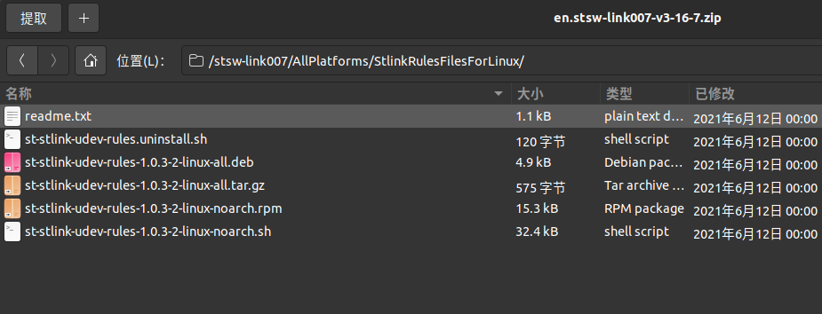

        

    4. 启动后界面如下：

        

### 2、连接开发板

1. 使用 **USB** 数据线将开发板的 **ST-Link** 调试接口连接到上位机，如下图所示：

    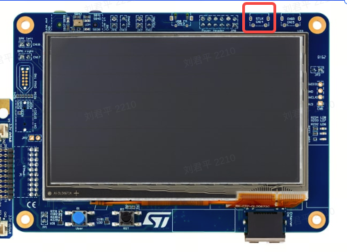

2. 启动 STM32CubeProgrammer，点击红框处**刷新**按钮，如果 **Serial number** 下拉框出现数字序列，表示已成功检测到开发板。

    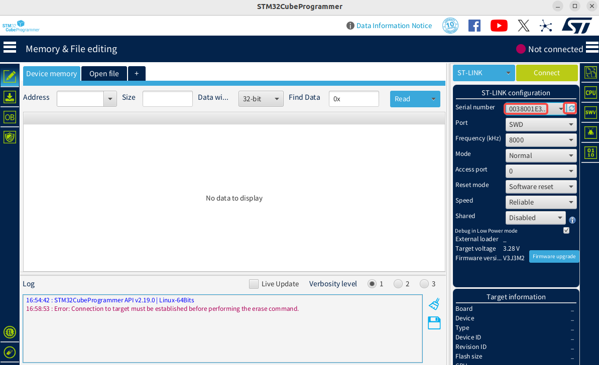

3. 在左侧导航栏选择 **Erasing & Programming**，如下图所示：

    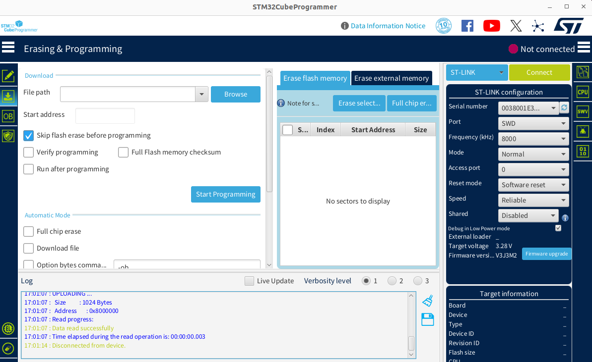

4. 选择 **ST-LINK** 方式，点击绿色 **Connect** 按钮。当按键变为 **Disconnect** 时，表示开发板已成功连接，如下图所示：

    **说明**：**ST-LINK** 的说明文档请参见[官方文档](https://www.st.com/resource/en/technical_note/tn1235-overview-of-stlink-derivatives-stmicroelectronics.pdf)。

    

## 三、运行 Demo

### 1、下载代码

参考[快速入门](../openvela_ubuntu_quick_start.md)完成代码下载。

### 2、编译代码

在完成代码仓库克隆和下载后，按以下流程为 STM32H750B‑DK 开发板生成所需二进制文件：

```Bash
# 进入 nuttx 根目录  
cd nuttx

# 配置开发板环境  
/build.sh stm32h750b-dk:lvgl -j8

# 在运行 make 编译前，可使用 make menuconfig 命令修改配置，确保所需的功能模块已经启用（如示例中的 LVGL Demo）

# 开始编译 
make
```

编译完成后，生成的文件位于 `nuttx` 目录下，包括：

- `nuttx.bin`
- `nuttx.hex`

    

### 3、运行程序

1. 打开上一步安装的 **STM32CubeProgrammer** 工具。

2. 选择需要下载的二进制文件，即上一步编译生成的 `nuttx.hex` 文件，并勾选 **Skip flash erase before programming**，如下图所示：

    

3. 单击 **Start Programming** 按钮开始下载。下载完成后，会弹出提示框，并且日志窗口会输出相关信息。

    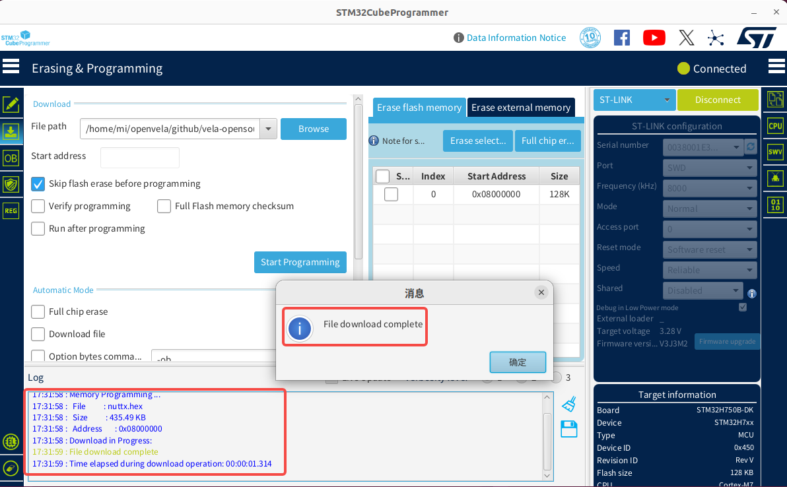

4. 如果下载过程中出现 Error，请单击 **Full chip erase** 按钮擦除芯片数据，然后重新下载固件，即可恢复正常。

    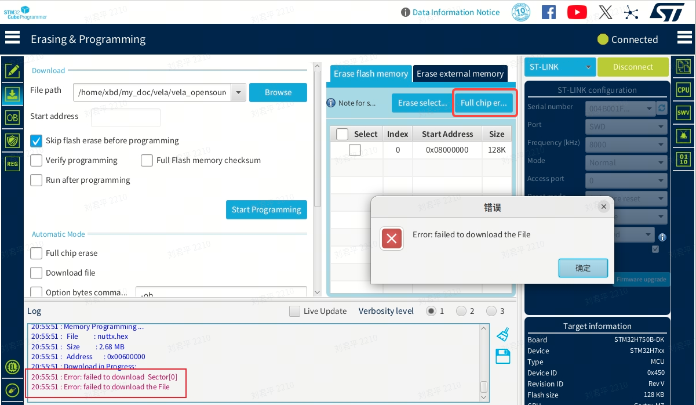

5. 使用串口工具（如 **Minicom** 或 **Tera Term**）连接并访问开发板，以下以 Minicom 为例，使用如下命令：

    ```Bash
    sudo minicom -D /dev/ttyACM0 -b 115200
    ```

6. 在 Minicom 串口终端中执行文件系统查看命令，具体操作如下：

    1. 首次使用 Minicom 的配置事项：如果无法接收键盘输入，请修改 Minicom 的相关配置。

    2. 使用以下命令打开 Minicom 配置界面：

        ```Bash
        sudo minicom -s
        ```

        

    3. 进入 Serial port setup 配置目录，确保以下两项配置值为 No：

        - Hardware Flow Control: No
        - Software Flow Control: No

        

    4. 配置完成后重新打开 Minicom。如果仍无法输入，请尝试按下开发板上的黑色按键，重新上电后再打开 Minicom。

        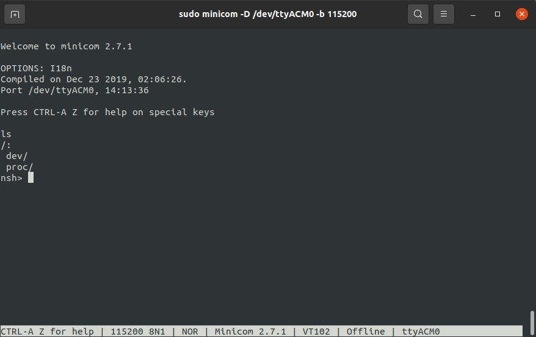

7. 输入以下命令运行示例程序：

     ```Bash
    lvgldemo
    ```

    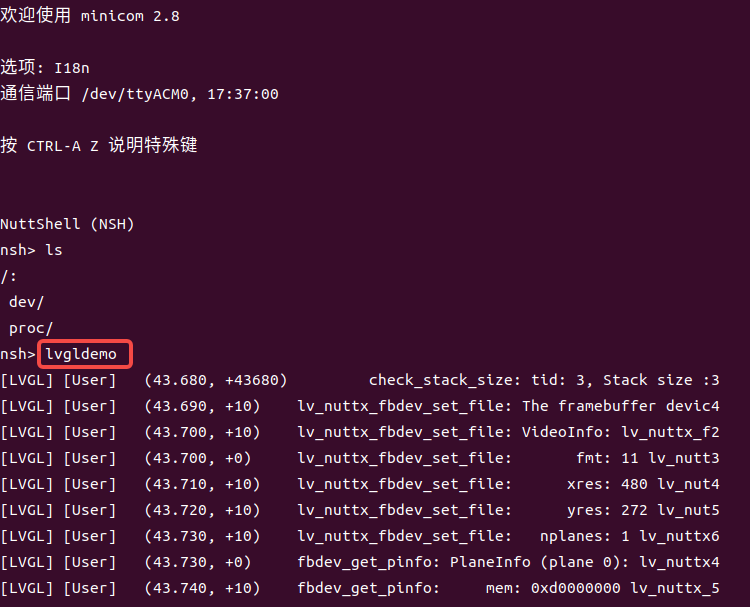

8. 示例程序运行结果如下图所示：

    

## 四、开发板简介

### 1、外观

1. 开发板正面。

    

2. 开发板背面。

    

### 2、主要硬件特性


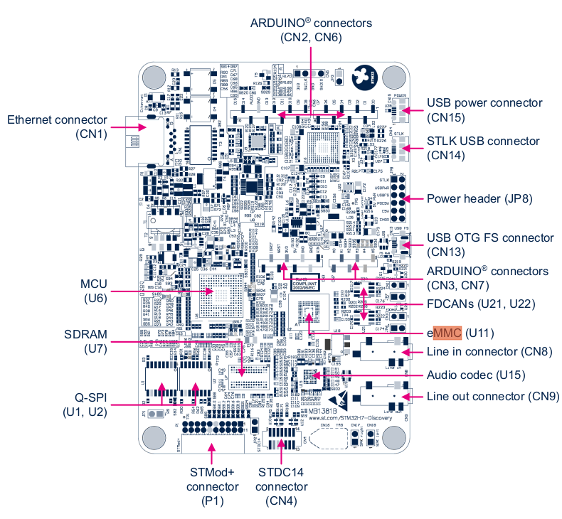

开发板更多详情请参见[官方文档](https://www.st.com.cn/zh/evaluation-tools/stm32h750b-dk.html#documentation)。

## 五、附录

### 1、新建开发板配置文件目录

1. 在 `nuttx/boards/arm/stm32h7` 目录下，为 **STM32H750B-DK** 开发板新建以下配置文件结构，以支持 openvela 项目的开发需求。

    ```Bash
    nuttx/boards/arm/stm32h7
    └── stm32h750b-dk     // 新建开发板目录
        └── configs
        │   ├── lvgl          // 新建 defconfig 目录
        │   │   └── defconfig // 配置选项
        │   └── nsh           // 其他 defconfig 目录
        │       └── defconfig // 配置选项
        ├── include           // 开发板配置信息
        │   └── board.h
        ├── scripts           // 启动脚本、链接文件
        │   ├── flash.ld
        │   ├── ...
        │   └── flash_m4.ld
        ├── src                 // 开发板资源文件  
        │   ├── stm32h745b-dk.h
        │   ├── ...
        │   └── stm32_boot.c
        ├── CMakeLists.txt      // CMake 配置文件
        └── Kconfig             // 内核配置文件
    ```

    确保 **configs** 目录中包含基于 **lvgl** 的 `defconfig` 文件以应用相关配置选项。

2. 液晶显示控制器（LCDC, LCD Controller）引脚配置调整。

    为了确保屏幕正常显示，需要根据 STM32H750B-DK 开发板的硬件信息，调整液晶显示控制器的引脚配置，使其与实际硬件设置保持一致。引脚映射修改步骤如下：

    1. 根据开发板[用户手册](https://www.st.com/resource/en/user_manual/um2488-discovery-kits-with-stm32h745xi-and-stm32h750xb-mcus-stmicroelectronics.pdf)和[设备引脚图说明](https://www.st.com/resource/en/schematic_pack/mb1381-h750xb-b01-schematic.pdf)，查找 LCD Connector 各个信号与芯片引脚的对应关系。

        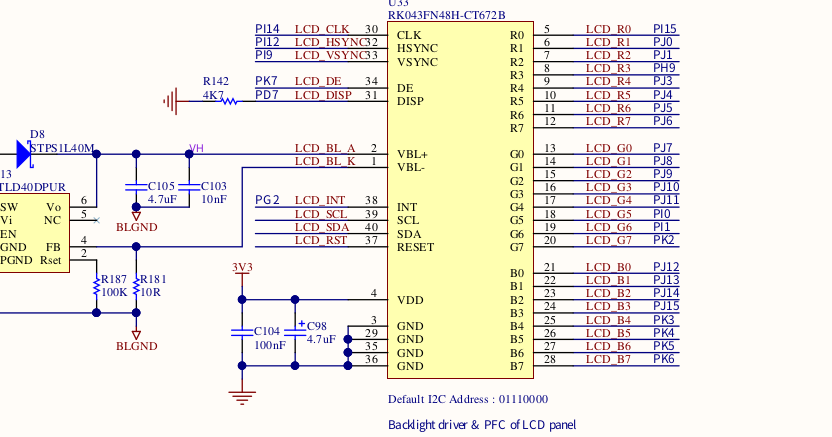

    2. 以 LCD panel 的 R3（红色数据位 3）为例：

        1. R3 信号连接到 STM32H750 芯片的 PH9 引脚。
        2. 在 `stm32h7xxx_pinmap.h` 文件中，`GPIO_PORTH` 与 `GPIO_PIN9` 组合为宏定义 `GPIO_LTDC_R3_1`。

            

    3. 修改当前编译配置所包含的 `board.h` 文件，将 `GPIO_LTDC_R3` 的定义更改为：

        ```C
        #define GPIO_LTDC_R3  GPIO_LTDC_R3_1 | GPIO_SPEED_XXXX
        ```

        其中，请根据实际硬件需求设置 `GPIO_SPEED_XXXX`。

    4. 其余相关信号引脚请按上述方法进行调整，确保所有引脚定义与硬件设计一致。

### 2、启用双缓冲绘制模式

开发板默认采用单缓冲显示模式，易导致屏幕在滑动时出现抖动。请按以下步骤配置双缓冲显示模式，以提升显示效果和用户体验。

#### 2.1 配置 SDRAM 以支持双缓冲模式

1. 根据屏幕大小计算双缓冲模式的 RAM 需求。

   以 480 × 272 分辨率和 16 位（2 字节）色深为例，双缓冲方式需两帧缓冲区：

    ```Plain
    // 屏幕宽 * 屏幕高 * 颜色深度/8 * buff数
    480 * 272 * 2 * 2 = 522240 Bytes
    ```

    > **注意**
    >
    > 开发板内部的静态随机存取存储器（SRAM，Static Random Access Memory）容量不足，需使用外部同步动态随机存取存储器（SDRAM， Synchronous Dynamic Random Access Memory）。

2. 配置 SDRAM 地址映射。

    ​根据 STM32H750B-DK 开发板的[用户手册](https://www.st.com/resource/en/user_manual/um2488-discovery-kits-with-stm32h745xi-and-stm32h750xb-mcus-stmicroelectronics.pdf)和[编程手册](https://www.st.com/resource/en/programming_manual/pm0253-stm32f7-series-and-stm32h7-series-cortexm7-processor-programming-manual-stmicroelectronics.pdf)，完成 SDRAM 地址映射的配置。

    1. 确认 SDRAM 管理方式。

        根据用户手册，SDRAM 由灵活内存控制器（FMC, Flexible Memory Controller）进行管理。

        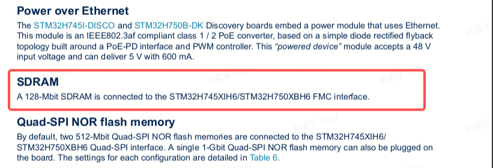

    2. 查阅地址映射信息。

        在编程手册的 FMC 章节，查找外部设备的地址映射图：

        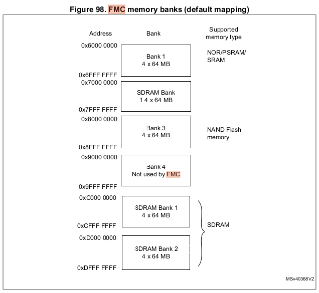

    3. 选择 Bank 并配置地址。

        开发板配备 128 MB SDRAM，由两块 64 MB Bank 组成。任选其中一块，记录起始地址作为基地址，并在链接脚本中声明。

    4. 编辑链接脚本。

        打开 `nuttx/boards/arm/stm32h7/stm32h750b-dk/scripts/flash.ld`，添加 SDRAM 地址声明。示例配置如下：

        ```Plain
        /* 配置 SDRAM 区域 */
        sdram (rw) : ORIGIN = 0xD0000000, LENGTH = 8M
        ```

        

        - `ORIGIN`：SDRAM 起始地址。
        - `LENGTH`：配置所需容量值，请确保不超出 SDRAM 实际映射终止地址。

#### 2.2 配置 LTDC 的帧缓冲到 SDRAM

为让双缓冲帧缓冲运行于 SDRAM 中，需要在 **make menuconfig** 中设置以下配置：

```Bash
// make menuconfig 填加如下配置
CONFIG_STM32H7_LTDC=y
CONFIG_STM32H7_LTDC_FB_BASE=0xd0000000
CONFIG_STM32H7_LTDC_FB_SIZE=522240
```

完成后，帧缓冲区会指定到 SDRAM 起始地址。

#### 2.3 修改 LCDC 驱动以支持双缓冲

为适配双缓冲显示模式，需要对液晶显示控制器（LCDC, LCD Controller）相关驱动文件进行如下修改。

1. 定位并打开驱动文件。

    找到 STM32H7 平台的 LTDC 驱动源码文件：

    ```C++
    nuttx/arch/arm/src/stm32h7/stm32_ltdc.c
    ```

2. 修改驱动参数以支持双缓冲。

    1. 配置帧缓冲区（Frame Buffer）大小。

        将帧缓冲区大小公式修改为支持双缓冲，此处将高度乘以 2，即预留两倍显示区域用于双缓冲。

        ```C++
        // 设置 STM32_LTDC_L1_FBSIZE 支持双缓冲  
        #define STM32_LTDC_L1_FBSIZE        (STM32_LTDC_L1_STRIDE * STM32_LTDC_HEIGHT * 2)
        ```

    2. 设置虚拟分辨率（Virtual Y Resolution）。

        调整虚拟分辨率参数 `yres_virtual`，以便支持双缓冲下的屏幕切换：

        ```C++
        // 修改 g_vtable pinfo yres_virtual 的高度为 STM32_LTDC_HEIGHT * 2
        .pinfo =
            {
            .fbmem           = (uint8_t *)STM32_LTDC_BUFFER_L1,
            .fblen           = STM32_LTDC_L1_FBSIZE,
            .stride          = STM32_LTDC_L1_STRIDE,
            .display         = 0,
            .bpp             = STM32_LTDC_L1_BPP,
            .xres_virtual    = STM32_LTDC_WIDTH,
        #if defined(CONFIG_FB_DOUBLE_BUFFER)
            .yres_virtual    = STM32_LTDC_HEIGHT * 2,
        #else
            .yres_virtual    = STM32_LTDC_HEIGHT,
        #endif
        ```

#### 2.4 添加 `pandisplay` 方法以触发显示内容更新

为了支持双缓冲模式，需要在驱动层添加 `pandisplay` 方法，用于触发 LCDC 重载，实现画面切换。

1. 在虚表中新增 `pandisplay` 方法指针。

    在 LCDC 驱动的虚表结构体 `vtable` 中，根据配置条件添加新方法指针：

    ```C++
    .vtable =
        {
        .getvideoinfo    = stm32_getvideoinfo,
        .getplaneinfo    = stm32_getplaneinfo
    #ifdef CONFIG_FB_SYNC
        ,
        .waitforvsync    = stm32_waitforvsync
    #endif

    #if defined(CONFIG_FB_DOUBLE_BUFFER)
        ,
        .pandisplay = stm32_pandisplay
    #endif
    ```

    > 说明
    >
    > 该添加允许仅在启用双缓冲（`CONFIG_FB_DOUBLE_BUFFER`）时使用 `pandisplay`。

2. 实现 `pandisplay` 方法以触发 LCDC 画面搬运。

    ```C++
    // pandisplay 方法：通过 stm32_ltdc_reload 触发 LCDC 画面搬运  
    static int stm32_pandisplay(struct fb_vtable_s *vtable,
                                struct fb_planeinfo_s *pinfo)
    {
    int ret = 0;

    DEBUGASSERT(vtable != NULL && vtable == &g_vtable.vtable);

    uint32_t new_fb_start = (uint32_t)pinfo->fbmem +
                            pinfo->yoffset * pinfo->stride +
                            pinfo->xoffset * (pinfo->bpp / 8);

    putreg32(new_fb_start, stm32_cfbar_layer_t[0]);
    ret = stm32_ltdc_reload(LTDC_SRCR_VBR, true);

    return ret;
    }
    ```

    > 说明
    >
    > 方法内部根据缓冲区参数计算新的帧起始地址，并调用重载接口，确保新内容可以及时显示在屏幕上。

#### 2.5 在 `Reload` 中断回调中清理上一帧数据

为更好地支持双缓冲显示模式，需要在 LCDC 的 `Reload` 中断回调函数中，调用 `fb_remove_paninfo` 方法，以通知显示缓冲管理模块清空上一帧数据。

在 Reload 中断处理逻辑中，添加如下代码：

```C++
  if (regval & LTDC_ISR_RRIF)
    {
      /* Register reload interrupt */

      /* Clear the interrupt status register */
      reginfo("Register reloaded\n");
      putreg32(LTDC_ICR_CRRIF, STM32_LTDC_ICR);
      priv->error = OK;

      fb_remove_paninfo(&g_vtable.vtable, FB_NO_OVERLAY);
    }
```

> 说明：
>
> - 当收到重载完成中断（`LTDC_ISR_RRIF`）时，调用 `fb_remove_paninfo`，通知 panbuff 清理上一帧无用数据。
> - 此修改确保双缓冲切换过程的帧数据管理更加高效和安全。

#### 2.6 验证双缓冲模式配置效果

1. 重新编译并下载程序至开发板。
2. 启动开发板，运行图形界面演示应用（如 lvgldemo）。
3. 观察终端日志，确认**双缓冲模式**已激活，屏幕滑动流畅、无明显抖动。

    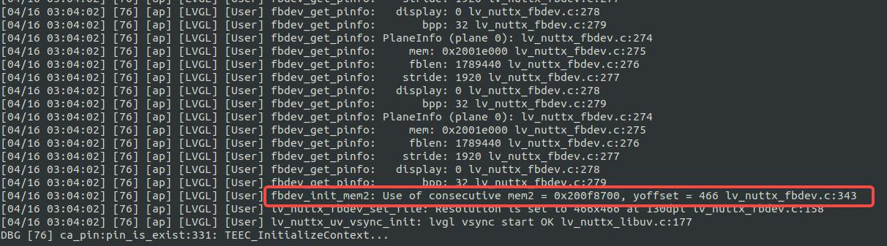

### 3、配置开机自动启动 Demo 应用

本节介绍如何配置系统，使 Demo 应用（如 lvgldemo）在系统启动后自动运行。

#### 3.1 创建系统启动脚本

参考[启动流程](../../device_dev_guide/kernel/boot_process.md)文档，为实现自动启动功能，需要在启动流程中添加如下脚本文件：

- `nuttx/boards/arm/stm32h7/stm32h750b-dk/src/etc/init.d/``rcS`
- `nuttx/boards/arm/stm32h7/stm32h750b-dk/src/etc/init.d/``rc.sysinit`

其中，`rc.sysinit` 用于核心应用的启动和文件系统挂载；`rcS` 用于启动用户应用。

在 `rcS` 文件中添加以下内容：

```C++
echo "Starting System..."
lvgldemo &
```

> 说明：
>
> 此脚本会在系统启动阶段自动运行，从而启动 Demo 应用 `lvgldemo`。

#### 3.2 配置只读内存文件系统（ROMFS）

为支持脚本自动启动，需要启用 ROMFS 相关选项并进行如下配置：

1. 运行配置工具：

    ```Bash
    make menuconfig
    ```

2. 启用并设置以下配置项：

    ```C++
    CONFIG_FS_FAT=y
    CONFIG_FS_ROMFS=y
    CONFIG_FS_ROMFS_CACHE_NODE=y
    CONFIG_FS_ROMFS_CACHE_FILE_NSECTORS=1
    CONFIG_ETC_ROMFS=y
    CONFIG_ETC_ROMFSMOUNTPT="/etc"
    CONFIG_ETC_ROMFSDEVNO=0
    CONFIG_ETC_ROMFSSECTSIZE=64
    CONFIG_NSH_SYSINITSCRIPT="init.d/rc.sysinit"
    CONFIG_NSH_INITSCRIPT="init.d/rcS"
    CONFIG_NSH_SCRIPT_REDIRECT_PATH=""
    ```

3. 保存配置并退出。

#### 3.3 将启动脚编译进目标文件

要让系统在启动时自动执行创建的[系统启动脚本](#31-创建系统启动脚本)，可按启动流程选择以下任一方法将脚本编译到目标文件中。

##### 方法一 生成 `etc_romfs.c` 文件

1. 生成 ROMFS 源文件，使用如下命令：

    ```Bash
    ./tools/mkromfsimg.sh . ../nuttx/boards/arm/stm32h7/stm32h750b-dk/src/etc/init.d/rc.sysinit ../nuttx/boards/arm/stm32h7/stm32h750b-dk/src/etc/init.d/rcS
    ```

2. 在 `nuttx/boards/arm/stm32h7/stm32h750b-dk/src/Makefile` 中引用生成的文件：

    ```Makefile
    ifeq ($(CONFIG_ETC_ROMFS),y)
    CSRCS += $(TOPDIR)/etc_romfs.c
    endif
    ```

##### 方法二 在 Makefile 中直接引用启动脚本

在 `nuttx/boards/arm/stm32h7/stm32h750b-dk/src/Makefile` 文件中, 添加 `rc.sysinit` 和 `rcS` 文件。

```Makefile
ifeq ($(CONFIG_ETC_ROMFS),y)
RCSRCS = etc/init.d/rc.sysinit etc/init.d/rcS
RCRAWS = etc/group etc/passwd
endif
```

#### 3.4 编译并下载程序

完成以上配置和修改后，执行以下步骤：

1. 在工程根目录执行执行 `make clean`，清除上一次构建产生的中间文件。
2. 执行 `make`，重新编译工程并生成新的固件文件（`.hex` 格式）。
3. 使用适配的烧录工具，将生成的 HEX 文件写入开发板。
4. 重新上电（或按下复位键）启动开发板。启动完成后，系统会自动运行 `lvgldemo`。