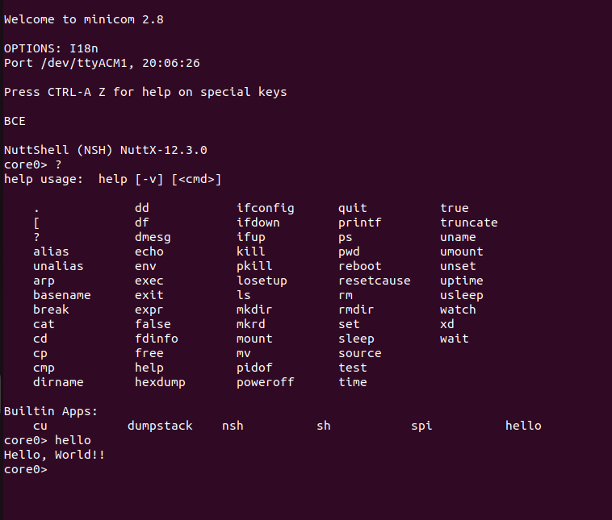
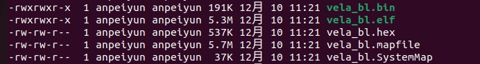
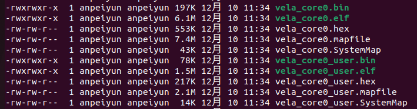

# FC7300F8M-EVB 开发板 openvela 运行指南

[ [English](../../../en/quickstart/development_board/fc7300f8m_evb_guide.md) | 简体中文 ]

## 一、概述

本指南将指导您在旗芯微 (Flagchip) FC7300F8M-EVB 开发板上，使用 protect 模式编译、构建并运行 openvela 操作系统。

FC7300F8M-EVB 是基于 FC7300F8MDT 芯片的高性能参考板，适用于域控制器、电池管理系统 (BMS) 等场景。

## 二、预期结果

完成本指南的操作后，您将成功启动系统，并通过串口（使用 Minicom 工具）进入 NSH (NuttShell) 交互终端。



## 三、前置准备

请确保您已准备好以下硬件设备，并在开发主机（Ubuntu 环境）上完成软件配置。

### 1、硬件准备

- **开发板**：一块 FC7300F8M-EVB 开发板。
- **调试器**：SEGGER J-Link 调试器（支持 SWD 模式）。
- **线缆**：电源线及 USB 数据线。

### 2、基础环境搭建

请参考官方文档[快速入门（Ubuntu）](../../quickstart/openvela_ubuntu_quick_start.md)，完成环境搭建及源代码下载。

### 3、安装 J-Link 驱动与补丁

为了支持 FC7300 系列芯片，您需要安装 J-Link 驱动并应用特定的设备补丁。

#### 步骤 1：安装 JLink 驱动

获取 `JLink_Linux_V688a_x86_64.deb` 安装包，执行以下命令进行安装：

[下载 JLink_Linux_V688a_x86_64.deb](./jlink/JLink_Linux_V688a_x86_64.deb)

```bash
 sudo dpkg -i ./JLink_Linux_V688a_x86_64.deb
```

#### 步骤 2：添加 FC7300 设备支持

获取设备补丁包 `JLink_Patch_v2.19.7z`，执行以下命令将补丁应用到 J-Link 安装目录。

[下载 JLink_Patch_v2.19.7z](./jlink/JLink_Patch_v2.19.7z)

**注意**：请将 `<patch_path>` 替换为您存放补丁文件的实际路径。

```Bash
# 1. 解压补丁包
sudo apt update
sudo apt install p7zip-full
7z x JLink_Patch_v2.19.7z

# 2. 拷贝设备定义文件
sudo cp -rf <patch_path>/JLink_Patch_v2.19/Devices/* /opt/SEGGER/JLink/Devices/

# 3. 更新设备配置文件 (JLinkDevices.xml)

# 场景 A：如果 /opt/SEGGER/JLink/JLinkDevices.xml 文件不存在，执行如下复制命令
sudo cp -rp /home/mi/XXX/JLink_Patch_v2.19/JLinkDevices.xml  /opt/SEGGER/JLink/JLinkDevices.xml

# 场景 B：如果配置文件已存在
# 如果 /opt/SEGGER/JLink/JLinkDevices.xml 文件已经存在，请将压缩包中 JLinkDevices.xml 文件中的 <DataBase> 标签内内容，追加到 /opt/SEGGER/JLink/JLinkDevices.xml 文件 <DataBase> 中
```

## 四、系统构建与运行

本章节将详细介绍如何编译 Bootloader (BL) 和 Core0 系统镜像，并将其烧录至开发板。

### 1、编译项目

进入 openvela 源码根目录，分别构建 Bootloader 和 Core0。

#### 步骤 1：编译 Bootloader(BL)

```Bash
./build.sh vendor/flagchip/boards/fc7300/fc7300f8m-evb/configs/kbl --cmake -j8
```

#### 步骤 2：编译核心系统 (Core0)

```Bash
./build.sh vendor/flagchip/boards/fc7300/fc7300f8m-evb/configs/kcore0 --cmake -j8
```

编译成功后，生成的镜像文件将位于以下目录：

- **BL 镜像**：`./cmake_out/fc7300f8m-evb_kbl`
  
    

- **Core0 镜像**：`./cmake_out/fc7300f8m-evb_kcore0`
  
    

### 2、烧录镜像

您可以选择 `.hex` 文件（推荐）或 `.bin` 文件进行烧录。

**方式一：使用 .hex 文件烧录（推荐）** 

此方式自带地址信息，无需手动指定烧录地址，操作更安全。

```Bash
# 烧录 Bootloader
cd ./cmake_out/fc7300f8m-evb_kbl
echo "loadfile vela_bl.hex" | sudo JLinkExe -if SWD -device FC7300F8MDTxXxxxT1B -speed 4800 -NoGui 1

# 烧录 Core0 及 User 镜像
cd ./cmake_out/fc7300f8m-evb_kcore0
echo "loadfile vela_core0.hex" | sudo JLinkExe -if SWD -device FC7300F8MDTxXxxxT1B -speed 4800 -NoGui 1
echo "loadfile vela_core0_user.hex" | sudo JLinkExe -if SWD -device FC7300F8MDTxXxxxT1B -speed 4800 -NoGui 1
```

**方式二：使用 .bin 文件烧录** 

需严格指定各镜像的内存起始地址。

```Bash
# 烧录 Bootloader (地址: 0x01000000)
cd ./cmake_out/fc7300f8m-evb_kbl
echo "loadfile vela_bl.bin 0x01000000" | sudo JLinkExe -if SWD -device FC7300F8MDTxXxxxT1B -speed 2500 -NoGui 1                                       

# 烧录 Core0 (地址: 0x01040000) 及 User 镜像 (地址: 0x011C0000)
cd ./cmake_out/fc7300f8m-evb_kcore0
echo "loadfile vela_core0.bin 0x01040000" | sudo JLinkExe -if SWD -device FC7300F8MDTxXxxxT1B -speed 2500 -NoGui 1
echo "loadfile vela_core0_user.bin 0x011C0000" | sudo JLinkExe -if SWD -device FC7300F8MDTxXxxxT1B -speed 2500 -NoGui 1
```

**注意**：烧录完成后，请务必**断电重启**开发板，以确保系统正确加载。

### 3、串口连接与验证

使用 `minicom` 连接开发板串口，查看启动日志。

1. 在主机终端执行以下命令（假设设备号为 `/dev/ttyUSB0`）：

    ` sudo minicom -D /dev/ttyUSB0 -b 115200  `

2. 按下开发板上的复位键（Reset）。
3. 终端将输出启动信息并显示 `core0>` 提示符，表示系统运行正常。

    

## 五、常见问题排查 (Troubleshooting)

### Q: Ubuntu 无法识别串口设备 `/dev/ttyUSB0`

**现象**：连接开发板后，在 `/dev/` 目录下找不到 `ttyUSB0` 设备，或者设备连接断断续续。

**原因**：Ubuntu 系统内置的盲文显示驱动 `brltty` 可能会占用 USB 转串口设备，导致冲突。

**解决方案**：

```Bash
sudo apt remove brltty
```
