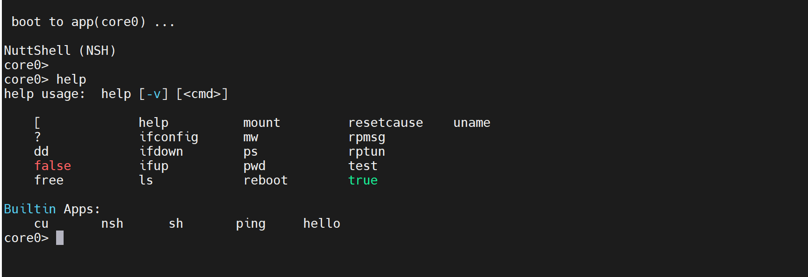
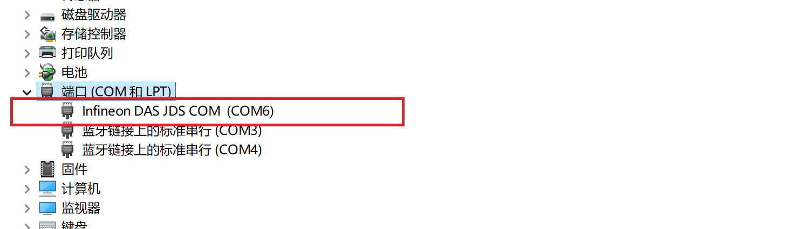
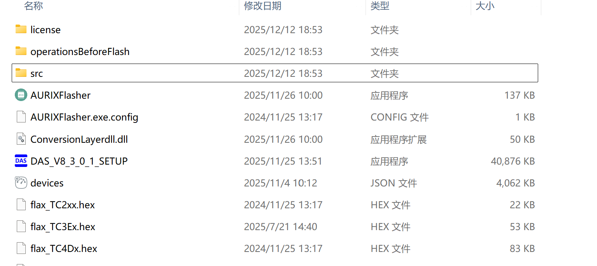
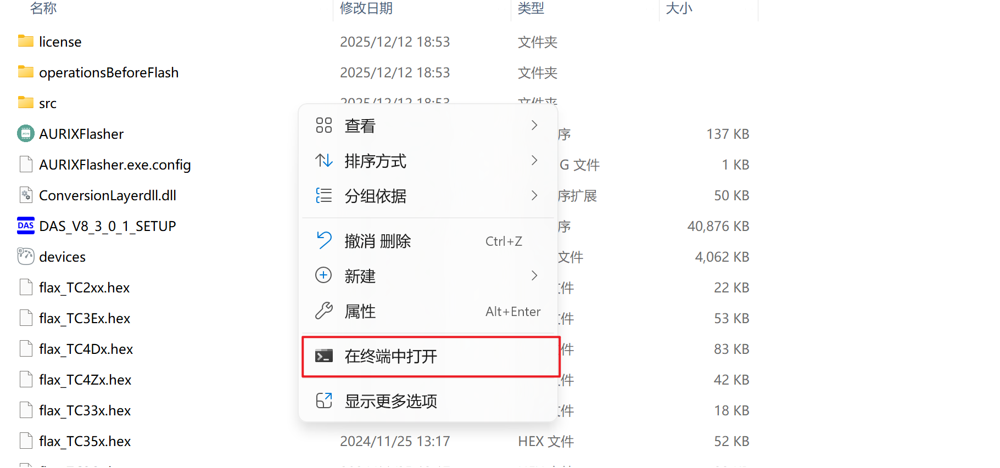
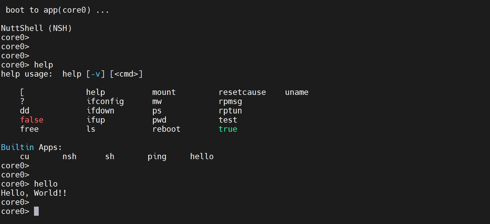
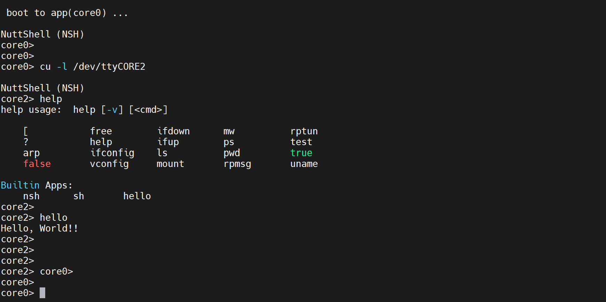

# TC4D9-EVB 开发板 openvela 运行指南

[ [English](../../../en/quickstart/development_board/tc4d9_evb_guide.md) | 简体中文 ]

## 一、概述

本指南将指导您在英飞凌 (Infineon) TC4D9-EVB 开发板上完成 openvela 操作系统的编译构建、部署及运行验证。

TC4D9-EVB 基于英飞凌 AURIX™ TC4x 系列微控制器（TC4D9/TC4Z9/TC489），集成了多路 CAN-FD、LIN、以太网、PCIe 等丰富接口，适用于汽车电子及高性能嵌入式系统的开发与原型验证。

## 二、预期效果

完成本指南的操作后，系统将成功启动，您可以通过串口终端（如 MobaXterm）进入 NSH (NuttShell) 进行交互，并支持多核切换。



## 三、前置准备

本流程涉及两个操作环境：**Linux 编译主机**用于构建代码，**Windows** **主机**用于工具烧录。

### 1、硬件准备

- **开发板**：TC4D9-EVB 开发板。
- **线缆**：电源线及 USB 数据线（连接板载调试器接口）。

### 2、编译主机准备 (Ubuntu)

1. 请在 Ubuntu 环境下，参照官方文档[快速入门（Ubuntu）](../../quickstart/openvela_ubuntu_quick_start.md)，完成 openvela 开发环境搭建和源代码下载。
2. 打开终端，执行以下命令，更新软件包列表并安装 srecord。

    ```bash
    sudo apt update
    sudo apt install srecord
    ```

### 3、烧录主机准备 (Windows)

TC4x 系列的烧录工具链依赖 Windows 环境，请安装以下软件。

1. 安装 TAS 工具 (Tool Access Socket)。

    TAS（Tool Access Socket）是英飞凌推出的一套工具访问中间层软件，用于为上位机开发工具提供统一、抽象的硬件访问接口，是使用烧录工具的前提。

    - 链接：[Infineon TAS](https://softwaretools.infineon.com/tools/com.ifx.tb.tool.infineontoolaccesssockettas)
    - **验证安装**：安装完成后，连接开发板并上电。打开 Windows 设备管理器，若出现 `Infineon DAS JDS COM` 设备，即表示驱动安装成功。

        

2. 安装  AURIX™ Flasher 烧录工具。

    用于对 TC4x 系列芯片进行擦除、编程和校验的命令行工具。

    - 下载链接：[AURIX™ Flasher Software Tool](https://softwaretools.infineon.com/assets/com.ifx.tb.tool.aurixflashersoftwaretool)
    - **验证安装：**默认安装在`C:\Infineon\AURIXFlasherSoftwareTool-3.0.14`目录下，进入该目录查看是否已经安装，如下图所示：

        

3. 安装串口终端 MobaXterm。

    用于与开发板进行串口通信，下载链接：[MobaXterm_Portable](https://download.mobatek.net/2542025111600034/MobaXterm_Portable_v25.4.zip)。

### 4、配置串口连接

1. 将开发板通过 USB 连接到电脑。
2. 打开 MobaXterm 软件，点击 Session。
3. 选择 Serial，建立 **Serial** 会话。
4. **Port**: 选择对应的 `Infineon DAS JDS COM` 端口。
5. **Speed**(bps) : 设置为 `115200`。
6. 点击 Advanced Serial settings，将 **Flow control** 为 `None`。
7. 点击 **OK** 打开连接。

## 四、系统构建 (Ubuntu)

TC4x 架构包含多个核心，需要分别编译 Bootloader (BL) 和 6 个核心的固件。

### 1、执行编译

进入 openvela 源码根目录，执行以下命令序列：

```Bash
# 1. 编译 Bootloader
./build.sh vendor/infineon/boards/aurix/tc4d9_evb/configs/bl --cmake -j16

# 2. 编译各核心固件 (Core0 - Core5)
./build.sh vendor/infineon/boards/aurix/tc4d9_evb/configs/core0 --cmake -j16
./build.sh vendor/infineon/boards/aurix/tc4d9_evb/configs/core1 --cmake -j16
./build.sh vendor/infineon/boards/aurix/tc4d9_evb/configs/core2 --cmake -j16
./build.sh vendor/infineon/boards/aurix/tc4d9_evb/configs/core3 --cmake -j16
./build.sh vendor/infineon/boards/aurix/tc4d9_evb/configs/core4 --cmake -j16
./build.sh vendor/infineon/boards/aurix/tc4d9_evb/configs/core5 --cmake -j16
```

### 2、确认编译产物

编译完成后，请在 `cmake_out/` 目录下收集以下 **7 个 .hex 文件**：

- `cmake_out/infineon_tc4d9_evb_bl/vela_bl.hex`
- `cmake_out/infineon_tc4d9_evb_core0/vela_core0.hex`
- ... 至 ...
- `cmake_out/infineon_tc4d9_evb_core5/vela_core5.hex`

## 五、固件部署 (Windows)

### 1、传输固件

将上述 7 个 `.hex` 文件从 Ubuntu 主机复制到 Windows 主机的同一目录下（例如 `D:\firmware\` 或 AURIXFlasher 安装目录）。

### 2、执行烧录

1. 确保开发板已上电并通过 USB 连接。
2. 进入 AURIXFlasher 安装目录（默认为 `C:\Infineon\AURIXFlasherSoftwareTool-3.0.14`），然后鼠标右键选择在终端打开，如下图所示：

    

3. 执行以下命令进行烧录（假设 hex 文件位于当前目录）：

    **重要提示**：必须烧录所有 7 个固件（BL + 6 个 Core），缺失任何一个核心的固件都可能导致系统无法正常启动。

    ```Plain
    :: 烧录 Bootloader
    ./AURIXFlasher.exe -hex vela_bl.hex


    :: 烧录 Core0 - Core5
    ./AURIXFlasher.exe -hex vela_core0.hex
    ./AURIXFlasher.exe -hex vela_core1.hex
    ./AURIXFlasher.exe -hex vela_core2.hex
    ./AURIXFlasher.exe -hex vela_core3.hex
    ./AURIXFlasher.exe -hex vela_core4.hex
    ./AURIXFlasher.exe -hex vela_core5.hex
    ```

## 六、运行与验证

### 1、启动系统

所有固件烧录完成后，系统将自动复位启动。

### 2、串口交互

返回 MobaXterm 串口窗口，您将看到启动日志并最终停留在 `core0>` 提示符，表示 Core0 已就绪。



### 3、多核切换验证

openvela 支持在 NSH 中通过 `cu` (Call Utility) 命令连接到其他核心的虚拟终端。

- **切换指令**：在 core0 中执行 `cu -l /dev/ttyCOREx` (x 代表核心编号)
- **退出指令**：按下 `Ctrl + C` 返回 Core0。

**示例：切换至 Core2** 

输入命令：

```Bash
cu -l /dev/ttyCORE2
```

终端提示符将变更为 `core2>`，如下图所示：



使用 `ctrl + c` 命令可以返回 core0。