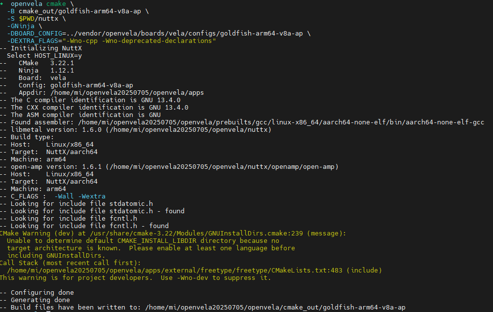
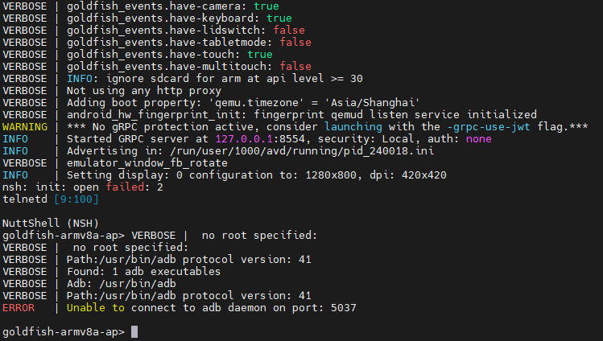

# 快速入门（Ubuntu）

[ [English](../../en/quickstart/openvela_ubuntu_quick_start.md) | 简体中文 ]

本指南将指导您在 **Ubuntu 22.04** 操作系统上完成 openvela 的开发环境准备、源代码下载、编译构建，并最终通过 Vela Emulator 运行编译产物。

> **环境要求**
>
> 本文仅适配 **Ubuntu 22.04**。不支持在 Windows Subsystem for Linux (WSL) 或 Docker 容器环境中进行编译。

## 步骤一：准备工作

在开始之前，请确保您的开发环境满足以下要求。

### 1. 硬件要求

- **硬盘：** 至少 40 GB 可用空间，用于存放源代码和编译产物。
- **内存：** 至少 16 GB RAM。

### 2. 操作系统要求

- **操作系统：** Ubuntu 22.04 (arm64/x86_64)

### 3. 安装开发工具

在开始之前，您需要安装编译 openvela 所需的软件包。

打开终端，执行以下命令，更新软件包列表并安装 Git、CMake、Python 3 和 build-essential 工具链。

```Bash
sudo apt update
sudo apt install git cmake python3 build-essential
```

### 4. 安装 Git LFS 组件

> **说明**：本项目包含大体积的二进制文件（如模型权重、数据集）。请务必配置 **Git LFS**，**否则拉取的文件将损坏（仅显示为几 KB 的指针文本）而无法运行**。

请在 Ubuntu 终端中执行以下命令进行安装和初始化：

```bash
# 第一步：配置官方源并安装 (确保获取最新版)
curl -s https://packagecloud.io/install/repositories/github/git-lfs/script.deb.sh | sudo bash
sudo apt-get install git-lfs

# 第二步：初始化配置 (重要：必须执行此步，否则 LFS 不会生效)
git lfs install
```

## 步骤二：下载源代码

openvela 使用 `repo` 工具管理其分布在多个 Git 仓库中的源代码。

### 1. 安装 Repo 工具

`repo` 是一个构建于 Git 之上的代码库管理工具。执行以下命令来安全地下载并安装它。

```Bash
curl -sSL "https://storage.googleapis.com/git-repo-downloads/repo" > repo
chmod +x repo
sudo mv repo /usr/local/bin
```

安装完成后，可运行 `repo --version` 进行验证。

### 2. 初始化并同步代码库

1. 创建一个工作目录，用于存放 openvela 的所有源代码。

    ```bash
    mkdir openvela && cd openvela
    ```

2. 使用 `repo` 初始化项目清单，并指定 `trunk-5.4` 分支。

    请根据您的网络环境和偏好，从以下任一平台选择一种方式（推荐使用 SSH）来初始化仓库。

    #### 选项 A：从 GitHub 下载

    - 方式一：SSH（推荐）

        此方式需要您先将 SSH 公钥添加至您的 GitHub 账户，请参考 [GitHub 官方文档](https://docs.github.com/en/authentication/connecting-to-github-with-ssh/adding-a-new-ssh-key-to-your-github-account)。

        ```bash
        repo init -u ssh://git@github.com/open-vela/manifests.git -b trunk-5.4 -m openvela.xml --git-lfs
        ```

    - 方式二：HTTPS

        ```bash
        repo init -u https://github.com/open-vela/manifests.git -b trunk-5.4 -m openvela.xml --git-lfs
        ```

    #### 选项 B：从 Gitee 下载

    - 方式一：SSH (推荐)

        此方式需要您先将 SSH 公钥添加至您的 Gitee 账户，请参考 [Gitee 官方文档](https://gitee.com/help/articles/4191)。

        ```bash
        repo init --u ssh://git@gitee.com/open-vela/manifests.git -b trunk-5.4 -m openvela.xml --repo-url=https://mirrors.tuna.tsinghua.edu.cn/git/git-repo/ --git-lfs
        ```

    - 方式二：HTTPS

        ```bash
        repo init -u https://gitee.com/open-vela/manifests.git -b trunk-5.4 -m openvela.xml --repo-url=https://mirrors.tuna.tsinghua.edu.cn/git/git-repo/ --git-lfs
        ```

    #### 选项 C：从 GitCode 下载

    - 方式一：SSH (推荐)

        此方式需要您先将 SSH 公钥添加至您的 GitCode 账户，请参考 [GitCode 官方文档](https://docs.gitcode.com/docs/help/home/user_center/security_management/ssh)。

        ```bash
        repo init -u ssh://git@gitcode.com/open-vela/manifests.git -b trunk-5.4 -m openvela.xml --repo-url=https://mirrors.tuna.tsinghua.edu.cn/git/git-repo/ --git-lfs
        ```

    - 方式二：HTTPS

        ```bash
        repo init -u https://gitcode.com/open-vela/manifests.git -b trunk-5.4 -m openvela.xml --repo-url=https://mirrors.tuna.tsinghua.edu.cn/git/git-repo/ --git-lfs
        ```

3. 执行同步命令，repo 将根据清单文件 (`openvela.xml`) 下载所有相关的源代码仓库。

    ```bash
    repo sync -c -j8
    ```

    

    > **操作提示**
    >
    > - 首次同步耗时较长，具体时间取决于您的网络状况和磁盘性能。
    > - 若因网络问题中断，可重复执行 `repo sync` 进行增量同步。

## 步骤三：编译源代码

完成源代码下载后，请在 openvela 根目录下执行以下编译步骤。

### 1. 设置环境变量

执行以下命令，将预编译的工具链路径添加到当前终端会话的环境变量中。

```Bash
uname_s=$(uname -s | tr '[A-Z]' '[a-z]')
uname_m=$(uname -m)
export PATH=$PWD/prebuilts/build-tools/${uname_s}-${uname_m}/bin:$PATH
export PATH=$PWD/prebuilts/cmake/${uname_s}-${uname_m}/bin:$PATH
export PATH=$PWD/prebuilts/python/${uname_s}-${uname_m}/bin:$PATH
export PATH=$PWD/prebuilts/gcc/${uname_s}-${uname_m}/aarch64-none-elf/bin:$PATH
export PATH=$PWD/prebuilts/gcc/${uname_s}-${uname_m}/arm-none-eabi/bin:$PATH
export PYTHONPATH=$PWD/prebuilts/tools/python/dist-packages/cxxfilt
export PYTHONPATH=$PWD/prebuilts/tools/python/dist-packages/kconfiglib:$PYTHONPATH
export PYTHONPATH=$PWD/prebuilts/tools/python/dist-packages/pyelftools:$PYTHONPATH
```

> **注意**： 此环境变量配置仅在当前终端窗口有效。若新开终端，需重新执行此脚本。

### 2. 配置 CMake 项目 (Out-of-Tree)

openvela 采用 **Out-of-tree build** 模式，该模式将编译产物与源代码分离，以保持源码目录的整洁。

运行以下 `cmake` 命令来配置项目。此命令将：

- 在 `cmake_out/goldfish-arm64-v8a-ap` 目录下生成构建系统文件。
- 使用 Ninja 作为构建工具以提升编译速度。
- 指定目标板的配置文件。

```Bash
cmake \
  -B cmake_out/goldfish-arm64-v8a-ap \
  -S $PWD/nuttx \
  -GNinja \
  -DBOARD_CONFIG=../vendor/openvela/boards/vela/configs/goldfish-arm64-v8a-ap \
  -DEXTRA_FLAGS="-Wno-cpp -Wno-deprecated-declarations"
```



### 3. （可选）自定义内核配置

您可以通过 `menuconfig` 命令打开图形化界面，以调整 NuttX 内核与组件的配置。

```Bash
cmake --build cmake_out/goldfish-arm64-v8a-ap -t menuconfig
```

> **操作技巧**
>
> - 按 `/` 键可搜索配置项。
> - 按 `空格键` 可切换选中状态（启用/禁用/模块化）。
> - 配置完成后，选择 **Save** 保存并退出。


### 4. 执行编译

执行以下命令，构建整个项目。

```Bash
cmake --build cmake_out/goldfish-arm64-v8a-ap
```

编译成功后，您将在 `cmake_out/goldfish-arm64-v8a-ap` 目录下找到 `nuttx` 等编译产物。


## 步骤四：运行模拟器

在 openvela 根目录下，执行以下脚本启动 `Vela Emulator` 并加载您的编译产物。

```Bash
./emulator.sh cmake_out/goldfish-arm64-v8a-ap
```

模拟器启动后，您将看到 `goldfish-armv8a-ap>` 提示符，表明 openvela 已成功运行。




## 后续步骤

- 常见问题

    - [快速入门常见问题](../faq/QuickStart_FAQ.md)

- 进一步阅读

    - [使用模拟器调试](./emulator/Debugging_Vela_with_Vela_Emulator_zh-cn.md)
    - [ADB 命令](./emulator/Android_Debug_Bridge_commands_zh-cn.md)
    - [发送模拟器控制台命令](./emulator/Send_emulator_console_commands_zh-cn.md)
