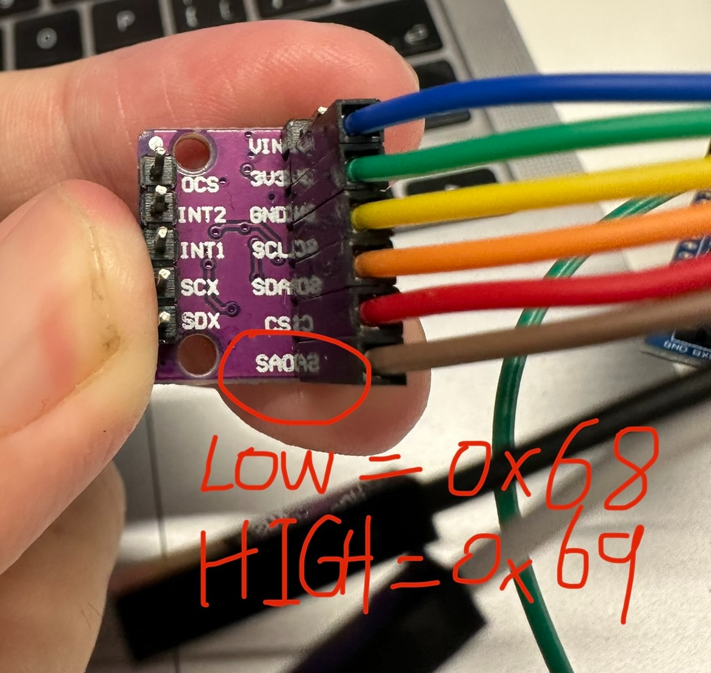
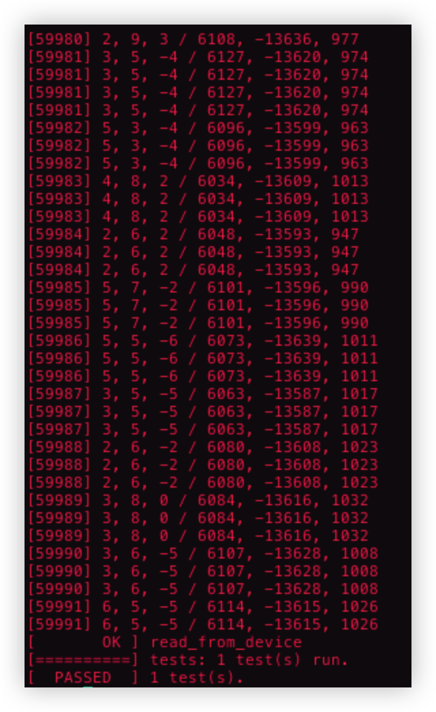

# SPI & I2C

## 前言

I2C (Inter-Integrated Circuit) 和 SPI (Serial Peripheral Interface) 是两种常用的通信协议，它们用于在芯片之间传输数据。

### I2C

是一种同步串行通信协议，用于连接低速周边设备和集成电路。它使用两根线 SDA (串行数据) 和 SCL (串行时钟) 进行通信。I2C协议有两种模式：主模式和从模式。主模式通过发送起始位和地址位来启动一次数据传输，从模式则等待主模式的请求并返回数据。I2C协议支持多个从设备连接到同一个总线上。

### SPI

是另一种同步串行通信协议，用于连接高速周边设备和集成电路。它使用四根线 MOSI (主设备输出，从设备输入)、MISO (主设备输入，从设备输出)、SCLK (串行时钟) 和 SS (片选) 进行通信。SPI协议使用主从模式，主设备控制通信并选择要与之通信的从设备。SPI协议支持高速数据传输和全双工通信，但只能连接一个从设备。

总的来说，I2C适用于低速数据传输和多个从设备的连接，而SPI适用于高速数据传输和单个从设备的连接。它们都是常用的通信协议，被广泛应用于各种嵌入式系统、传感器和电子设备中。

### BMI160传感器

BMI160是一种高度集成的惯性测量单元（IMU），由Bosch Sensortec公司生产。它包含一个三轴加速度计和一个三轴陀螺仪，可用于检测设备的加速度、角速度和方向。

BMI160传感器具有低功耗和高性能的特点，可在移动设备、健身跟踪器、智能手表等各种应用中使用。它还具有高度灵活性和可配置性，可以通过SPI和I2C接口进行通信，并支持多种采样率和测量范围。

BMI160传感器还具有内置的自动运动检测功能，可以检测设备的运动状态并触发相应的事件。此外，它还可以通过内置的温度传感器测量环境温度。



BMI160相关资料参见**附录**

## I2C & SPI Testcase使用

### 准备

#### 购买

请先购买BMI160传感器

https://item.m.jd.com/product/10031826295758.html?utm_user=plusmember&gx=RnE1kjVZYDGKn9QcewztiMgWwX-3

#### 软件

首先将对应的I2C和SPI以及BMI160初始化代码加入到 `board_late_initialize()` 函数里，

以下为 board_late_initialize上的示例

```c
// BMI160依赖
#include <nuttx/sensors/bmi160.h>

board_late_initialize()
{
#ifdef CONFIG_SIM_I2CBUS
  struct i2c_master_s *i2cbus;
#endif
#ifdef CONFIG_SIM_SPI
  struct spi_dev_s *spidev;
#endif

  ......
  
#ifdef CONFIG_SIM_I2CBUS
  /* 初始化I2C总线 */
  i2cbus = sim_i2cbus_initialize(CONFIG_SIM_I2CBUS_ID);
  i2c_register(i2cbus, 0);
  bmi160_register("/dev/accel0", i2cbus);
#endif /* CONFIG_SIM_I2C */
  
  ......
  
#ifdef CONFIG_SIM_SPI
  /* 初始化SPI总线 */
  spidev = sim_spi_initialize(CONFIG_SIM_SPIDEV_NAME);
  spi_register(spidev, 0);
  bmi160_register("/dev/accel0", spidev);
#endif /* CONFIG_SIM_SPI */

  ......
}

/*             注意          
* 以上代码中的 sim_i2cbus_initialize    
*            sim_spi_initialize       
* 需要vendor自己实现，调用后结果返回         
*            struct i2c_master_s *    
*            struct spi_dev_s *       
* 类型的设备指针                           
* 以上仅仅为主要创建代码，具体请补全相关错误处理 
*/                                       
```

依赖配置

```bash
# spi测试

# spi 驱动框架
CONFIG_SPI
CONFIG_SPI_EXCHANGE
CONFIG_SPI_DRIVER

# sim环境下板级别SPI驱动注册及传感器BMI160初始化
CONFIG_SIM_SPI
```

修改后，打开如下config

```c
# 打开设备上的SPI或I2C相关配置
# 例如
# SPI=y

# 测试相关配置
CONFIG_SENSORS_BMI160=y

# 如果是测试I2C，则打开
    CONFIG_SENSORS_BMI160_I2C=y

# 如果是测试SPI，则打开
    CONFIG_SENSORS_BMI160_SPI=y

# 打开cmocka相关配置
TESTING_CMOCKA=y
TESTING_DRIVER_TEST=y
```

随后编译代码：

在nuttx中输入help，看到如下指令则代表testcase已编译至nuttx中

```
cmocka_driver_i2c_spi
```

#### 硬件

I2C和SPI 需要依赖BMI160加速度传感器读取数值来判断能否通过测试，因此需要提前准备BMI160传感器。

将传感器和HOST按照如下方式连接

##### 测试I2C

请根据SA0的接线方式决定

```
BMI160_I2C_ADDR_68=y
或者
BMI160_I2C_ADDR_69=y 
```

```
                        VCC   GND                      
┌─────────┐      ─┬─  ─┬─   ┌─────────┐
│             VCC├────┘     │     │               │
│                │             │     │               │
│             3V3├───        │     │               │
│                │             │     │               │
│             GND├────────┘     │               │
│BMI60           │                    │               │
│             SCL├────────────┤SCL  Host      │
│I2C Test Wire   │                    │               │
│             SDA├────────────┤SDA            │
│                │                    │               │
│SA0:          CS├───               │               │
│  LOW  0x68     │                    │               │
│  HIGH 0x69  SA0├────────────┤SA0            │
└─────────┘                     └─────────┘
 0x68 BMI160_I2C_ADDR_68=y                             
 0x69 BMI160_I2C_ADDR_69=y                             
 
 BMI   Host
 SCL -- SCL
 SDA -- SDA
 SA0 -- SA0
```

##### 测试SPI

```
                          VCC   GND                      
┌────────────────┐      ─┬─   ─┬─     ┌───────────────┐
│             VCC├───────┘     │      │               │
│                │             │      │               │
│             3V3├───          │      │               │
│                │             │      │               │
│             GND├─────────────┘      │               │
│     BMI60      │                    │               │
│             SCL├────────────────────┤SCK  Host      │
│ SPI Test Wire  │                    │               │
│             SDA├────────────────────┤MOSI           │
│                │                    │               │
│              CS├────────────────────┤NSS/CS         │
│                │                    │               │
│             SA0├────────────────────┤MISO           │
└────────────────┘                    └───────────────┘
 BMI   Host
 SCL -- SCK
 SDA -- MOSI
  CS -- CS
 SA0 -- MISO
```

### 测试

准备工作完成后，在nuttx终端中输入`cmocka_driver_i2c_spi`执行测试程序。

成功会输出 `PASSED`字样

失败会输出 `FAILED`字样

例如，得到如下结果则代表测试成功：



### 其他配置

如果出现问题，可以打开sensor相关的log输出配置，如下所示

```c
DEBUG_SENSORS=y
DEBUG_SENSORS_ERROR=y
DEBUG_SENSORS_INFO=y
DEBUG_SENSORS_WARN=y
```

I2C和SPI日志输出配置如下所示

```c
DEBUG_I2C=y
DEBUG_I2C_ERROR=y
DEBUG_I2C_INFO=y
DEBUG_I2C_WARN=y

DEBUG_SPI=y
DEBUG_SPi_ERROR=y
DEBUG_SPI_INFO=y
DEBUG_SPI_WARN=y
```

## 附录

附件：[BMI160_datasheet.pdf](BMI160_datasheet.pdf)
