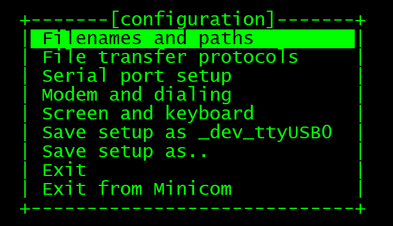
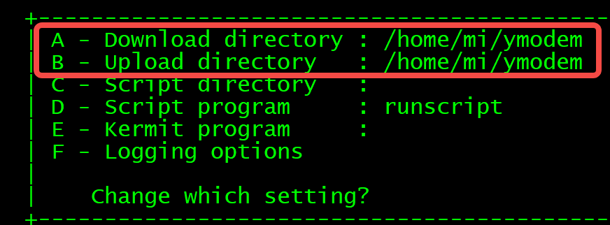
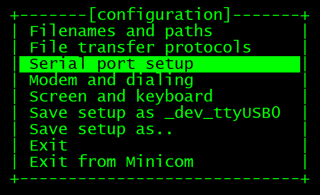
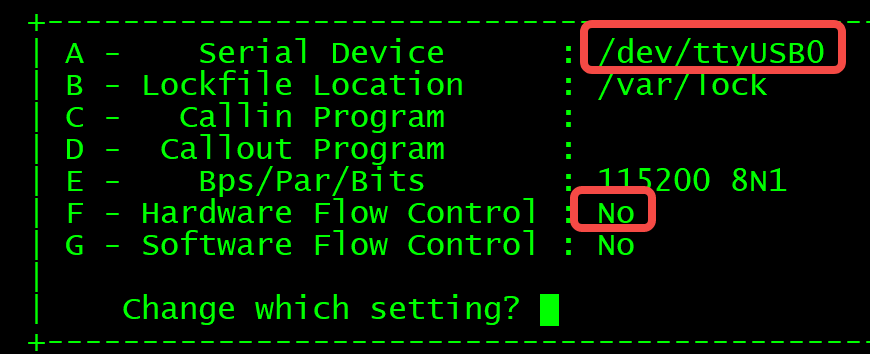
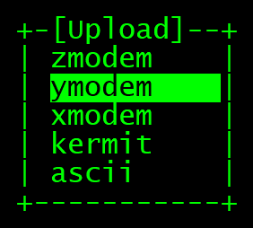
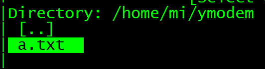
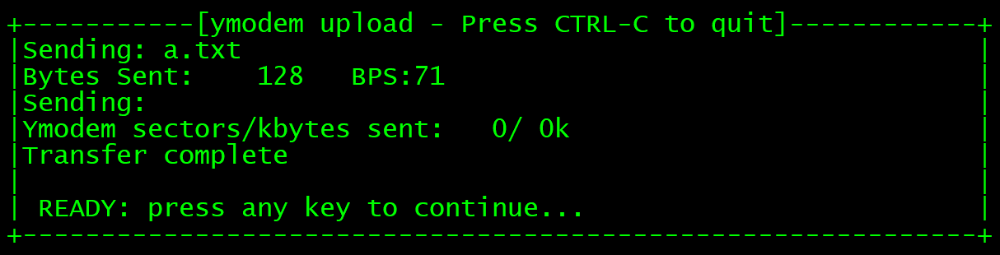
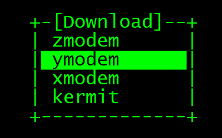
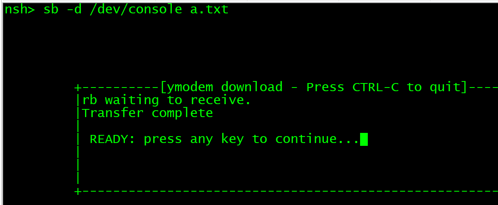
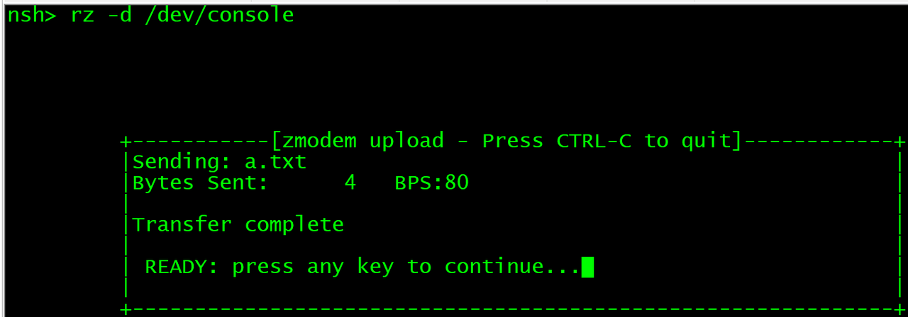

# Ymodem测试

Ymodem/zmodem测试

## 测试操作过程

1、在ubuntu上新建一个目录用于ymodem发送和接收文件使用，创建一个将被发送的文件a.txt，内容随便写点东西。例如/home/mi/ymodem

2、执行sudo minicom -s /dev/ttyUSB0

a、进入filenames and paths，将发送和接收路径都设备为/home/mi/ymodem

```plaintext
ctrl + a z o
```





b、进入Serial port setup
自己的是/dev/ttyUSBx要自己确定一下，Hardware Flow Control设置为No，否则minicom无法输入。





c、以上设置完成之后退出设置页面

3、ymodem接收测试(minicom发送板子接收)

```bash
minicom下进入nsh
cd /tmp
rb -d /dev/console
```

minicom下按ctrl+a,z,s,再选择ymodem



选中要传输的文件



可以看到minicom完成了对a.txt的发送，在板子/tmp目录下可以看到这个文件



4、ymodem发送测试(minicom接收板子发送)

```plaintext
minicom下进入nsh
cd /tmp
sb -d /dev/console a.txt
```

minicom下按ctrl+a,z,r，选择ymodem



可以看到传输成功



5、zmodem接收测试

```plaintext
cd /tmp
rz -d /dev/console
```

ctrl+a,z,s，选择zmodem，选择要发送的文件



6、zmodem发送测试

```plaintext
cd /tmp
sz -d /dev/console /tmp/a.txt     //注意一定要使用绝对路径，否则失败
```

ctrl+a,z,r，选择zmodem
